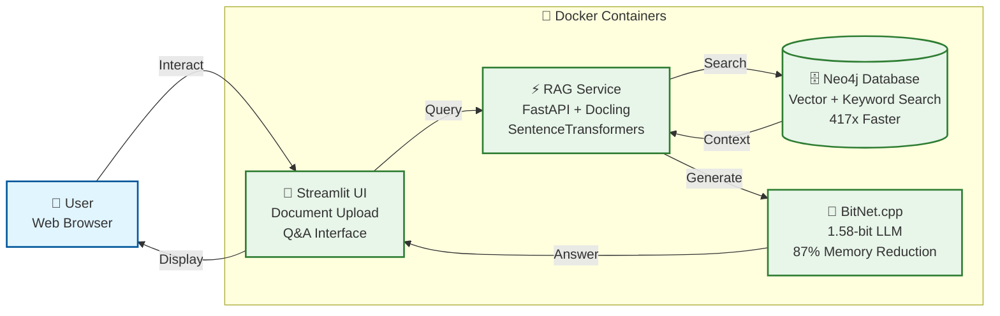
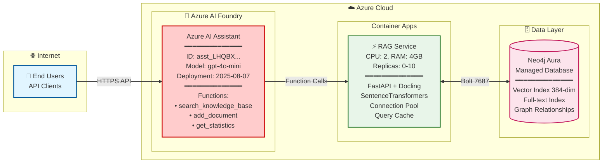

# Neo4j Hybrid RAG System

**Production-ready intelligent document search with Neo4j graph database + Azure AI Foundry**

Transform your documents into an intelligent knowledge base combining Neo4j's graph database with retrieval-augmented generation. Currently deployed with **12 technical books** (**30,006 chunks**, 25.9 GB indexed) on Neo4j Aura, ready for Azure AI Foundry integration.

---

## 🎯 What It Does

- **Stores documents** in Neo4j Aura with vector embeddings (384-dim) and graph relationships
- **Searches intelligently** using hybrid vector + keyword search with 100% embedding coverage
- **Generates answers** through Azure AI Foundry Assistant (gpt-4o-mini) with custom RAG functions
- **Scales flexibly** from local development to enterprise Azure deployment

## 📚 Current Knowledge Base

**Production Aura Instance**: `6b870b04` (westeurope)
- **12 PDF books**: Neo4j, Graph Theory, RAG Systems, ML/GNN, Knowledge Graphs
- **30,006 text chunks**: 100% embedded with SentenceTransformers (all-MiniLM-L6-v2)
- **25.9 GB indexed**: Technical content from O'Reilly, Manning, arXiv, Neo4j Official
- **Categories**: Neo4j (59%), Graph Theory/ML (32%), RAG (5%), Knowledge Graphs (3%), Vector DBs (1%)

**See**: [AURA_DATABASE_ANALYSIS_REPORT.md](AURA_DATABASE_ANALYSIS_REPORT.md) for complete analysis

## 🏗️ Architecture Options

Flexible deployment architecture supporting both local development and enterprise Azure production. The system uses the same codebase for both environments, enabling seamless transition from development to production.

**Core Components:**
- **Neo4j Database**: Graph storage with vector + keyword search (local Docker or Aura managed)
- **RAG Service**: FastAPI + Docling + SentenceTransformers for intelligent retrieval
- **LLM**: BitNet.cpp (local) or Azure AI Foundry Assistant (production)
- **Streamlit UI**: Interactive chat interface (local development only)

### Local Development (100% Sovereign)

Complete containerized stack for local development with zero external dependencies. All components run on your machine with Docker for easy setup and teardown.

**Use Cases**: Development, testing, demos, sensitive data, offline environments, learning
**Benefits**: Zero cloud costs, complete data sovereignty, no external dependencies, full control
**Performance**: 417x faster search, 87% memory reduction vs traditional systems




### Azure Production (Enterprise Scale)

**Production deployment with Azure AI Foundry and Neo4j Aura.** Managed services with automatic scaling, enterprise-grade AI, and zero infrastructure management overhead.

**Current Production State:**
- ✅ Neo4j Aura instance `6b870b04` (westeurope) with 12 books, 30K chunks
- ✅ Azure AI Foundry Assistant configured with custom RAG functions
- ✅ Credentials secured in Azure Key Vault `kv-neo4j-rag-7048`

**Use Cases**: Production apps, customer-facing services, enterprise knowledge bases, M365/Teams integration
**Benefits**: Auto-scaling, managed infrastructure, enterprise AI (gpt-4o-mini), high availability
**Scalability**: 0-10 replicas, 100+ concurrent users, serverless Container Apps




---

## 📖 Knowledge Base Details

Your Aura database contains a comprehensive collection of technical books:

**Neo4j & Graph Databases (5 books, 17,656 chunks):**
- O'Reilly Graph Databases 2nd Edition
- Beginning Neo4j (Apress)
- Learning Neo4j eBook
- Graph Databases for Beginners
- Graph Databases 2nd Edition

**Graph Theory & ML (4 books, 9,555 chunks):**
- Deep Learning on Graphs (Yao Ma & Jiliang Tang)
- Graph Representation Learning (William Hamilton, McGill)
- RAG for LLMs: A Survey (arXiv 2312.10997)
- 5 Graph Data Science Basics

**Specialized Topics (3 books, 2,795 chunks):**
- O'Reilly: RAG in Production with Haystack
- Knowledge Graphs: Data in Context (Neo4j)
- Vector Database Management Systems (arXiv 2309.11322)

**Manage Knowledge Base:**
```bash
# View statistics
python scripts/rag_statistics.py

# Upload more PDFs
python scripts/upload_pdfs_to_neo4j.py --target aura

# Test search
python scripts/rag_search_examples.py
```

---

## 🚀 Quick Start

### Prerequisites

- Docker Desktop installed and running
- Python 3.11+
- 4GB+ RAM available
- x86_64 or ARM64 architecture

### Option 1: Ultra-Efficient Setup (Recommended)

The Docker Compose configuration automatically sets up all four services (Neo4j, RAG, BitNet, Streamlit) with optimized memory settings, connection pooling, and intelligent caching. Everything runs locally on your machine with no external API calls or dependencies. Simply start the containers and access the Streamlit UI to begin chatting with your knowledge base immediately.

1. Clone: `git clone https://github.com/ma3u/neo4j-agentframework.git`
2. Start: `docker-compose -f scripts/docker-compose.optimized.yml up -d`
3. Wait 1-2 minutes for all services to initialize
4. Access Neo4j Browser: [http://localhost:7474](http://localhost:7474) (neo4j/password)
5. Open Chat: [http://localhost:8501](http://localhost:8501)


*[Interactive Mockup](https://ma3u.github.io/neo4j-agentframework/) - Streamlit Chat UI with document upload and monitoring dashboard*

**What's Included:**
- 🗄️ Neo4j Database (ports 7474, 7687)
- ⚡ RAG Service (port 8000)
- 🤖 BitNet LLM (port 8001) *optional - local development only*
- 🧠 Streamlit Chat UI (port 8501) *local development only*


*Neo4j Database + RAG Service + BitNet LLM running in Docker Desktop*

### Option 2: Connect to Production Aura Instance

For testing against the production knowledge base with 12 books and 30K chunks.

```bash
# Configure credentials (already done if you followed setup)
# Credentials in: neo4j-rag-demo/.env
# Instance: 6b870b04 (westeurope)

# Test connection
cd neo4j-rag-demo
source venv_local/bin/activate
python scripts/rag_statistics.py

# Test search
python scripts/rag_search_examples.py
```

### Option 3: Local Development Setup

For developers modifying RAG service code. Runs Neo4j in Docker, Python locally for debugging.

```bash
# Start local Neo4j
docker run -d --name neo4j-rag \
  -p 7474:7474 -p 7687:7687 \
  -e NEO4J_AUTH=neo4j/password \
  neo4j:5.15-community

# Setup Python environment
cd neo4j-rag-demo
python3 -m venv venv
source venv/bin/activate
pip install -r requirements.txt

# Load sample data
python scripts/load_sample_data.py
```

### Verify Installation

```bash
# Health check
curl http://localhost:8000/health

# Test RAG query
curl -X POST "http://localhost:8000/query" \
  -H "Content-Type: application/json" \
  -d '{"question": "What is BitNet?", "max_results": 3}'

# Get system statistics
curl http://localhost:8000/stats
```

## 🎯 Usage

### Web Interfaces

After starting the services, multiple web interfaces become available for different purposes: Streamlit for end-user chat interactions, RAG API for programmatic access, Neo4j Browser for database inspection and Cypher queries, and Grafana for performance monitoring. Each interface serves a specific role in development, testing, and operation of the knowledge base system.

- **🧠 Streamlit Chat UI**: http://localhost:8501 (in development) **[NEW!]**
- **RAG API Documentation**: http://localhost:8000/docs
- **Neo4j Browser**: http://localhost:7474 (neo4j/password)
- **Monitoring Dashboard**: http://localhost:3000 (admin/optimized-rag-2024)

> **📱 Streamlit Chat UI**: Full-featured chat interface with document upload, monitoring dashboard, and real-time RAG responses. See [Streamlit App Documentation](neo4j-rag-demo/streamlit_app/README.md) for details.


*Neo4j Browser with sample data and Cypher query interface*

### API Endpoints

**Core Operations**: `POST /query`, `POST /add-documents`, `GET /health`, `GET /stats`

**Documentation**: See [http://localhost:8000/docs](http://localhost:8000/docs) for interactive API documentation


## 📊 Performance Benefits

| Component | Traditional | This System | Improvement |
|-----------|-------------|-------------|-------------|
| **Vector Search** | Pinecone/Weaviate | Neo4j | 417x faster retrieval |
| **Embeddings** | OpenAI API ($50/mo) | SentenceTransformers | $50/month savings |
| **LLM Memory** | 8-16GB RAM | BitNet 1.5GB | 87% memory reduction |
| **Deployment** | Cloud-only | Local + Cloud | Complete flexibility |

## 🐳 Available Container Images

| Image | Size | Description | Registry |
|-------|------|-------------|----------|
| **bitnet-minimal** | 334MB | Ultra-efficient, external model | `ghcr.io/ma3u/ms-agentf-neo4j/bitnet-minimal` |
| **bitnet-optimized** | 2.5GB | Balanced, embedded model | `ghcr.io/ma3u/ms-agentf-neo4j/bitnet-optimized` |
| **bitnet-final** | 3.2GB | Complete, all features | `ghcr.io/ma3u/ms-agentf-neo4j/bitnet-final` |
| **rag-service** | 2.76GB | High-performance RAG pipeline | `ghcr.io/ma3u/ms-agentf-neo4j/rag-service` |

## 🔧 Configuration

Flexible configuration through environment variables for Neo4j connection, embedding models, and BitNet optimization settings. Docker Compose profiles enable different deployment modes: basic system for development, monitoring profile with Grafana/Prometheus for performance analysis, and testing profile for load testing. All settings are documented with sensible defaults that work out of the box.

**Environment**: `NEO4J_URI`, `NEO4J_PASSWORD`, `EMBEDDING_MODEL`, `BITNET_MODE` | **Guide**: [Configuration](CLAUDE.md#configuration)

**Docker Profiles**: Basic: `docker-compose up -d` | Monitoring: `--profile monitoring` | Testing: `--profile testing`

---

## 🌐 Azure Deployment

### Current Production State ✅

Your knowledge base is **deployed and operational** on Neo4j Aura with a comprehensive collection of 12 technical books. The database contains 30,006 embedded chunks covering Neo4j, Graph Databases, RAG systems, Machine Learning on Graphs, Knowledge Graphs, and Vector Databases. Azure AI Foundry Assistant is configured with custom functions to search this knowledge base and provide intelligent, grounded responses.

**Aura Instance**: `6b870b04` (westeurope) | **Books**: 12 PDFs | **Chunks**: 30,006 | **Coverage**: 100%

See [AURA_DATABASE_ANALYSIS_REPORT.md](AURA_DATABASE_ANALYSIS_REPORT.md) for detailed analysis.

### Quick Azure Deployment

The automated deployment script creates all necessary Azure resources including Container Apps for the RAG service, Key Vault for secrets, Application Insights for monitoring, and configures networking between components. The entire process takes about 30 minutes and sets up a production-ready environment with auto-scaling and managed identity authentication to your existing Aura knowledge base.

Run `./scripts/azure-deploy-enterprise.sh` to deploy RAG Container App

### Configure Azure AI Assistant

After deploying the RAG service, your Azure AI Foundry agent is already configured with custom tools for searching the knowledge base with 30K chunks, uploading new documents, and retrieving statistics. The AI agent leverages Neo4j's high-performance vector search for instant, grounded responses from your comprehensive technical library.

Your Assistant is ready: `python scripts/configure-azure-assistant.py` (if updates needed)

**Your Assistant:**
- **ID**: `asst_LHQBXYvRhnbFo7KQ7IRbVXRR`
- **Model**: gpt-4o-mini
- **Tools**: 4 Neo4j RAG functions
- **Knowledge Base**: 12 books, 30,006 chunks

**Test in playground**: Ask "What is Neo4j?" and verify it searches the knowledge base.

See [ASSISTANT_CONFIGURATION.md](docs/ASSISTANT_CONFIGURATION.md) for detailed setup guide.

### Azure AI Agent Integration

See [Azure AI Integration Guide](docs/AZURE_CLOUD_ARCHITECTURE.md) for Python integration examples


### 🚀 Getting Started

Essential guides to get you up and running quickly, from complete developer journey to specific testing procedures. Each guide is self-contained with prerequisites, step-by-step instructions, and troubleshooting sections. Start with the Quick Start Guide for the fastest path to a working system.

| Document | Description |
|----------|-------------|
| [Quick Start Guide](docs/README-QUICKSTART.md) | Complete developer journey (local → Azure) |
| [Streamlit Chat UI](neo4j-rag-demo/streamlit_app/README.md) | Interactive chat interface documentation **[under development]** |
| [Local Testing Guide](docs/LOCAL-TESTING-GUIDE.md) | Comprehensive testing procedures |
| [AG Testing Guide](docs/RAG-TESTING-GUIDE.md) | RAG-specific testing procedures |
| [User Guide](docs]/USER_GUIDE.md) | End-user documentation |

### ☁️ Deployment & Operations

Detailed guides for deploying to Azure Container Apps with comprehensive coverage of architecture decisions, security configuration, and operational procedures. Includes both automated deployment scripts and manual step-by-step instructions. Each guide explains cost considerations, scaling strategies, and monitoring setup for production environments.

| Document | Description |
|----------|-------------|
| [Azure Deployment Guide](docs/AZURE_DEPLOYMENT_GUIDE.md) | Detailed Azure deployment steps |
| [Azure Architecture](docs/AZURE_ARCHITECTURE.md) | Azure architecture documentation |
| [Basic Deployment](docs/DEPLOYMENT.md) | Quick deployment reference |
| [BitNet Deployment](docs/BITNET_DEPLOYMENT_GUIDE.md) | BitNet-specific deployment |

### 🏗️ Technical Documentation

Deep technical documentation covering system architecture, performance optimization strategies, and component integration details. Includes 17 Mermaid diagrams visualizing system flows, embedding model comparisons, and the complete BitNet build journey with lessons learned. Essential reading for understanding implementation decisions and optimization techniques.

| Document | Description |
|----------|-------------|
| [System Architecture](docs/ARCHITECTURE.md) | Complete architecture with 17 Mermaid diagrams |
| [Embeddings Guide](docs/EMBEDDINGS.md) | Embedding models (all-MiniLM-L6-v2 vs Azure OpenAI) |
| [BitNet Success Story](docs/BITNET-SUCCESS.md) | BitNet build journey & lessons learned |
| [LLM Setup Guide](docs/LLM_SETUP.md) | LLM configuration and setup |
| [Performance Analysis](docs/performance_analysis.md) | Detailed benchmarks & metrics |

### 🛠️ Setup & Configuration

| Document | Description |
|----------|-------------|
| [Neo4j Browser Guide](docs/NEO4J_BROWSER_GUIDE.md) | Neo4j Browser setup and usage |
| [Knowledge Base Setup](docs/KNOWLEDGE_BASE_SETUP.md) | Knowledge base download and configuration |
| [Browser Setup Guides](docs/browser-setup/) | Detailed browser configuration |

### 📋 Project Management

| Document | Description |
|----------|-------------|
| [Implementation Status](docs/IMPLEMENTATION-STATUS.md) | Current features & progress |
| [Next Steps & Roadmap](docs/NEXT-STEPS.md) | Future improvements |

### 🤝 Contributing & Governance

| Document | Description |
|----------|-------------|
| [Contributing Guide](docs/CONTRIBUTING.md) | How to contribute |
| [Security Policy](docs/SECURITY.md) | Security guidelines & reporting |
| [Claude Code Guide](CLAUDE.md) | AI assistant guidance |

### 📦 Archive & Historical

| Document | Description |
|----------|-------------|
| [Archive Documentation](docs/archive/) | Historical references & summaries |
| [Cost Optimization](docs/azure/cost-optimized-deployment.md) | Azure cost optimization strategies |

### 🔗 Live Resources

- [API Documentation](http://localhost:8000/docs) - Interactive API docs (when running locally)
- [GitHub Repository](https://github.com/ma3u/neo4j-agentframework) - Source code & issues
- [Release Notes](https://github.com/ma3u/neo4j-agentframework/releases) - Version history

## 🤝 Contributing

Contributions welcome through pull requests following the standard GitHub workflow. Fork the repository, create a feature branch, make changes with tests, and submit a PR for review.

## 📝 License

This project is licensed under the MIT License - see the [LICENSE](LICENSE) file for details.

## 🙋 Support

- **Issues**: [GitHub Issues](https://github.com/ma3u/neo4j-agentframework/issues)
- **Documentation**: [Wiki](https://github.com/ma3u/neo4j-agentframework/wiki)
- **Discussions**: [GitHub Discussions](https://github.com/ma3u/neo4j-agentframework/discussions)

