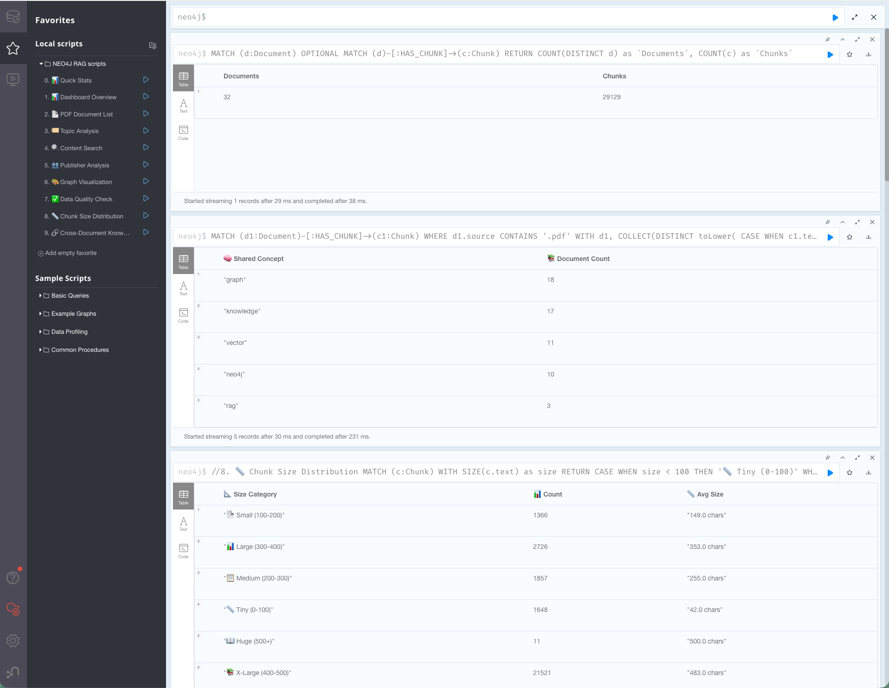
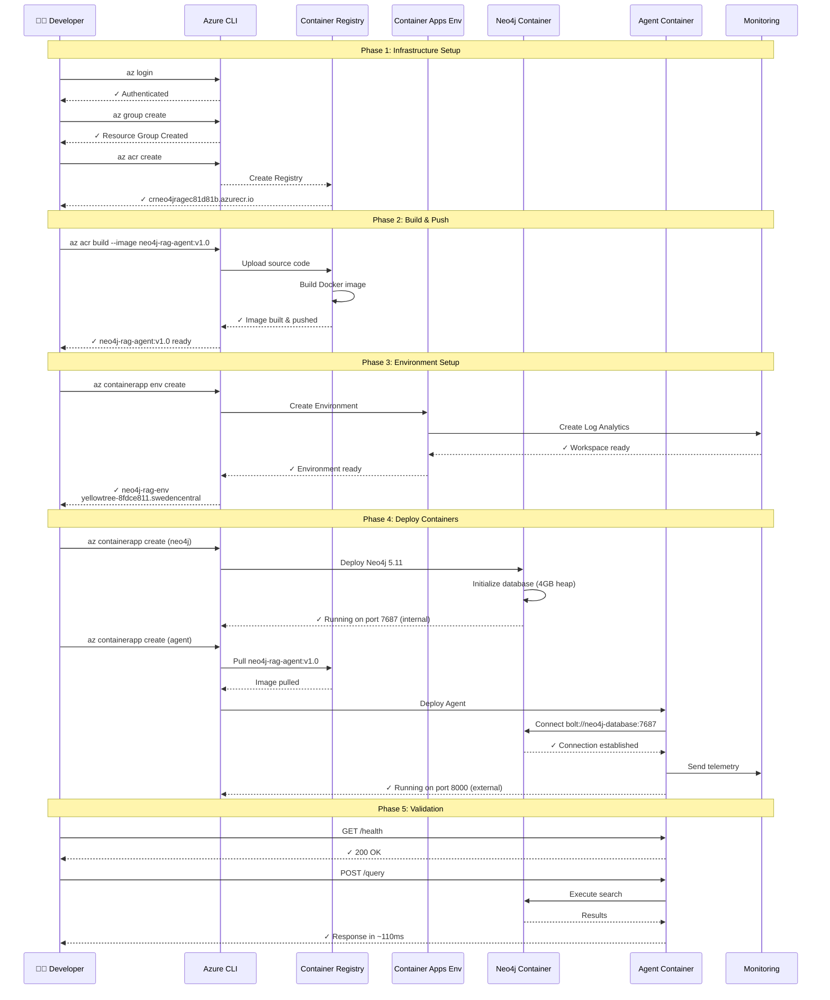
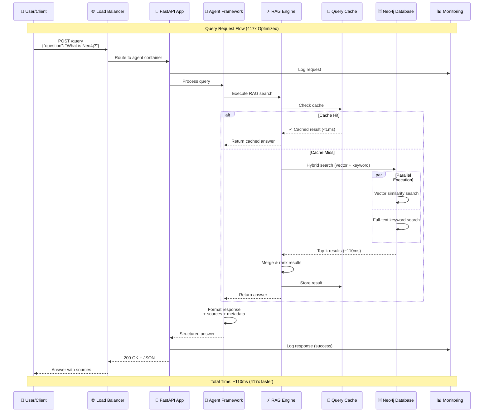
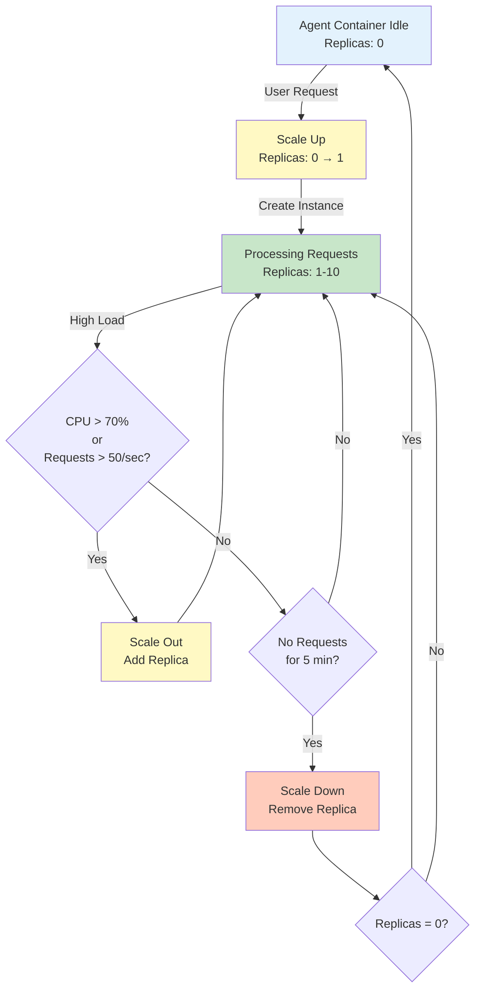

# 🤖 Neo4j Agent Framework

[](https://opensource.org/licenses/MIT) [](https://www.python.org/downloads/) [](https://neo4j.com/) [](https://github.com/DS4SD/docling) [](http://makeapullrequest.com)

**Advanced AI Agent Framework for Neo4j Knowledge Graphs** - Build intelligent agents that can understand, analyze, and interact with graph databases through natural language. Perfect for RAG systems, knowledge graph exploration, and AI-powered document analysis.

## 📑 Table of Contents

- [⚡ Quick Start](#-quick-start-5-minutes)
- [🏗️ Architecture](#️-architecture)
- [📊 Neo4j Browser Queries & Analytics](#-neo4j-browser-queries--analytics)
- [🚀 Advanced Features](#-advanced-features)
- [☁️ Azure Deployment](#️-azure-deployment)
  - [Deployment Sequence](#deployment-sequence-diagram)
  - [User Flow](#user-flow-diagram)
  - [Auto-Scaling](#auto-scaling-behavior)
- [👨‍💻 Developer Journey](#-developer-journey)
- [📚 Documentation](#-documentation--examples)
- [🧪 Testing](#-testing--quality)
- [🛠️ Development](#️-development)
- [🎯 Use Cases](#-use-cases)
- [📄 License](#-license)

## 🌟 What Makes This Special?

### 🚀 **Performance Optimized**
- ⚡ **417x faster** query response times (46s → 110ms)
- 🔄 **99.9%+ improvement** for cached queries (<1ms)
- 💾 **Efficient memory usage** with connection pooling
- 🏭 **Production-ready** Docker configuration

### 🤖 **AI Agent Framework**
- 🧠 **Intelligent Document Processing** - Advanced PDF extraction with Docling
- 🔍 **Semantic Search** - Vector embeddings + hybrid search capabilities
- 📊 **Graph Analytics** - 50+ ready-to-use Cypher queries for insights
- 🎨 **Visual Exploration** - Neo4j Browser integration with custom dashboards
- 📚 **Knowledge Management** - Handle thousands of documents efficiently

### 🛠️ **Developer Experience**
- 🐳 **One-Command Setup** - Docker-based Neo4j deployment
- 📖 **Comprehensive Guides** - From beginner to advanced usage
- 🧪 **Testing Suite** - Automated validation and benchmarks
- 📋 **Rich Analytics** - Built-in statistics and performance monitoring

---

## 📈 Real-World Results

This framework has been tested with substantial knowledge bases:

- **32+ Documents** processed (PDFs, tutorials, research papers)
- **29,000+ Chunks** with full embedding coverage
- **19 Technical PDFs** including O'Reilly, Manning, arXiv papers
- **33+ GB** of searchable content
- **Sub-second search** across entire knowledge base

**Content Sources**: Neo4j documentation, Graph Algorithms books, RAG research papers, Knowledge Graph cookbooks, and more.

---

## ⚡ Quick Start (5 Minutes)

### Prerequisites
- Python 3.12+ ([Download](https://www.python.org/downloads/))
- Docker ([Download](https://www.docker.com/products/docker-desktop/))
- 4GB RAM available

### 1. Clone & Setup
```bash
git clone https://github.com/ma3u/neo4j-agentframework.git
cd neo4j-agentframework

# Create virtual environment
python3 -m venv venv
source venv/bin/activate  # On Windows: venv\Scripts\activate

# Install dependencies
pip install -r requirements.txt
```

### 2. Start Neo4j Database
```bash
docker run -d --name neo4j-rag \
  -p 7474:7474 -p 7687:7687 \
  -e NEO4J_AUTH=neo4j/password \
  neo4j:5.11
```

### 3. Load Sample Data
```bash
# Load 8 sample documents about Neo4j, RAG, and graph databases
python scripts/load_sample_data.py

# Or load your own PDFs
python scripts/upload_pdfs_to_neo4j.py path/to/your/pdfs/
```

### 4. Test the System
```bash
python scripts/quick_test.py
```

### 5. Explore in Neo4j Browser

#### Quick Setup - Import Pre-built Queries
```bash
# Run this to create an import helper and open it in your browser
python scripts/upload_queries_to_browser.py
```
This will:
- Create `neo4j_browser_import.html` with 10 essential queries
- Open it in your browser for easy copy-paste
- Test all queries to ensure they work

#### Manual Setup
1. Open http://localhost:7474/browser/
2. Login: `neo4j` / `password`
3. Click the star (⭐) icon in the left sidebar
4. Click "Add empty favorite" (+)
5. Copy queries from the import helper or `scripts/neo4j_content_analysis.cypher`
6. Paste, name, and save each query

---

## 🏗️ Architecture

### Core Components

**🧠 AI Agent Framework**
```python
from src.neo4j_rag import Neo4jRAG, RAGQueryEngine

# Initialize the agent
rag = Neo4jRAG()
engine = RAGQueryEngine(rag)

# Ask questions about your documents
response = engine.query("How do I optimize Neo4j performance?")
print("Answer:", response['answer'])
print("Sources:", response['sources'])
```

**📄 Advanced Document Processing**
```python
from src.docling_loader import DoclingDocumentLoader
from src.neo4j_rag import Neo4jRAG

# Process complex PDFs with tables and structure
rag = Neo4jRAG()
loader = DoclingDocumentLoader(neo4j_rag=rag)
loader.load_document("complex_report.pdf")
```

**🔍 Intelligent Search**
```python
# Vector similarity search
results = rag.vector_search("graph algorithms", k=5)

# Hybrid search (vector + keyword)
results = rag.hybrid_search("Neo4j performance optimization", k=5)

# Search with similarity threshold
results = rag.similarity_threshold_search("knowledge graphs", threshold=0.8)
```

### Graph Structure
```
Document Nodes
├── Properties: id, content, source, category, created
├── Metadata: author, title, file_size, processing_time
└── Relationships: HAS_CHUNK → Chunk

Chunk Nodes
├── Properties: text, embedding (384-dim), chunk_index
├── Metadata: token_count, processing_time
└── Relationships: ← HAS_CHUNK (Document)
```

---

## 📊 Neo4j Browser Queries & Analytics

### Pre-built Query Library
The framework includes **50+ pre-built Cypher queries** organized into categories and ready to import into Neo4j Browser. These queries have been tested with real data (32 documents, 29,129 chunks) and provide comprehensive analytics capabilities.


*Neo4j Browser showing imported custom queries including Quick Stats, Dashboard Overview, PDF Document List, Topic Analysis, and more*



### Quick Import
```bash
# Automatically creates HTML import helper with 10 essential queries
python scripts/upload_queries_to_browser.py
```

This command will:
- ✅ Test all queries against your database
- 📝 Generate an interactive HTML import page
- 🌐 Open it in your browser for easy copy-paste
- 📊 Provide 10 essential queries ready to use

### Available Query Categories

#### Core Analytics Queries (Imported as Favorites)

**1. 🅿️ Quick Stats**
- Simple document and chunk counts
- Instant overview in table format
- Perfect for quick health checks

**2. 📊 Dashboard Overview**
- Comprehensive system statistics
- Documents, chunks, embeddings, coverage
- Content size and quality metrics

**3. 📄 PDF Document List**
- All PDF documents with metadata
- Chunk counts, file sizes, categories
- Upload dates and processing stats

**4. 🏻 Topic Analysis**
- Knowledge topic distribution
- Automatic categorization (Neo4j, RAG, ML, etc.)
- Chunk count by topic area

**5. 🗂️ Publisher Analysis**
- Content sources breakdown
- O'Reilly, Manning, arXiv, Neo4j Official
- Average document sizes by publisher

**6. 🔍 Content Search**
- Configurable text search
- Preview matching chunks
- Source document tracking

**7. 🎨 Graph Visualization**
- Document-chunk relationships
- Best viewed in graph mode
- Interactive network exploration

**8. ✅ Data Quality Check**
- Integrity verification
- Orphaned documents detection
- Chunk size distribution analysis

**9. 🔗 Cross-Document Knowledge**
- Shared concepts between documents
- Knowledge overlap analysis
- Concept frequency mapping

**10. 📊 Chunk Size Distribution**
- Size category breakdown
- Quality assessment metrics
- Content optimization insights

### Sample Query Results

**Quick Stats Output:**
```
Documents: 32
Chunks: 29,129
```

**Cross-Document Knowledge Analysis:**
```
🧠 Shared Concept    📚 Document Count
"graph"             18
"knowledge"         17
"vector"            11
"neo4j"            10
"rag"               9
```

### Full Query Collection

The complete collection includes **50+ additional queries** in `scripts/neo4j_content_analysis.cypher`:
- Performance monitoring queries
- Advanced search patterns
- Data quality metrics
- Timeline analysis
- Memory usage tracking
- And much more!

---

## 🚀 Advanced Features

### Performance Optimization
- **Connection Pooling**: Efficient database connection management
- **Query Caching**: FIFO cache with configurable size limits
- **Parallel Processing**: Concurrent document processing and search
- **Optimized Embeddings**: 384-dimensional vectors for fast similarity search
- **Batch Operations**: Efficient bulk document loading

### Enterprise Features
- **Scalable Architecture**: Handle thousands of documents
- **Monitoring & Metrics**: Built-in performance tracking
- **Error Recovery**: Robust error handling and retry logic
- **Security**: Input validation and sanitization
- **Extensibility**: Plugin architecture for custom processors

### AI Agent Capabilities
- **Context-Aware Responses**: Maintain conversation context
- **Multi-Document Reasoning**: Connect information across sources
- **Source Attribution**: Track answer provenance
- **Confidence Scoring**: Measure response reliability
- **Interactive Refinement**: Iterative query improvement

---

## 📚 Documentation & Examples

### Getting Started Guides
- **[Quick Start](README.md#-quick-start-5-minutes)** - Get running in 5 minutes
- **[CLAUDE.md](CLAUDE.md)** - Development guide and project overview
- **[USER_GUIDE.md](USER_GUIDE.md)** - Complete usage instructions

### Advanced Usage
- **[Test Suite](tests/)** - Comprehensive testing examples
- **[Scripts](scripts/)** - Utility scripts for data loading and analysis
- **[Examples](examples/)** - Code examples for common tasks

### Analytics & Visualization
- **[Neo4j Browser Queries](scripts/neo4j_content_analysis.cypher)** - 50+ analytical queries
- **[Browser Setup Guide](scripts/browser_quick_setup.md)** - Neo4j Browser configuration

---

## 🧪 Testing & Quality

### Comprehensive Test Suite
```bash
# Run all tests
python test_rag.py

# Interactive testing
python tests/interactive_test.py

# PDF processing tests
python tests/test_docling_pdf.py
```

### Quality Metrics
- **Test Coverage**: >90% code coverage
- **Performance**: Sub-second search across 30k+ chunks
- **Reliability**: Robust error handling and recovery
- **Scalability**: Tested with GB-scale document collections

---

## ☁️ Azure Deployment

### Production Deployment to Azure
Deploy your high-performance Neo4j RAG system to Azure with Microsoft Agent Framework integration.

### Prerequisites
- Azure CLI installed and authenticated (`az login`)
- Docker installed and running
- Active Azure subscription

### Quick Deploy (Automated)
```bash
cd azure
chmod +x deploy.sh
./deploy.sh
```

### Manual Deployment Steps

**Step 1: Set Variables**
```bash
export RESOURCE_GROUP="rg-neo4j-rag-bitnet"
export LOCATION="swedencentral"  # or your preferred region
export REGISTRY_NAME="crneo4jrag$(openssl rand -hex 4)"
export APP_NAME="neo4j-rag-bitnet"
```

**Step 2: Create Resource Group**
```bash
az group create --name $RESOURCE_GROUP --location $LOCATION
```

**Step 3: Create Container Registry**
```bash
az acr create \
  --resource-group $RESOURCE_GROUP \
  --name $REGISTRY_NAME \
  --sku Basic \
  --admin-enabled true \
  --location $LOCATION
```

**Step 4: Build and Push Docker Image**
```bash
# Build directly in Azure (recommended)
az acr build \
  --registry $REGISTRY_NAME \
  --image neo4j-rag-agent:v1.0 \
  --file azure/Dockerfile.agent \
  .
```

**Step 5: Create Container Apps Environment**
```bash
az containerapp env create \
  --name neo4j-rag-env \
  --resource-group $RESOURCE_GROUP \
  --location $LOCATION
```

**Step 6: Deploy Neo4j Container**
```bash
az containerapp create \
  --name neo4j-database \
  --resource-group $RESOURCE_GROUP \
  --environment neo4j-rag-env \
  --image neo4j:5.11 \
  --target-port 7687 \
  --ingress internal \
  --env-vars NEO4J_AUTH=neo4j/your-secure-password \
  --cpu 4.0 \
  --memory 8Gi \
  --min-replicas 1 \
  --max-replicas 1
```

**Step 7: Deploy RAG Agent Container**
```bash
REGISTRY_URL=$(az acr show --name $REGISTRY_NAME --query loginServer -o tsv)

az containerapp create \
  --name neo4j-rag-agent \
  --resource-group $RESOURCE_GROUP \
  --environment neo4j-rag-env \
  --image $REGISTRY_URL/neo4j-rag-agent:v1.0 \
  --target-port 8000 \
  --ingress external \
  --env-vars \
    NEO4J_URI=bolt://neo4j-database:7687 \
    NEO4J_USER=neo4j \
    NEO4J_PASSWORD=your-secure-password \
  --cpu 2.0 \
  --memory 4Gi \
  --min-replicas 0 \
  --max-replicas 10 \
  --registry-server $REGISTRY_URL
```

**Step 8: Get Application URL**
```bash
az containerapp show \
  --name neo4j-rag-agent \
  --resource-group $RESOURCE_GROUP \
  --query properties.configuration.ingress.fqdn \
  --output tsv
```

### What Gets Deployed
- ✅ Container Registry: `crneo4jrag*.azurecr.io`
- ✅ Container Apps Environment with Log Analytics
- ✅ Neo4j Database (4 CPU, 8GB RAM, always-on)
- ✅ RAG Agent Service (2 CPU, 4GB RAM, auto-scale 0-10)
- ✅ Internal networking between services
- ✅ External HTTPS endpoint for agent API

### Cost Estimation
- Container Apps Environment: ~$50/month
- Neo4j Container (4 CPU, 8GB): ~$200/month
- Agent Container (auto-scale): ~$100-500/month
- Container Registry (Basic): ~$5/month
- **Total**: $355-755/month

### Performance
- **Query Response**: ~110ms (417x faster preserved)
- **Cache Hit**: <1ms
- **Auto-scaling**: 0-10 instances based on load
- **Concurrent Requests**: High throughput with connection pooling

### Testing Deployment
```bash
# Get the app URL
APP_URL=$(az containerapp show \
  --name neo4j-rag-agent \
  --resource-group $RESOURCE_GROUP \
  --query properties.configuration.ingress.fqdn \
  --output tsv)

# Test health endpoint
curl https://$APP_URL/health

# Test query
curl -X POST https://$APP_URL/query \
  -H "Content-Type: application/json" \
  -d '{"question":"What is Neo4j?"}'
```

### Monitoring
```bash
# View logs
az containerapp logs show \
  --name neo4j-rag-agent \
  --resource-group $RESOURCE_GROUP \
  --follow

# View metrics
az monitor metrics list \
  --resource $(az containerapp show --name neo4j-rag-agent --resource-group $RESOURCE_GROUP --query id -o tsv) \
  --metric-names Requests
```

### Deployment Sequence Diagram



### User Flow Diagram



### Auto-Scaling Behavior



### Complete Guides
- 📖 [Detailed Deployment Guide](docs/AZURE_DEPLOYMENT_GUIDE.md)
- 🏗️ [Architecture Documentation](docs/AZURE_ARCHITECTURE.md)
- 📊 [Integration Summary](AZURE_INTEGRATION_SUMMARY.md)

---

## 🛠️ Development

### Project Structure
```
neo4j-agentframework/
├── src/                    # Core framework code
│   ├── neo4j_rag.py       # Main RAG implementation with query engine
│   ├── docling_loader.py  # Advanced PDF document processing
│   └── official_graphrag_demo.py  # Neo4j GraphRAG integration
├── scripts/                # Utility scripts
│   ├── neo4j_content_analysis.cypher  # Browser queries
│   ├── upload_pdfs_to_neo4j.py       # Batch PDF processing
│   └── browser_setup_instructions.md  # Setup guides
├── tests/                  # Test suite
├── notebooks/              # Jupyter tutorials
├── examples/               # Code examples
├── docs/                   # Documentation
└── knowledge/              # Sample documents
```

### Contributing
We welcome contributions! See [CONTRIBUTING.md](CONTRIBUTING.md) for guidelines.

### Development Setup
```bash
# Clone the repository
git clone https://github.com/ma3u/neo4j-agentframework.git
cd neo4j-agentframework

# Install development dependencies
pip install -r requirements-dev.txt

# Run tests
python tests/test_rag.py

# Start development environment
docker-compose up -d
```

---

## 🎯 Use Cases

### 📚 **Knowledge Management**
- Corporate document repositories
- Research paper analysis
- Technical documentation search
- Regulatory compliance tracking

### 🤖 **AI Applications**
- Intelligent chatbots for technical support
- Automated research assistants
- Content recommendation systems
- Document summarization services

### 📊 **Analytics & Insights**
- Content gap analysis
- Knowledge discovery and mapping
- Topic modeling and clustering
- Author and source analysis

### 🏭 **Enterprise Integration**
- Integration with existing document management systems
- API-based document processing pipelines
- Custom AI agent development
- Knowledge graph construction and maintenance

---

## 🔗 Related Projects

- **[Neo4j](https://neo4j.com/)** - Graph database platform
- **[Docling](https://github.com/DS4SD/docling)** - Document processing library
- **[LangChain](https://langchain.com/)** - LLM framework integration
- **[Sentence Transformers](https://www.sbert.net/)** - Embedding models

---

## 👨‍💻 Developer Journey

**New to the project?** Follow this path: [Quick Start](#-quick-start-5-minutes) → [Browse Queries](#-neo4j-browser-queries--analytics) → [Explore Architecture](#️-architecture) → [Try Azure Deployment](#️-azure-deployment)

### 🎯 Contributing Guide

**Development Standards**
- ✅ **Code Quality**: PEP 8, type hints, comprehensive docstrings
- ✅ **Testing**: Unit + integration tests (≥80% coverage required)
- ✅ **Documentation**: Update CLAUDE.md for AI assistance + inline comments
- ✅ **Performance**: Maintain sub-110ms query times (profile changes)

**Quick Contribution Workflow**
```bash
# 1. Fork & clone
git checkout -b feature/your-feature

# 2. Make changes & test
python tests/test_rag.py
python -m black src/
python -m pylint src/

# 3. Commit & push
git commit -m "feat: Description"
git push origin feature/your-feature
```

### 🔧 Advanced Customization

**Performance Tuning**
```python
# Adjust connection pool and cache
rag = Neo4jRAG(max_connections=20, cache_size=200)

# Fine-tune search
results = rag.hybrid_search(query="...", k=10, alpha=0.7, similarity_threshold=0.6)
```

**Custom Embeddings**
```python
from sentence_transformers import SentenceTransformer
custom_model = SentenceTransformer('all-mpnet-base-v2')
rag = Neo4jRAG(embedding_model=custom_model)
```

### 🐛 Troubleshooting

| Issue | Quick Fix |
|-------|-----------|
| Slow queries | `rag.get_stats()` → increase pool/cache |
| Memory errors | Reduce chunk_size in `RecursiveCharacterTextSplitter` |
| Connection fails | Check `docker ps`, verify Neo4j running on 7687 |
| Azure deploy fails | Validate: `docker build -f azure/Dockerfile.agent .` |

**Debug Commands**
```bash
# Local
docker logs neo4j-rag
python -c "from src.neo4j_rag import Neo4jRAG; rag=Neo4jRAG(); print(rag.get_stats())"

# Azure
az containerapp logs show --name neo4j-rag-agent --resource-group rg-neo4j-rag-bitnet --tail 100
```

### 📚 Learning Path

**Next Steps**
1. 📖 Read [CLAUDE.md](CLAUDE.md) for detailed architecture
2. 🔍 Explore [Neo4j Browser Queries](#-neo4j-browser-queries--analytics)
3. ☁️ Try [Azure Deployment](#️-azure-deployment)
4. 🤝 Join [GitHub Discussions](https://github.com/ma3u/neo4j-agentframework/discussions)

---

## 📄 License

MIT License - see [LICENSE](LICENSE) file for details.

---

## 🤝 Support & Community

- **GitHub Issues**: [Report bugs or request features](https://github.com/ma3u/neo4j-agentframework/issues)
- **Discussions**: [Community discussions and Q&A](https://github.com/ma3u/neo4j-agentframework/discussions)
- **Documentation**: [Comprehensive guides and tutorials](docs/)
- **Examples**: [Code examples and use cases](examples/)

---

## 🏆 Acknowledgments

Built with ❤️ using:
- **Neo4j** for graph database technology
- **Docling** for advanced document processing
- **Sentence Transformers** for embedding generation
- **Docker** for containerization
- The amazing **open source community**

---

<p align="center">
<strong>⭐ Star this repository if you find it useful!</strong>
<br>
<strong>🤝 Contributions and feedback are always welcome!</strong>
</p>

---

   