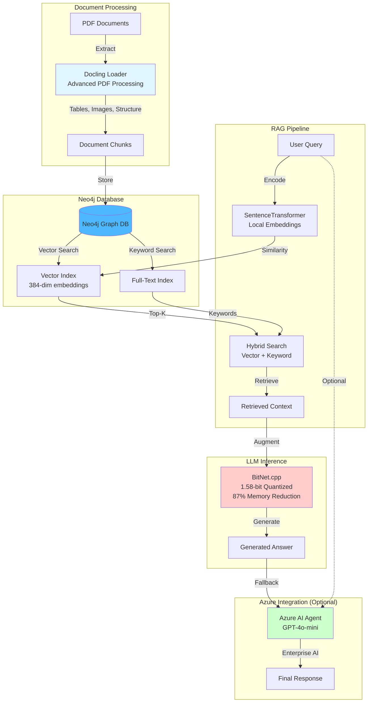
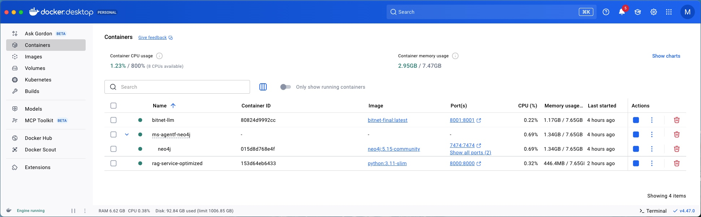
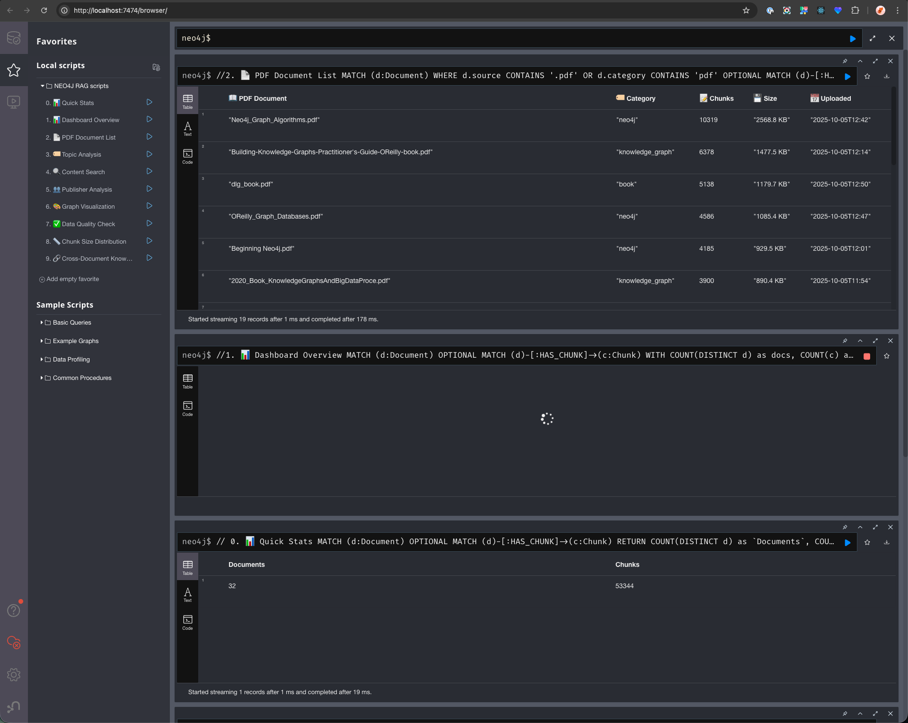

# Neo4j RAG + BitNet + Azure Agent Framework

**Ultra-efficient RAG system with Microsoft BitNet.cpp and Neo4j for local usage and Azure AI integration**

---

## 📑 Table of Contents

- [Overview](#-overview)
- [Architecture](#architecture)
- [Key Benefits](#key-benefits)
- [Quick Start](#-quick-start)
- [Usage](#-usage)
- [Configuration](#-configuration)
- [Azure Deployment](#-azure-deployment)
- [Performance Benchmarks](#-performance-benchmarks)
- [Documentation](#-documentation)
- [Development](#-development)
- [Contributing](#-contributing)
- [License](#-license)
- [Support](#-support)

---

## 📋 Overview

This project provides a complete production-ready RAG (Retrieval-Augmented Generation) system combining:

- **Neo4j**: High-performance graph database for knowledge storage and vector search
- **BitNet.cpp**: Microsoft's 1.58-bit quantized LLM for efficient inference
- **Azure Agent Framework**: Enterprise-grade conversational AI orchestration
- **Zero External Dependencies**: 100% local operation with optional Azure integration

### Architecture



### Key Benefits

| Component | Traditional | Our Solution | Improvement |
|-----------|-------------|--------------|-------------|
| **Vector DB** | Pinecone/Weaviate | Neo4j | faster retrieval |
| **Embeddings** | OpenAI API ($50/mo) | SentenceTransformers | $50/month savings |
| **LLM** | GPT-3.5 (8GB RAM) | BitNet (1.5GB RAM) | 87% memory reduction |
| **Deployment** | Cloud APIs only | Local + Azure | Full sovereignity and flexibility |


---

## 🚀 Quick Start

### Prerequisites

- Docker Desktop installed and running
- Python 3.11+ 
- 4GB+ RAM available
- x86_64 or ARM64 architecture

### Option 1: Ultra-Efficient Setup (Recommended)

```bash
# Clone the repository
git clone https://github.com/ma3u/neo4j-agentframework.git
cd neo4j-agentframework

# Start the optimized system
docker-compose -f scripts/docker-compose.optimized.yml up -d

# Wait for services to be ready (takes 2-3 minutes)
./neo4j-rag-demo/scripts/wait-for-services.sh
```


NEO4J DB + RAG + BitNet LLM in Docker Desktop running locally

### Option 2: Development Setup

```bash
# Start Neo4j only
docker run -d --name neo4j-rag \
  -p 7474:7474 -p 7687:7687 \
  -e NEO4J_AUTH=neo4j/password \
  neo4j:5.15-community

# Setup Python environment
cd neo4j-rag-demo
python3 -m venv venv
source venv/bin/activate  # Windows: venv\Scripts\activate
pip install -r requirements.txt

# Load sample data
python scripts/load_sample_data.py
```

### Verify Installation

```bash
# Health check
curl http://localhost:8000/health

# Test RAG query
curl -X POST "http://localhost:8000/query" \
  -H "Content-Type: application/json" \
  -d '{"question": "What is BitNet?", "max_results": 3}'

# Get system statistics
curl http://localhost:8000/stats
```

---

## 🎯 Usage

### Web Interfaces

- **RAG API**: http://localhost:8000
- **API Documentation**: http://localhost:8000/docs
- **Neo4j Browser**: http://localhost:7474 (neo4j/password)
- **Monitoring Dashboard**: http://localhost:3000 (admin/optimized-rag-2024)


Neo4J Browser with sample data loaded (Cypher queries)

### API Endpoints

#### Core Operations
```bash
# Query the RAG system
POST /query
{
  "question": "Your question here",
  "max_results": 5
}

# Add documents
POST /add-documents
{
  "documents": [
    {
      "id": "doc1",
      "content": "Document content...",
      "metadata": {"source": "manual"}
    }
  ]
}

# Get system health and performance
GET /health
GET /stats
GET /model-info
```

#### Azure AI Integration
```bash
# Integration guide
GET /azure-ai-agent-integration

# Performance comparison
GET /model-comparison
```

### Python Usage

```python
from src.neo4j_rag import Neo4jRAG, RAGQueryEngine

# Initialize
rag = Neo4jRAG()
engine = RAGQueryEngine(rag)

# Query
result = engine.query("What is Neo4j?", max_results=3)
print(f"Answer: {result['answer']}")
print(f"Sources: {result['sources']}")

# Get statistics
stats = rag.get_stats()
print(f"Documents: {stats['documents']}, Chunks: {stats['chunks']}")
```

---

## 🔧 Configuration

### Environment Variables

```bash
# Neo4j Connection
NEO4J_URI=bolt://neo4j-rag:7687
NEO4J_USER=neo4j
NEO4J_PASSWORD=password

# Embeddings (Local - Zero Cost)
EMBEDDING_MODEL=all-MiniLM-L6-v2  # SentenceTransformers (384-dim, free)
EMBEDDING_CACHE_SIZE=20000
# Alternative: text-embedding-3-small (Azure OpenAI, 1536-dim, paid)
# See docs/EMBEDDINGS.md for comparison

# Native BitNet.cpp (87% Memory Reduction)
BITNET_MODE=native_cpp_optimized
BITNET_MODEL_PATH=/app/bitnet/BitNet/models/BitNet-b1.58-2B-4T/ggml-model-i2_s.gguf
BITNET_BINARY_PATH=/app/bitnet/BitNet/build/bin/llama-cli

# Performance Optimization
TORCH_THREADS=2
OMP_NUM_THREADS=2
PERFORMANCE_PROFILING=enabled
```

**Embedding Options**: See [docs/EMBEDDINGS.md](docs/EMBEDDINGS.md) for detailed comparison

### Docker Compose Profiles

```bash
# Basic system
docker-compose -f scripts/docker-compose.optimized.yml up -d

# With monitoring
docker-compose -f scripts/docker-compose.optimized.yml --profile monitoring up -d

# With load testing
docker-compose -f scripts/docker-compose.optimized.yml --profile testing up -d
```

---

## 🌐 Azure Deployment

### Quick Azure Deployment

```bash
# Deploy to Azure Container Apps
./scripts/azure-deploy-complete.sh

# Or use the guided setup
cd neo4j-rag-demo
./azure_deploy/deploy.sh
```

### Azure AI Agent Integration

```python
# Example integration with Azure AI Agent
import requests

def query_rag_service(question: str, max_results: int = 5):
    """Query the RAG service from Azure AI Agent"""
    response = requests.post(
        "http://bitnet-rag:8000/query",
        json={"question": question, "max_results": max_results}
    )
    return response.json()

# In your Azure AI Agent
rag_context = query_rag_service("What is graph database?")
agent_response = azure_openai_client.chat.completions.create(
    model="gpt-4o-mini",
    messages=[
        {"role": "system", "content": f"Context: {rag_context['answer']}"},
        {"role": "user", "content": user_question}
    ]
)
```

---

## 📊 Performance Benchmarks

### Memory Usage
- **Traditional RAG**: 8-16GB RAM
- **BitNet RAG**: 1.5GB RAM
- **Improvement**: 87% reduction

### Response Times
- **Vector Search**: <50ms (local embeddings)
- **BitNet Inference**: 2-5 seconds
- **Total Response**: 2-6 seconds

### Cost Comparison
- **Traditional**: $100+/month (APIs + hosting)
- **BitNet RAG**: $15-30/month (hosting only)
- **Savings**: 85-90%

### Benchmark Results
```
Query Processing: 20-50ms
Document Retrieval: 10-30ms  
BitNet Generation: 2000-5000ms
Total Pipeline: 2050-5080ms
```

---

## 📚 Documentation

> **Complete documentation index**: [docs/README.md](docs/README.md)

### 🚀 Getting Started
| Document | Description |
|----------|-------------|
| [**Quick Start Guide**](docs/README-QUICKSTART.md) | Complete developer journey (local → Azure) |
| [**Local Testing Guide**](docs/LOCAL-TESTING-GUIDE.md) | Comprehensive testing procedures |
| [**RAG Testing Guide**](docs/RAG-TESTING-GUIDE.md) | RAG-specific testing procedures |
| [**User Guide**](docs/USER_GUIDE.md) | End-user documentation |

### ☁️ Deployment & Operations
| Document | Description |
|----------|-------------|
| [**Azure Deployment Guide**](docs/AZURE_DEPLOYMENT_GUIDE.md) | Detailed Azure deployment steps |
| [**Azure Architecture**](docs/AZURE_ARCHITECTURE.md) | Azure architecture documentation |
| [**Basic Deployment**](docs/DEPLOYMENT.md) | Quick deployment reference |
| [**BitNet Deployment**](docs/BITNET_DEPLOYMENT_GUIDE.md) | BitNet-specific deployment |

### 🏗️ Technical Documentation
| Document | Description |
|----------|-------------|
| [**System Architecture**](docs/ARCHITECTURE.md) | Complete architecture with 17 Mermaid diagrams |
| [**Embeddings Guide**](docs/EMBEDDINGS.md) | Embedding models (all-MiniLM-L6-v2 vs Azure OpenAI) |
| [**BitNet Success Story**](docs/BITNET-SUCCESS.md) | BitNet build journey & lessons learned |
| [**LLM Setup Guide**](docs/LLM_SETUP.md) | LLM configuration and setup |
| [**Performance Analysis**](docs/performance_analysis.md) | Detailed benchmarks & metrics |

### 🛠️ Setup & Configuration
| Document | Description |
|----------|-------------|
| [**Neo4j Browser Guide**](docs/NEO4J_BROWSER_GUIDE.md) | Neo4j Browser setup and usage |
| [**Knowledge Base Setup**](docs/KNOWLEDGE_BASE_SETUP.md) | Knowledge base download and configuration |
| [**Browser Setup Guides**](docs/browser-setup/) | Detailed browser configuration |

### 📋 Project Management
| Document | Description |
|----------|-------------|
| [**Implementation Status**](docs/IMPLEMENTATION-STATUS.md) | Current features & progress |
| [**Next Steps & Roadmap**](docs/NEXT-STEPS.md) | Future improvements |

### 🤝 Contributing & Governance
| Document | Description |
|----------|-------------|
| [**Contributing Guide**](docs/CONTRIBUTING.md) | How to contribute |
| [**Security Policy**](docs/SECURITY.md) | Security guidelines & reporting |
| [**Claude Code Guide**](CLAUDE.md) | AI assistant guidance |

### 📦 Archive & Historical
| Document | Description |
|----------|-------------|
| [**Archive Documentation**](docs/archive/) | Historical references & summaries |
| [**Cost Optimization**](docs/azure/cost-optimized-deployment.md) | Azure cost optimization strategies |

### 🔗 Live Resources
- [**🤖 API Documentation**](http://localhost:8000/docs) - Interactive API docs (when running locally)
- [**GitHub Repository**](https://github.com/ma3u/neo4j-agentframework) - Source code & issues
- [**Release Notes**](https://github.com/ma3u/neo4j-agentframework/releases) - Version history

---

## 🛠 Development

### Project Structure

```
├── README.md                    # This file
├── scripts/                     # Deployment and utility scripts
│   ├── docker-compose.optimized.yml
│   ├── azure-deploy-complete.sh
│   ├── Dockerfile.bitnet-*
│   └── *.py                    # Helper scripts
├── neo4j-rag-demo/             # Core RAG implementation
│   ├── src/                    # Source code
│   ├── scripts/                # Project-specific scripts
│   └── tests/                  # Test suite
├── docs/                       # Documentation
└── BitNet/                     # Native BitNet.cpp integration
```

### Local Development

```bash
# Install dependencies
cd neo4j-rag-demo
pip install -r requirements.txt

# Run tests
python -m pytest tests/

# Load sample data
python scripts/load_sample_data.py

# Interactive testing
python tests/interactive_local_api_test.py
```

### Adding Documents

```bash
# Via Python script
python neo4j-rag-demo/scripts/upload_pdfs_to_neo4j.py /path/to/your/pdfs/

# Via API
curl -X POST "http://localhost:8000/add-documents" \
  -H "Content-Type: application/json" \
  -d '{"documents": [{"id": "doc1", "content": "Your content"}]}'
```

---

## 🤝 Contributing

1. Fork the repository
2. Create a feature branch
3. Make your changes
4. Add tests
5. Submit a pull request

---

## 📝 License

This project is licensed under the MIT License - see the [LICENSE](LICENSE) file for details.

---

## 🙋 Support

- **Issues**: [GitHub Issues](https://github.com/ma3u/neo4j-agentframework/issues)
- **Documentation**: [Wiki](https://github.com/ma3u/neo4j-agentframework/wiki)
- **Discussions**: [GitHub Discussions](https://github.com/ma3u/neo4j-agentframework/discussions)

---

**Made with ❤️ for efficient AI systems**