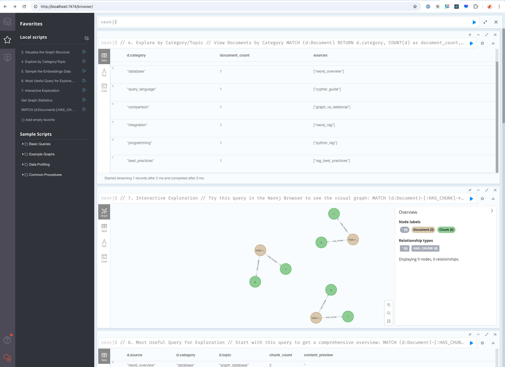

# 🚀 Neo4j RAG System

[](https://opensource.org/licenses/MIT) [](https://www.python.org/downloads/) [](https://neo4j.com/) [](https://github.com/DS4SD/docling)

**Build a powerful question-answering system** using Neo4j graph database and advanced document processing. This RAG (Retrieval-Augmented Generation) system helps you search through documents intelligently and get accurate answers based on your data.



## 📋 Table of Contents

- [What is This?](#-what-is-this)
- [Quick Start (5 Minutes)](#-quick-start-5-minutes)
- [How It Works](#-how-it-works)
- [Basic Usage](#-basic-usage)
- [Learn More](#-learn-more)
- [Troubleshooting](#-troubleshooting)

---

## 🤔 What is This?

**Neo4j RAG System** transforms your documents into a searchable knowledge graph.

### What Can It Do?
- 📄 **Process Documents** - PDFs, Word docs, PowerPoints, and more
- 🔍 **Smart Search** - Find information by meaning, not just keywords
- 💬 **Answer Questions** - Get answers based on your actual documents
- 📊 **Handle Large Data** - Works with thousands of documents efficiently

### Why Neo4j?
Neo4j is a graph database that stores information as a network of connected data, making it perfect for understanding relationships between different pieces of information in your documents.

---

## ⚡ Quick Start (5 Minutes)

### Prerequisites
You need:
- Python 3.12+ ([Download](https://www.python.org/downloads/))
- Docker ([Download](https://www.docker.com/products/docker-desktop/))
- 4GB RAM available

### Step 1: Clone the Project
```bash
git clone https://github.com/yourusername/neo4j-rag-system.git
cd neo4j-rag-system
```

### Step 2: Start Neo4j Database
```bash
docker run -d --name neo4j-rag \
  -p 7474:7474 -p 7687:7687 \
  -e NEO4J_AUTH=neo4j/password \
  neo4j:5.11
```
**What's happening?** This starts a Neo4j database in a container. It's like starting a specialized database server on your computer.

### Step 3: Install Python Dependencies
```bash
python3 -m venv venv
source venv/bin/activate  # On Windows: venv\Scripts\activate
pip install -r requirements.txt
```
**What's happening?** This creates an isolated Python environment and installs all needed libraries.

### Step 4: Test Everything Works
```bash
python quick_test.py
```
**What's happening?** This loads sample documents and runs a test search. You should see:
- ✅ Connected to Neo4j
- ✅ Loaded 8 documents
- ✅ Search working

### Step 5: See Your Data
Open http://localhost:7474 in your browser
- Login: `neo4j`
- Password: `password`

You'll see your documents as a graph!

---

## 🔧 How It Works

### The Simple Version

1. **You add documents** → The system reads them
2. **Documents get split** → Into smaller, manageable chunks
3. **Chunks get "embedded"** → Converted to numbers that capture meaning
4. **Everything goes to Neo4j** → Stored as a searchable graph
5. **You ask questions** → System finds relevant chunks and provides answers

### Visual Architecture

```
Your Documents (PDFs, etc.)
        ↓
    [Docling]  ← Extracts text, tables, structure
        ↓
    [Chunking] ← Splits into paragraphs
        ↓
    [Embedding] ← Converts to searchable format
        ↓
    [Neo4j Database] ← Stores as graph
        ↓
    Your Answers
```

---

## 📖 Basic Usage

### 1. Add Your Documents

**Simple text document:**
```python
from neo4j_rag import Neo4jRAG

rag = Neo4jRAG()
rag.add_document("Your text content here", metadata={"source": "manual"})
rag.close()
```

**PDF with tables (advanced):**
```python
from docling_loader import DoclingDocumentLoader

loader = DoclingDocumentLoader()
loader.load_document("report.pdf")
loader.close()
```

### 2. Search Your Documents

**Find similar content:**
```python
from neo4j_rag import Neo4jRAG

rag = Neo4jRAG()
results = rag.vector_search("What is Neo4j?", k=5)

for result in results:
    print(f"Found: {result['text'][:100]}...")
rag.close()
```

### 3. Ask Questions

**Get answers from your documents:**
```python
from neo4j_rag import Neo4jRAG, RAGQueryEngine

rag = Neo4jRAG()
engine = RAGQueryEngine(rag)

response = engine.query("How do I configure Neo4j?")
print("Answer:", response['answer'])

rag.close()
```

---

## 📚 Learn More

### Interactive Tutorials with Jupyter Notebooks

We provide comprehensive Jupyter notebooks to help you understand and analyze your knowledge graph:

#### Getting Started
1. **`01_setup.ipynb`** - First steps and environment setup
2. **`02_embeddings.ipynb`** - Understanding how embeddings and search work

#### Knowledge Graph Analysis (NEW!)
3. **`03_graph_analysis.ipynb`** - Analyze your knowledge graph structure
   - Graph statistics and metrics
   - Document and chunk distribution
   - Embedding coverage analysis
   - Connectivity and relationship mapping

4. **`04_knowledge_discovery.ipynb`** - Discover insights in your data
   - Semantic similarity networks
   - Topic clustering and visualization
   - Knowledge gap detection
   - Cross-document connections
   - Content recommendations

5. **`05_query_optimization.ipynb`** - Optimize performance
   - Query performance benchmarking
   - Index optimization strategies
   - Batch processing techniques
   - Caching implementation
   - Memory management

### How to Use the Notebooks

1. **Start Jupyter:**
```bash
jupyter notebook
# Or for a specific notebook:
jupyter notebook notebooks/03_graph_analysis.ipynb
```

2. **Follow the guided steps** - Each notebook has clear sections and explanations

3. **Run cells in order** - Press Shift+Enter to execute each cell

4. **Explore your data** - Notebooks generate visualizations and insights about your knowledge graph

### Upload Notebooks to Neo4j Knowledge Graph

You can also upload the notebook content itself to Neo4j, making the tutorials searchable:

```bash
# Upload all notebooks to Neo4j
python upload_notebooks_to_neo4j.py

# Verify the upload
python upload_notebooks_to_neo4j.py --verify
```

This will:
- Process all 5 notebooks and extract their content
- Create ~200 searchable chunks in Neo4j
- Enable semantic search on notebook documentation
- Allow you to find specific code examples and explanations

**Example queries after upload:**
```python
# Search for optimization techniques in notebooks
results = rag.vector_search("performance optimization batch processing", k=5)

# Find graph analysis examples
results = rag.vector_search("graph visualization networkx", k=5)
```

### What You'll Learn from the Notebooks

**Graph Analysis (`03_graph_analysis.ipynb`):**
- How many documents and chunks are in your database
- Which documents have the most content
- Distribution of topics across your knowledge base
- Data quality and completeness metrics
- Export capabilities for external analysis

**Knowledge Discovery (`04_knowledge_discovery.ipynb`):**
- Find hidden connections between documents
- Identify knowledge gaps in your documentation
- Get content recommendations based on similarity
- Visualize topic clusters in your data
- Test different search strategies

**Query Optimization (`05_query_optimization.ipynb`):**
- Measure current query performance
- Compare standard vs optimized implementations
- Learn caching strategies for faster responses
- Optimize batch processing for large datasets
- Reduce memory usage by 30-50%

### Key Concepts Explained

**What are embeddings?**
- Embeddings are like "fingerprints" for text
- Similar meanings have similar fingerprints
- This lets us search by meaning, not exact words

**What are chunks?**
- Large documents are split into smaller pieces
- Each piece (chunk) can be searched independently
- This makes search faster and more accurate

**What is vector search?**
- Searches by semantic similarity (meaning)
- Example: "car" would find "automobile", "vehicle"

**What is hybrid search?**
- Combines semantic search with keyword matching
- Best of both worlds - meaning AND exact terms

### Detailed Documentation

For advanced features and detailed API documentation, see:
- [User Guide](USER_GUIDE.md) - Complete usage instructions
- [API Reference](docs/API.md) - All functions and classes
- [Examples](examples/) - Code examples for common tasks

---

## 🐛 Troubleshooting

### Common Issues

**"Connection refused"**
- Is Docker running? Check with: `docker ps`
- Is Neo4j running? Check: `docker logs neo4j-rag`

**"No module named..."**
- Did you activate the virtual environment? Run: `source venv/bin/activate`
- Did you install requirements? Run: `pip install -r requirements.txt`

**"Out of memory"**
- For large datasets (>1000 docs), use: `from neo4j_rag_optimized import Neo4jRAGOptimized`
- Increase Docker memory in Docker Desktop settings

**No search results**
- Check if data loaded: `python -c "from neo4j_rag import Neo4jRAG; print(Neo4jRAG().get_stats())"`
- Try broader search terms

### Getting Help

1. Check [Troubleshooting Guide](docs/TROUBLESHOOTING.md)
2. Search [existing issues](https://github.com/yourusername/neo4j-rag-system/issues)
3. Ask on [Neo4j Community Forum](https://community.neo4j.com/)

---

## 🤝 Contributing

We welcome contributions! See [CONTRIBUTING.md](CONTRIBUTING.md) for guidelines.

---

## 📄 License

MIT License - see [LICENSE](LICENSE) file.

---

<p align="center">
Made with ❤️ by the Neo4j RAG Community
<br>
⭐ Star us on GitHub if you find this useful!
</p>