# 🚀 Intelligent Knowledge Base: Neo4j + RAG + AI Agents

**Build production-ready AI that actually remembers and learns - 417x faster vector search with hybrid local/cloud deployment**

Transform your documents into an intelligent knowledge base that combines Neo4j's graph database power with retrieval-augmented generation. Deploy locally for complete control and zero costs, or scale to Azure with enterprise-grade AI agents. Get started in 5 minutes with our Streamlit chat interface and experience AI that truly understands your data.

---

## 📑 Table of Contents

- [Overview](#-overview)
- [Architecture](#architecture)
- [Key Benefits](#key-benefits)
- [Quick Start](#-quick-start)
- [Usage](#-usage)
- [Configuration](#-configuration)
- [Azure Deployment](#-azure-deployment)
- [Performance Benchmarks](#-performance-benchmarks)
- [Documentation](#-documentation)
- [Development](#-development)
- [Contributing](#-contributing)
- [License](#-license)
- [Support](#-support)

---

## 📋 Overview

A production-ready hybrid RAG system that combines Neo4j's graph database with intelligent retrieval and generation capabilities. The system works both locally for development and testing (with optional BitNet.cpp LLM), and in Azure for enterprise production deployments (using AI Foundry's managed models). Built for flexibility, it delivers 417x faster vector search while maintaining complete data sovereignty locally and enterprise scalability in the cloud.

**Core components**: Neo4j (graph database + vector search), RAG Service (intelligent retrieval + generation), BitNet.cpp (optional local LLM - development only), Azure AI Foundry (managed AI models for production - GPT-4o, GPT-4o-mini, etc.).

## Architecture

Two deployment options for maximum flexibility: run everything locally for development with zero external dependencies, or deploy the knowledge base to Azure Container Apps while Azure AI Foundry handles conversational AI as a managed service. Both architectures use the same codebase, enabling seamless transition from development to production.

### Local Development (100% Sovereign)

Run the complete stack on your laptop with full data control and zero recurring costs, including BitNet.cpp for local LLM inference (optional). All components containerized with Docker for easy setup and teardown. Perfect for development, testing, demos, and organizations requiring complete data sovereignty without external API dependencies.

```mermaid
graph TB
    subgraph "User Interface"
        StreamlitUI[🧠 Streamlit Chat UI<br/>Port 8501]
        WebUI[Web Browser]
        WebUI -->|Interact| StreamlitUI
    end

    subgraph "Document Processing"
        Upload[📤 Document Upload<br/>PDF, TXT, MD, DOCX]
        Docling[Docling Loader<br/>Advanced PDF Processing]
        Upload -->|Files| Docling
        Docling -->|Tables, Images, Structure| Chunks[Document Chunks]
    end

    subgraph "Neo4j Database"
        Neo4j[(Neo4j Graph DB<br/>Port 7687)]
        Chunks -->|Store| Neo4j
        Neo4j -->|Vector Search| VectorIdx[Vector Index<br/>384-dim embeddings]
        Neo4j -->|Keyword Search| FullText[Full-Text Index]
    end

    subgraph "RAG Pipeline"
        RAGAPI[RAG Service<br/>Port 8000]
        Embed[SentenceTransformer<br/>Local Embeddings]
        Search[Hybrid Search<br/>Vector + Keyword]

        StreamlitUI -->|Query| RAGAPI
        StreamlitUI -->|Upload| Upload
        RAGAPI -->|Encode| Embed
        Embed -->|Similarity| VectorIdx
        Search -->|Retrieve| Context[Retrieved Context]
        VectorIdx -->|Top-K| Search
        FullText -->|Keywords| Search
    end

    subgraph "LLM Inference"
        BitNet[BitNet.cpp<br/>Port 8001<br/>1.58-bit Quantized<br/>87% Memory Reduction]
        Context -->|Augment| BitNet
        BitNet -->|Generate| Answer[Generated Answer]
        Answer -->|Return| StreamlitUI
    end

    subgraph "Monitoring"
        Health[🏥 Health Checks]
        Stats[📊 System Stats]
        StreamlitUI -->|Monitor| Health
        StreamlitUI -->|Metrics| Stats
        Health -->|Check| Neo4j
        Health -->|Check| RAGAPI
        Health -->|Check| BitNet
        Stats -->|Query| RAGAPI
    end

    style StreamlitUI fill:#ff4b4b
    style Docling fill:#e1f5ff
    style Neo4j fill:#4db8ff
    style BitNet fill:#ffcccc
    style Health fill:#ccffcc
    style RAGAPI fill:#ffe1cc
```



### Azure Cloud Architecture (Enterprise Deployment)

Enterprise production deployment uses Azure Container Apps to host Neo4j database and RAG service as independently scalable containers, providing the intelligent knowledge base layer. Azure AI Foundry provides the complete AI agent solution with access to GPT-4o, GPT-4o-mini, GPT-3.5-turbo, and other models as a fully managed service - no LLM deployment needed. This architecture deploys only the knowledge base (Neo4j + RAG) to containers while leveraging Azure's managed AI services, delivering enterprise capabilities at approximately $326/month for the knowledge base infrastructure.


**Note**: BitNet.cpp and Streamlit are local development tools only - Azure production uses AI Foundry's managed AI models (GPT-4o, GPT-4o-mini, GPT-3.5-turbo, etc.) with Neo4j and RAG Container Apps providing the knowledge base infrastructure.

### Key Benefits

Comparing our solution against traditional RAG implementations shows significant advantages in cost, performance, and flexibility. Using Neo4j instead of specialized vector databases provides both vector search and graph capabilities in one system. Local embeddings and BitNet quantization eliminate expensive API calls while delivering comparable quality. The hybrid deployment model provides sovereignty for development and scalability for production.

| Component | Traditional | Our Solution | Improvement |
|-----------|-------------|--------------|-------------|
| **Vector DB** | Pinecone/Weaviate | Neo4j | faster retrieval |
| **Embeddings** | OpenAI API ($50/mo) | SentenceTransformers | $50/month savings |
| **LLM** | GPT-3.5 (8GB RAM) | BitNet (1.5GB RAM) | 87% memory reduction |
| **Deployment** | Cloud APIs only | Local + Azure | Full sovereignity and flexibility |


---

## 🚀 Quick Start

### Prerequisites

- Docker Desktop installed and running
- Python 3.11+ 
- 4GB+ RAM available
- x86_64 or ARM64 architecture

### Option 1: Ultra-Efficient Setup (Recommended)

The Docker Compose configuration automatically sets up all four services (Neo4j, RAG, BitNet, Streamlit) with optimized memory settings, connection pooling, and intelligent caching. Everything runs locally on your machine with no external API calls or dependencies. Simply start the containers and access the Streamlit UI to begin chatting with your knowledge base immediately.

1. Clone: `git clone https://github.com/ma3u/neo4j-agentframework.git`
2. Start: `docker-compose -f scripts/docker-compose.optimized.yml up -d`
3. Open: [http://localhost:8501](http://localhost:8501)

**What's Included:**
- 🗄️ Neo4j Database (ports 7474, 7687)
- ⚡ RAG Service (port 8000)
- 🤖 BitNet LLM (port 8001) *optional - local development only*
- 🧠 Streamlit Chat UI (port 8501) *local development only*


NEO4J DB + RAG + BitNet LLM in Docker Desktop running locally

### Option 2: Development Setup

```bash
# Start Neo4j only
docker run -d --name neo4j-rag \
  -p 7474:7474 -p 7687:7687 \
  -e NEO4J_AUTH=neo4j/password \
  neo4j:5.15-community

# Setup Python environment
cd neo4j-rag-demo
python3 -m venv venv
source venv/bin/activate  # Windows: venv\Scripts\activate
pip install -r requirements.txt

# Load sample data
python scripts/load_sample_data.py
```

### Verify Installation

```bash
# Health check
curl http://localhost:8000/health

# Test RAG query
curl -X POST "http://localhost:8000/query" \
  -H "Content-Type: application/json" \
  -d '{"question": "What is BitNet?", "max_results": 3}'

# Get system statistics
curl http://localhost:8000/stats
```

---

## 🎯 Usage

### Web Interfaces

After starting the services, multiple web interfaces become available for different purposes: Streamlit for end-user chat interactions, RAG API for programmatic access, Neo4j Browser for database inspection and Cypher queries, and Grafana for performance monitoring. Each interface serves a specific role in development, testing, and operation of the knowledge base system.

- **🧠 Streamlit Chat UI**: http://localhost:8501 (Interactive chat with RAG) **[NEW!]**
- **RAG API**: http://localhost:8000
- **API Documentation**: http://localhost:8000/docs
- **Neo4j Browser**: http://localhost:7474 (neo4j/password)
- **Monitoring Dashboard**: http://localhost:3000 (admin/optimized-rag-2024)

> **📱 Streamlit Chat UI**: Full-featured chat interface with document upload, monitoring dashboard, and real-time RAG responses. See [Streamlit App Documentation](neo4j-rag-demo/streamlit_app/README.md) for details.


Neo4J Browser with sample data loaded (Cypher queries)

### API Endpoints

**Core Operations**: `POST /query`, `POST /add-documents`, `GET /health`, `GET /stats`

**Documentation**: See [http://localhost:8000/docs](http://localhost:8000/docs) for interactive API documentation

### Python Usage

See [API Documentation](neo4j-rag-demo/README.md) and [CLAUDE.md](CLAUDE.md) for Python code examples

---

## 🔧 Configuration

Flexible configuration through environment variables for Neo4j connection, embedding models, and BitNet optimization settings. Docker Compose profiles enable different deployment modes: basic system for development, monitoring profile with Grafana/Prometheus for performance analysis, and testing profile for load testing. All settings are documented with sensible defaults that work out of the box.

**Environment**: `NEO4J_URI`, `NEO4J_PASSWORD`, `EMBEDDING_MODEL`, `BITNET_MODE` | **Guide**: [Configuration](CLAUDE.md#configuration)

**Docker Profiles**: Basic: `docker-compose up -d` | Monitoring: `--profile monitoring` | Testing: `--profile testing`

---

## 🌐 Azure Deployment

### Quick Azure Deployment

The automated deployment script creates all necessary Azure resources including Container Apps for Neo4j and RAG, Key Vault for secrets, Application Insights for monitoring, and configures networking between components. The entire process takes about 30 minutes and sets up a production-ready environment with auto-scaling and managed identity authentication.

Run `./scripts/azure-deploy-enterprise.sh` to deploy Neo4j + RAG Container Apps

### Configure Azure AI Assistant

After deploying the knowledge base, integrate it with your Azure AI Foundry agent by running the configuration script. This adds custom tools for searching the knowledge base, uploading documents, and retrieving statistics. Your AI agent can then leverage the 417x performance improvements for instant, grounded responses.

After deployment, configure your AI Assistant: `python scripts/configure-azure-assistant.py`

**What it configures:**
- ✅ Adds 4 custom tools (search, add document, stats, health)
- ✅ Updates instructions for Neo4j RAG usage
- ✅ Sets optimal parameters for knowledge base queries
- ✅ Enables 417x performance for your Assistant

**Your Assistant**:
- **ID**: `asst_LHQBXYvRhnbFo7KQ7IRbVXRR`
- **Name**: Neo4j RAG Assistant (updated from Assistant347)
- **Model**: gpt-4o-mini
- **Tools**: 4 Neo4j RAG functions

**Test in playground**: Ask "What is Neo4j?" and verify it searches the knowledge base.

See [ASSISTANT_CONFIGURATION.md](docs/ASSISTANT_CONFIGURATION.md) for detailed setup guide.

### Azure AI Agent Integration

See [Azure AI Integration Guide](docs/AZURE_CLOUD_ARCHITECTURE.md) for Python integration examples

---

## 📊 Performance Benchmarks

Significant improvements across memory usage, response times, and costs through intelligent optimization and quantization. BitNet's 1.58-bit quantization reduces memory by 87% while maintaining answer quality, enabling deployment on consumer hardware. Vector search optimizations achieve 417x speed improvements over baseline implementations through connection pooling, intelligent caching, and parallel processing.

**Memory**: Traditional 8-16GB → BitNet 1.5GB (87% reduction)

**Speed**: Vector search 46s → 110ms (417x faster), Total response 5-10s → 2-6s (sub-second with cache)

**Cost**: Traditional $100+/month → BitNet $15-30/month (85-90% savings), Azure deployment ~$326/month

---

## 📚 Documentation

Comprehensive documentation covering everything from quick start guides to detailed Azure deployment procedures. Organized into getting started guides, deployment and operations manuals, technical architecture documentation, and testing procedures. Each guide is self-contained with clear examples and troubleshooting sections.

**Complete index**: [docs/README.md](docs/README.md)

### 🚀 Getting Started

Essential guides to get you up and running quickly, from complete developer journey to specific testing procedures. Each guide is self-contained with prerequisites, step-by-step instructions, and troubleshooting sections. Start with the Quick Start Guide for the fastest path to a working system.

| Document | Description |
|----------|-------------|
| [**Quick Start Guide**](docs/README-QUICKSTART.md) | Complete developer journey (local → Azure) |
| [**Streamlit Chat UI**](neo4j-rag-demo/streamlit_app/README.md) | Interactive chat interface documentation **[NEW!]** |
| [**Local Testing Guide**](docs/LOCAL-TESTING-GUIDE.md) | Comprehensive testing procedures |
| [**RAG Testing Guide**](docs/RAG-TESTING-GUIDE.md) | RAG-specific testing procedures |
| [**User Guide**](docs/USER_GUIDE.md) | End-user documentation |

### ☁️ Deployment & Operations

Detailed guides for deploying to Azure Container Apps with comprehensive coverage of architecture decisions, security configuration, and operational procedures. Includes both automated deployment scripts and manual step-by-step instructions. Each guide explains cost considerations, scaling strategies, and monitoring setup for production environments.

| Document | Description |
|----------|-------------|
| [**Azure Deployment Guide**](docs/AZURE_DEPLOYMENT_GUIDE.md) | Detailed Azure deployment steps |
| [**Azure Architecture**](docs/AZURE_ARCHITECTURE.md) | Azure architecture documentation |
| [**Basic Deployment**](docs/DEPLOYMENT.md) | Quick deployment reference |
| [**BitNet Deployment**](docs/BITNET_DEPLOYMENT_GUIDE.md) | BitNet-specific deployment |

### 🏗️ Technical Documentation

Deep technical documentation covering system architecture, performance optimization strategies, and component integration details. Includes 17 Mermaid diagrams visualizing system flows, embedding model comparisons, and the complete BitNet build journey with lessons learned. Essential reading for understanding implementation decisions and optimization techniques.

| Document | Description |
|----------|-------------|
| [**System Architecture**](docs/ARCHITECTURE.md) | Complete architecture with 17 Mermaid diagrams |
| [**Embeddings Guide**](docs/EMBEDDINGS.md) | Embedding models (all-MiniLM-L6-v2 vs Azure OpenAI) |
| [**BitNet Success Story**](docs/BITNET-SUCCESS.md) | BitNet build journey & lessons learned |
| [**LLM Setup Guide**](docs/LLM_SETUP.md) | LLM configuration and setup |
| [**Performance Analysis**](docs/performance_analysis.md) | Detailed benchmarks & metrics |

### 🛠️ Setup & Configuration
| Document | Description |
|----------|-------------|
| [**Neo4j Browser Guide**](docs/NEO4J_BROWSER_GUIDE.md) | Neo4j Browser setup and usage |
| [**Knowledge Base Setup**](docs/KNOWLEDGE_BASE_SETUP.md) | Knowledge base download and configuration |
| [**Browser Setup Guides**](docs/browser-setup/) | Detailed browser configuration |

### 📋 Project Management
| Document | Description |
|----------|-------------|
| [**Implementation Status**](docs/IMPLEMENTATION-STATUS.md) | Current features & progress |
| [**Next Steps & Roadmap**](docs/NEXT-STEPS.md) | Future improvements |

### 🤝 Contributing & Governance
| Document | Description |
|----------|-------------|
| [**Contributing Guide**](docs/CONTRIBUTING.md) | How to contribute |
| [**Security Policy**](docs/SECURITY.md) | Security guidelines & reporting |
| [**Claude Code Guide**](CLAUDE.md) | AI assistant guidance |

### 📦 Archive & Historical
| Document | Description |
|----------|-------------|
| [**Archive Documentation**](docs/archive/) | Historical references & summaries |
| [**Cost Optimization**](docs/azure/cost-optimized-deployment.md) | Azure cost optimization strategies |

### 🔗 Live Resources
- [**🤖 API Documentation**](http://localhost:8000/docs) - Interactive API docs (when running locally)
- [**GitHub Repository**](https://github.com/ma3u/neo4j-agentframework) - Source code & issues
- [**Release Notes**](https://github.com/ma3u/neo4j-agentframework/releases) - Version history

---

## 🛠 Development

Well-organized project structure with core RAG implementation in `neo4j-rag-demo/`, deployment scripts in `scripts/`, comprehensive documentation in `docs/`, and native BitNet.cpp integration. The modular design separates concerns: source code, tests, deployment configs, and documentation for easy navigation and maintenance.

**Project structure**: See [CLAUDE.md](CLAUDE.md#project-structure) for detailed layout

**Local development**: Install dependencies, run tests, load data | **Guide**: [Development Guide](CLAUDE.md)

**Adding documents**: Via Streamlit UI, Python scripts, or REST API | **Details**: [API Documentation](neo4j-rag-demo/README.md)

---

## 🤝 Contributing

Contributions welcome through pull requests following the standard GitHub workflow. Fork the repository, create a feature branch, make changes with tests, and submit a PR for review. See [CLAUDE.md](CLAUDE.md) for development guidelines, project structure, and coding standards to ensure consistency across the codebase.

---

## 📝 License

This project is licensed under the MIT License - see the [LICENSE](LICENSE) file for details.

---

## 🙋 Support

- **Issues**: [GitHub Issues](https://github.com/ma3u/neo4j-agentframework/issues)
- **Documentation**: [Wiki](https://github.com/ma3u/neo4j-agentframework/wiki)
- **Discussions**: [GitHub Discussions](https://github.com/ma3u/neo4j-agentframework/discussions)

---

**Made with ❤️ for efficient AI systems**