# Neo4j Hybrid RAG System

**Intelligent document search and generation with Neo4j graph database + local/cloud LLM options**

Transform your documents into an intelligent knowledge base that combines Neo4j's graph database power with retrieval-augmented generation. Deploy 100% locally for complete control, or scale to Azure for enterprise production.

---

## 🎯 What It Does

- **Stores documents** in Neo4j with vector embeddings and graph relationships
- **Searches intelligently** using hybrid vector + keyword + graph search  
- **Generates answers** using local BitNet LLM (1.58-bit quantized) or Azure OpenAI
- **Scales flexibly** from local development to enterprise cloud deployment

## 🏗️ Architecture Options

This project demonstrates production-ready hybrid RAG system that combines Neo4j's graph database with intelligent retrieval and generation capabilities. The system works both locally for development and testing (with optional BitNet.cpp LLM), and in Azure for enterprise production deployments (using AI Foundry's managed models). Built for flexibility, it delivers fast vector search while maintaining complete data sovereignty locally and enterprise scalability in the cloud.

**Core components:**

- Graph database + vector search)
- RAG Service (intelligent retrieval + generation)
- High-efficiency LLM model 
- Streamlit Chat UI (interactive interface for local testing)
- Azure AI Foundry (Assistent + managed AI models for production)

### Local Development (100% Sovereign)

Run the complete stack on your laptop with full data control and zero recurring costs, including BitNet.cpp for local LLM inference (optional). All components containerized with Docker for easy setup and teardown. Perfect for development, testing, demos, and organizations requiring complete data sovereignty without external API dependencies.

**100% sovereign deployment for complete data control and privacy.** Ideal for organizations with strict data residency requirements, development teams wanting full control over their infrastructure, or anyone seeking to avoid cloud costs and API dependencies. Run the entire AI-powered knowledge base on your laptop, development server, or private cloud infrastructure with zero external API calls. Perfect for offline environments, sensitive data processing, regulatory compliance scenarios, or simply learning and experimenting without cloud commitments.

**Use Cases**: Development environments, sensitive data processing, regulatory compliance, offline operations, learning & experimentation
**Benefits**: Zero cloud costs, complete data sovereignty, no external dependencies, full infrastructure control
**Performance**: fast search, 87% memory reduction

```mermaid
graph LR
    USER[👤 User<br/>Web Browser]

    subgraph Docker["🐳 Docker Containers"]
        UI[🧠 Streamlit UI<br/>Document Upload<br/>Q&A Interface]
        RAG[⚡ RAG Service<br/>FastAPI + Docling<br/>SentenceTransformers]
        DB[(🗄️ Neo4j Database<br/>Vector + Keyword Search<br/>417x Faster)]
        BitNet[🤖 BitNet.cpp<br/>1.58-bit LLM<br/>87% Memory Reduction]
    end

    USER -->|Interact| UI
    UI -->|Query| RAG
    RAG -->|Search| DB
    DB -->|Context| RAG
    RAG -->|Generate| BitNet
    BitNet -->|Answer| UI
    UI -->|Display| USER

    classDef userClass fill:#e1f5ff,stroke:#01579b,stroke-width:2px
    classDef containerClass fill:#e8f5e9,stroke:#2e7d32,stroke-width:2px

    class USER userClass
    class UI,RAG,DB,BitNet containerClass
```




### Azure Production (Enterprise Scale)

**Production-ready enterprise deployment with automatic scaling and managed services.** Ideal for organizations needing high availability, automatic scaling based on demand, and enterprise-grade AI capabilities through Azure AI Foundry. Scales from zero to ten replicas automatically based on traffic, eliminating infrastructure management overhead while maintaining exceptional performance. Perfect for production applications, customer-facing services, multi-user environments, and integrations with Microsoft 365, Teams, or custom enterprise applications requiring intelligent document search.

Enterprise production deployments uses Neo4j Aura (managed graph database) and RAG service in Azure Container Apps with passwordless authentication via Managed Identity and Key Vault. Azure AI Foundry provides the complete AI agent solution with access to GPT-4o, GPT-5o-mini, and other models as a fully managed service - no LLM deployment needed. This secure architecture eliminates credential management overhead while delivering enterprise capabilities including auto-scaling, audit trails, and SOC 2/GDPR compliance at approximately $65-200/month for Neo4j Aura plus $150/month for RAG Container Apps.

**Use Cases**: Production applications, customer-facing services, multi-user environments, Microsoft 365/Teams integration, enterprise knowledge bases
**Benefits**: Automatic scaling, zero infrastructure management, enterprise-grade AI (gpt-5o-mini), high availability, global reach
**Scalability**: 0-10 replicas auto-scaling, 100+ concurrent users, serverless architecture

```mermaid
graph LR
    subgraph Internet["🌐 Internet"]
        USER[👤 End Users<br/>API Clients]
    end

    subgraph Azure["☁️ Azure Cloud"]
        subgraph AIFoundry["🤖 Azure AI Foundry"]
            ASSISTANT["Azure AI Assistant<br/>━━━━━━━━━━━━━━<br/>ID: asst_LHQBX...<br/>Model: gpt-4o-mini<br/>Deployment: 2025-08-07<br/>━━━━━━━━━━━━━━<br/>Functions:<br/>• search_knowledge_base<br/>• add_document<br/>• get_statistics"]
        end

        subgraph CAE["Container Apps"]
            RAG["⚡ RAG Service<br/>CPU: 2, RAM: 4GB<br/>Replicas: 0-10<br/>━━━━━━━━━━━━━━<br/>FastAPI + Docling<br/>SentenceTransformers<br/>Connection Pool<br/>Query Cache"]
        end

        subgraph Data["🗄️ Data Layer"]
            AURA[(Neo4j Aura<br/>Managed Database<br/>━━━━━━━━━━━━━━<br/>Vector Index 384-dim<br/>Full-text Index<br/>Graph Relationships)]
        end
    end

    %% Left to Right Flow
    USER -->|HTTPS API| ASSISTANT
    ASSISTANT -->|Function Calls| RAG
    RAG <-->|Bolt 7687| AURA

    classDef userClass fill:#e1f5ff,stroke:#01579b,stroke-width:2px
    classDef assistantClass fill:#ffcccc,stroke:#cc0000,stroke-width:2px
    classDef containerClass fill:#e8f5e9,stroke:#2e7d32,stroke-width:2px
    classDef dbClass fill:#fce4ec,stroke:#c2185b,stroke-width:2px

    class USER userClass
    class ASSISTANT assistantClass
    class RAG containerClass
    class AURA dbClass
```




## 🚀 Quick Start

### Prerequisites

- Docker Desktop installed and running
- Python 3.11+
- 4GB+ RAM available
- x86_64 or ARM64 architecture

### Option 1: Ultra-Efficient Setup (Recommended)

The Docker Compose configuration automatically sets up all four services (Neo4j, RAG, BitNet, Streamlit) with optimized memory settings, connection pooling, and intelligent caching. Everything runs locally on your machine with no external API calls or dependencies. Simply start the containers and access the Streamlit UI to begin chatting with your knowledge base immediately.

1. Clone: `git clone https://github.com/ma3u/neo4j-agentframework.git`
2. Start: `docker-compose -f scripts/docker-compose.optimized.yml up -d`
3. Wait 1-2 minutes for all services to initialize
4. Access Neo4j Browser: [http://localhost:7474](http://localhost:7474) (neo4j/password)
5. Open Chat: [http://localhost:8501](http://localhost:8501)


*[Interactive Mockup](https://ma3u.github.io/neo4j-agentframework/) - Streamlit Chat UI with document upload and monitoring dashboard*

**What's Included:**
- 🗄️ Neo4j Database (ports 7474, 7687)
- ⚡ RAG Service (port 8000)
- 🤖 BitNet LLM (port 8001) *optional - local development only*
- 🧠 Streamlit Chat UI (port 8501) *local development only*


*Neo4j Database + RAG Service + BitNet LLM running in Docker Desktop*

### Option 2: Development Setup

For developers who want to modify the RAG service code or debug with breakpoints. Runs Neo4j in Docker but the Python RAG service locally, enabling faster iteration cycles, easier debugging, and direct code editing without rebuilding containers.

```bash
# Start Neo4j only
docker run -d --name neo4j-rag \
  -p 7474:7474 -p 7687:7687 \
  -e NEO4J_AUTH=neo4j/password \
  neo4j:5.15-community

# Setup Python environment
cd neo4j-rag-demo
python3 -m venv venv
source venv/bin/activate  # Windows: venv\Scripts\activate
pip install -r requirements.txt

# Load sample data
python scripts/load_sample_data.py
```

### Verify Installation

```bash
# Health check
curl http://localhost:8000/health

# Test RAG query
curl -X POST "http://localhost:8000/query" \
  -H "Content-Type: application/json" \
  -d '{"question": "What is BitNet?", "max_results": 3}'

# Get system statistics
curl http://localhost:8000/stats
```

## 🎯 Usage

### Web Interfaces

After starting the services, multiple web interfaces become available for different purposes: Streamlit for end-user chat interactions, RAG API for programmatic access, Neo4j Browser for database inspection and Cypher queries, and Grafana for performance monitoring. Each interface serves a specific role in development, testing, and operation of the knowledge base system.

- **🧠 Streamlit Chat UI**: http://localhost:8501 (in development) **[NEW!]**
- **RAG API Documentation**: http://localhost:8000/docs
- **Neo4j Browser**: http://localhost:7474 (neo4j/password)
- **Monitoring Dashboard**: http://localhost:3000 (admin/optimized-rag-2024)

> **📱 Streamlit Chat UI**: Full-featured chat interface with document upload, monitoring dashboard, and real-time RAG responses. See [Streamlit App Documentation](neo4j-rag-demo/streamlit_app/README.md) for details.


*Neo4j Browser with sample data and Cypher query interface*

### API Endpoints

**Core Operations**: `POST /query`, `POST /add-documents`, `GET /health`, `GET /stats`

**Documentation**: See [http://localhost:8000/docs](http://localhost:8000/docs) for interactive API documentation


## 📊 Performance Benefits

| Component | Traditional | This System | Improvement |
|-----------|-------------|-------------|-------------|
| **Vector Search** | Pinecone/Weaviate | Neo4j | 417x faster retrieval |
| **Embeddings** | OpenAI API ($50/mo) | SentenceTransformers | $50/month savings |
| **LLM Memory** | 8-16GB RAM | BitNet 1.5GB | 87% memory reduction |
| **Deployment** | Cloud-only | Local + Cloud | Complete flexibility |

## 🐳 Available Container Images

| Image | Size | Description | Registry |
|-------|------|-------------|----------|
| **bitnet-minimal** | 334MB | Ultra-efficient, external model | `ghcr.io/ma3u/ms-agentf-neo4j/bitnet-minimal` |
| **bitnet-optimized** | 2.5GB | Balanced, embedded model | `ghcr.io/ma3u/ms-agentf-neo4j/bitnet-optimized` |
| **bitnet-final** | 3.2GB | Complete, all features | `ghcr.io/ma3u/ms-agentf-neo4j/bitnet-final` |
| **rag-service** | 2.76GB | High-performance RAG pipeline | `ghcr.io/ma3u/ms-agentf-neo4j/rag-service` |

## 🔧 Configuration

Flexible configuration through environment variables for Neo4j connection, embedding models, and BitNet optimization settings. Docker Compose profiles enable different deployment modes: basic system for development, monitoring profile with Grafana/Prometheus for performance analysis, and testing profile for load testing. All settings are documented with sensible defaults that work out of the box.

**Environment**: `NEO4J_URI`, `NEO4J_PASSWORD`, `EMBEDDING_MODEL`, `BITNET_MODE` | **Guide**: [Configuration](CLAUDE.md#configuration)

**Docker Profiles**: Basic: `docker-compose up -d` | Monitoring: `--profile monitoring` | Testing: `--profile testing`

---

## 🌐 Azure Deployment

### Quick Azure Deployment

The automated deployment script creates all necessary Azure resources including Container Apps for Neo4j and RAG, Key Vault for secrets, Application Insights for monitoring, and configures networking between components. The entire process takes about 30 minutes and sets up a production-ready environment with auto-scaling and managed identity authentication.

Run `./scripts/azure-deploy-enterprise.sh` to deploy Neo4j + RAG Container Apps

### Configure Azure AI Assistant

After deploying the knowledge base, integrate it with your Azure AI Foundry agent by running the configuration script. This adds custom tools for searching the knowledge base, uploading documents, and retrieving statistics. Your AI agent can then leverage the 417x performance improvements for instant, grounded responses.

After deployment, configure your AI Assistant: `python scripts/configure-azure-assistant.py`

**What it configures:**
- ✅ Adds 4 custom tools (search, add document, stats, health)
- ✅ Updates instructions for Neo4j RAG usage
- ✅ Sets optimal parameters for knowledge base queries
- ✅ Enables 417x performance for your Assistant

**Your Assistant:**
- **ID**: `asst_LHQBXYvRhnbFo7KQ7IRbVXRR`
- **Name**: Neo4j RAG Assistant (updated from Assistant347)
- **Model**: gpt-4o-mini
- **Tools**: 4 Neo4j RAG functions


**Test in playground**: Ask "What is Neo4j?" and verify it searches the knowledge base.

See [ASSISTANT_CONFIGURATION.md](docs/ASSISTANT_CONFIGURATION.md) for detailed setup guide.

### Azure AI Agent Integration

See [Azure AI Integration Guide](docs/AZURE_CLOUD_ARCHITECTURE.md) for Python integration examples


### 🚀 Getting Started

Essential guides to get you up and running quickly, from complete developer journey to specific testing procedures. Each guide is self-contained with prerequisites, step-by-step instructions, and troubleshooting sections. Start with the Quick Start Guide for the fastest path to a working system.

| Document | Description |
|----------|-------------|
| [Quick Start Guide](docs/README-QUICKSTART.md) | Complete developer journey (local → Azure) |
| [Streamlit Chat UI](neo4j-rag-demo/streamlit_app/README.md) | Interactive chat interface documentation **[under development]** |
| [Local Testing Guide](docs/LOCAL-TESTING-GUIDE.md) | Comprehensive testing procedures |
| [AG Testing Guide](docs/RAG-TESTING-GUIDE.md) | RAG-specific testing procedures |
| [User Guide](docs]/USER_GUIDE.md) | End-user documentation |

### ☁️ Deployment & Operations

Detailed guides for deploying to Azure Container Apps with comprehensive coverage of architecture decisions, security configuration, and operational procedures. Includes both automated deployment scripts and manual step-by-step instructions. Each guide explains cost considerations, scaling strategies, and monitoring setup for production environments.

| Document | Description |
|----------|-------------|
| [Azure Deployment Guide](docs/AZURE_DEPLOYMENT_GUIDE.md) | Detailed Azure deployment steps |
| [Azure Architecture](docs/AZURE_ARCHITECTURE.md) | Azure architecture documentation |
| [Basic Deployment](docs/DEPLOYMENT.md) | Quick deployment reference |
| [BitNet Deployment](docs/BITNET_DEPLOYMENT_GUIDE.md) | BitNet-specific deployment |

### 🏗️ Technical Documentation

Deep technical documentation covering system architecture, performance optimization strategies, and component integration details. Includes 17 Mermaid diagrams visualizing system flows, embedding model comparisons, and the complete BitNet build journey with lessons learned. Essential reading for understanding implementation decisions and optimization techniques.

| Document | Description |
|----------|-------------|
| [System Architecture](docs/ARCHITECTURE.md) | Complete architecture with 17 Mermaid diagrams |
| [Embeddings Guide](docs/EMBEDDINGS.md) | Embedding models (all-MiniLM-L6-v2 vs Azure OpenAI) |
| [BitNet Success Story](docs/BITNET-SUCCESS.md) | BitNet build journey & lessons learned |
| [LLM Setup Guide](docs/LLM_SETUP.md) | LLM configuration and setup |
| [Performance Analysis](docs/performance_analysis.md) | Detailed benchmarks & metrics |

### 🛠️ Setup & Configuration

| Document | Description |
|----------|-------------|
| [Neo4j Browser Guide](docs/NEO4J_BROWSER_GUIDE.md) | Neo4j Browser setup and usage |
| [Knowledge Base Setup](docs/KNOWLEDGE_BASE_SETUP.md) | Knowledge base download and configuration |
| [Browser Setup Guides](docs/browser-setup/) | Detailed browser configuration |

### 📋 Project Management

| Document | Description |
|----------|-------------|
| [Implementation Status](docs/IMPLEMENTATION-STATUS.md) | Current features & progress |
| [Next Steps & Roadmap](docs/NEXT-STEPS.md) | Future improvements |

### 🤝 Contributing & Governance

| Document | Description |
|----------|-------------|
| [Contributing Guide](docs/CONTRIBUTING.md) | How to contribute |
| [Security Policy](docs/SECURITY.md) | Security guidelines & reporting |
| [Claude Code Guide](CLAUDE.md) | AI assistant guidance |

### 📦 Archive & Historical

| Document | Description |
|----------|-------------|
| [Archive Documentation](docs/archive/) | Historical references & summaries |
| [Cost Optimization](docs/azure/cost-optimized-deployment.md) | Azure cost optimization strategies |

### 🔗 Live Resources

- [API Documentation](http://localhost:8000/docs) - Interactive API docs (when running locally)
- [GitHub Repository](https://github.com/ma3u/neo4j-agentframework) - Source code & issues
- [Release Notes](https://github.com/ma3u/neo4j-agentframework/releases) - Version history

## 🤝 Contributing

Contributions welcome through pull requests following the standard GitHub workflow. Fork the repository, create a feature branch, make changes with tests, and submit a PR for review.

## 📝 License

This project is licensed under the MIT License - see the [LICENSE](LICENSE) file for details.

## 🙋 Support

- **Issues**: [GitHub Issues](https://github.com/ma3u/neo4j-agentframework/issues)
- **Documentation**: [Wiki](https://github.com/ma3u/neo4j-agentframework/wiki)
- **Discussions**: [GitHub Discussions](https://github.com/ma3u/neo4j-agentframework/discussions)

