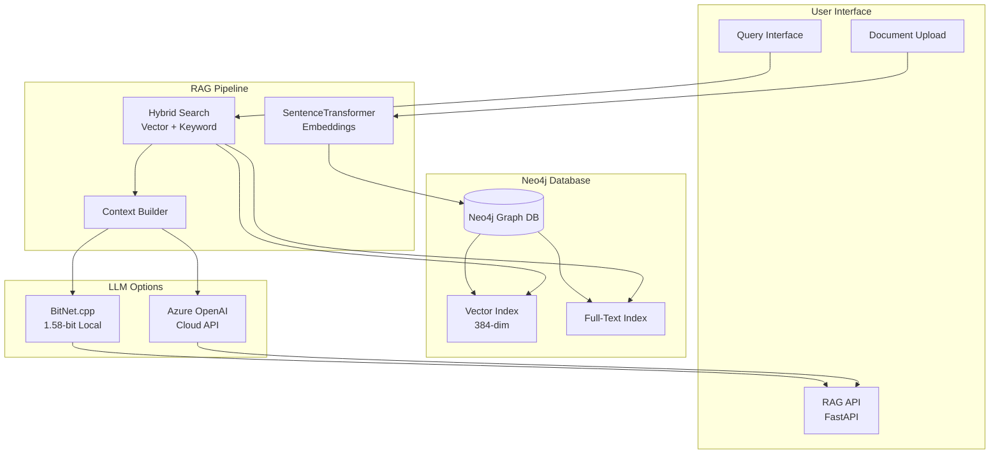

# System Architecture

## 🔗 Quick Navigation
- [← Back to Main README](../README.md) | [Deployment](DEPLOYMENT.md) | [API Reference](API-REFERENCE.md)

High-level design of the Neo4j Hybrid RAG System.

## 🏗️ Overview

The system combines three core components to provide intelligent document search and generation:

1. **Neo4j Database** - Stores documents with vector embeddings and relationships  
2. **RAG Service** - Handles retrieval and orchestration
3. **LLM Engine** - Generates responses (local BitNet or Azure OpenAI)

## 📐 Architecture Diagram



## 🔄 Data Flow

### Document Ingestion
1. **Upload** → Document received via API
2. **Chunk** → Split into manageable pieces  
3. **Embed** → Generate vector embeddings (SentenceTransformer)
4. **Store** → Save in Neo4j with vector and full-text indexes

### Query Processing
1. **Query** → User question received
2. **Embed** → Convert question to vector
3. **Search** → Hybrid search (vector + keyword + graph)
4. **Retrieve** → Get top-k relevant chunks
5. **Generate** → LLM creates answer using context
6. **Return** → Structured response with sources

## 🏠 Local Architecture

**Components**:
- Neo4j Community (graph database)
- SentenceTransformer all-MiniLM-L6-v2 (embeddings)  
- BitNet.cpp with 1.58-bit quantization (LLM)
- FastAPI service (orchestration)

**Benefits**:
- 100% data sovereignty
- No API costs
- Fast local inference
- Works offline

**Trade-offs**:
- Requires local compute resources (~4GB RAM)
- Model quality limited by BitNet capabilities
- Manual updates and maintenance

## ☁️ Azure Architecture  

**Components**:
- Neo4j Aura (managed graph database)
- Azure Container Apps (RAG service)
- Azure OpenAI (LLM generation)
- Azure AI Foundry (agent orchestration)

**Benefits**:
- Auto-scaling and high availability
- Enterprise security and compliance
- Latest OpenAI models
- Managed maintenance

**Trade-offs**:  
- Monthly costs (~$200-350)
- Data leaves your environment
- Internet dependency
- Vendor lock-in risks

## 🔍 Search Strategy

The system uses a **hybrid search approach** combining:

### Vector Search
- **Purpose**: Semantic similarity matching
- **Technology**: Neo4j vector index (COSINE similarity)
- **Dimensions**: 384 (SentenceTransformer all-MiniLM-L6-v2)
- **Performance**: Sub-100ms for most queries

### Keyword Search  
- **Purpose**: Exact term matching
- **Technology**: Neo4j full-text index (Lucene)
- **Features**: Fuzzy matching, stemming, scoring
- **Use case**: Technical terms, proper nouns

### Graph Relationships
- **Purpose**: Context expansion via relationships
- **Technology**: Neo4j Cypher queries
- **Benefits**: Follow document relationships, hierarchies
- **Use case**: Multi-document reasoning

## 🧠 LLM Integration

### Local BitNet.cpp
```
BitNet Binary → Model Loading → Inference → Response
     ↑              ↑             ↑          ↓
334MB container  1.1GB model   ~2s gen    JSON API
```

**Characteristics**:
- 1.58-bit quantization (vs 16-bit traditional)
- 87% memory reduction 
- ARM-optimized kernels
- External model storage

### Azure OpenAI
```
RAG Context → Azure API → Model Inference → Structured Response
     ↑           ↑            ↑               ↓
Local prep   Managed     GPT-4o-mini      Enhanced JSON
```

**Characteristics**:
- Latest model versions
- Higher quality responses  
- Auto-scaling infrastructure
- Pay-per-token pricing

## 📊 Performance Characteristics

### Latency Breakdown
| Component | Local | Azure |
|-----------|-------|-------|
| **Vector Search** | ~50ms | ~100ms |
| **Context Building** | ~20ms | ~30ms |
| **LLM Generation** | ~2000ms | ~500ms |
| **Total Response** | ~2100ms | ~650ms |

### Throughput
| Metric | Local | Azure |
|--------|-------|-------|
| **Concurrent Users** | 1-5 | 10-100+ |
| **Queries/minute** | 20-30 | 100-1000+ |
| **Document Ingestion** | 100/min | 1000+/min |

## 🔧 Scalability Design

### Horizontal Scaling
- **Neo4j**: Cluster mode for read replicas
- **RAG Service**: Multiple container instances  
- **BitNet**: Model sharing via volume mounts

### Vertical Scaling
- **Memory**: More RAM improves model performance
- **CPU**: Faster inference with more cores
- **Storage**: SSD improves Neo4j performance

### Caching Strategy
- **Query Cache**: Recent query results (10-minute TTL)
- **Embedding Cache**: Reuse embeddings for identical text
- **Model Cache**: Keep models loaded in memory

## 🛡️ Security Considerations

### Local Deployment
- All data remains on-premises
- Standard Docker container security
- Neo4j authentication required
- No external API keys needed

### Azure Deployment  
- Azure Managed Identity for authentication
- Key Vault for secrets management
- Network security groups for isolation
- Audit logging via Application Insights

---

**Implementation Details**: See [DEPLOYMENT.md](DEPLOYMENT.md) for setup instructions and [docs/API-REFERENCE.md](docs/API-REFERENCE.md) for usage examples.