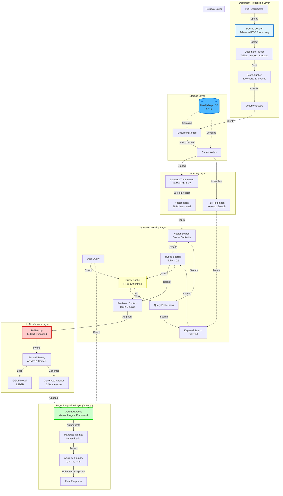
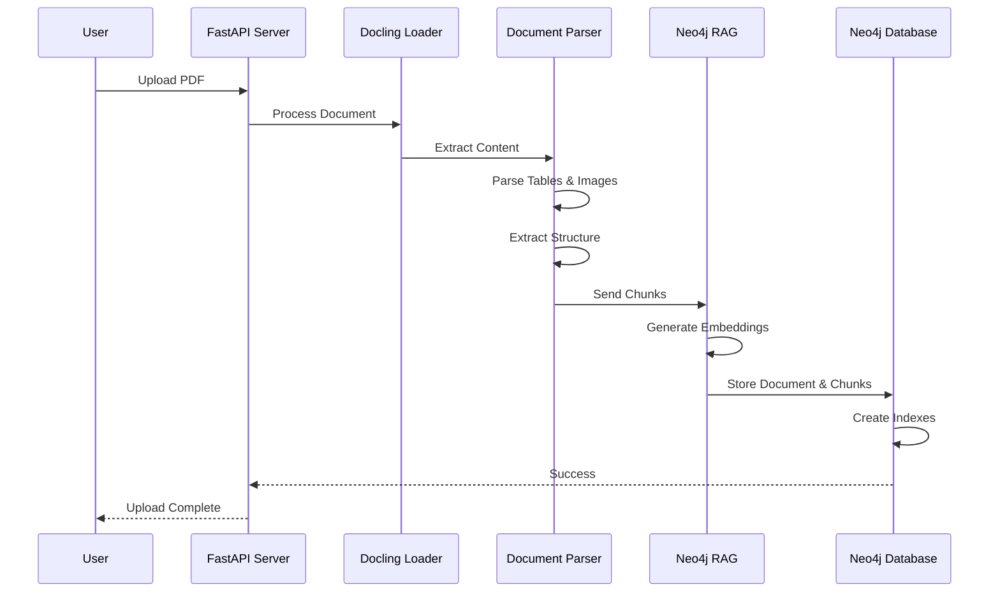
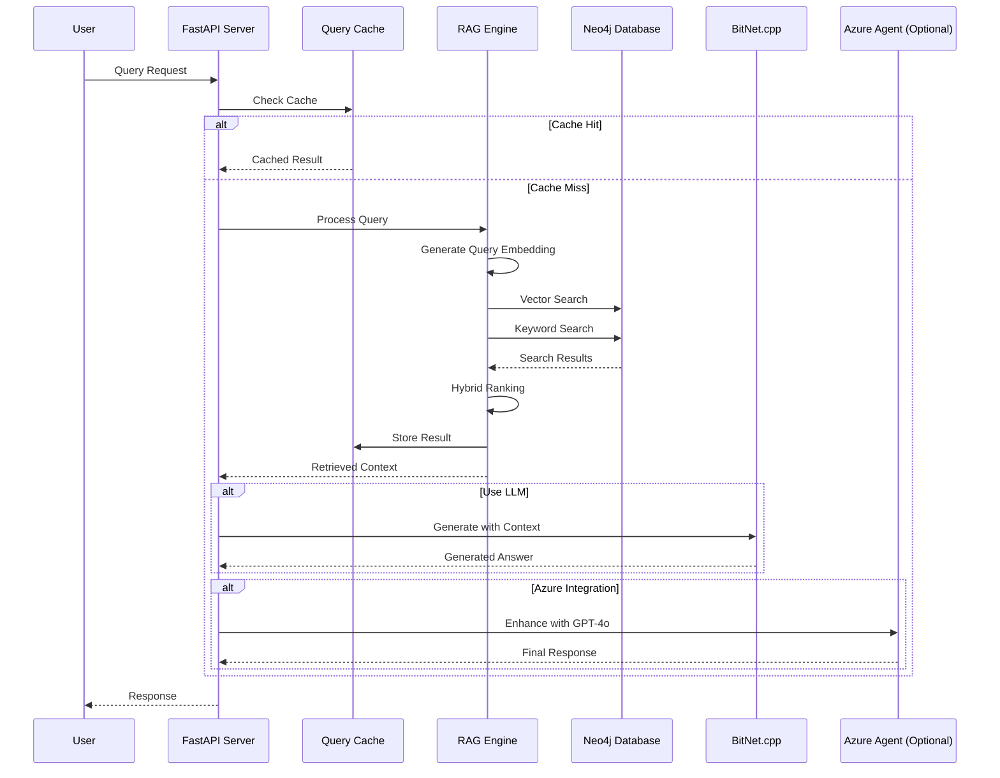
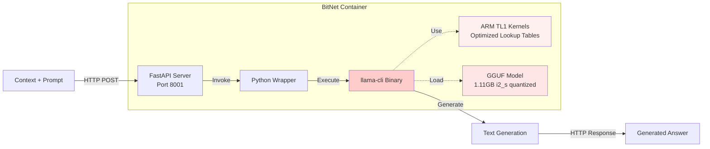
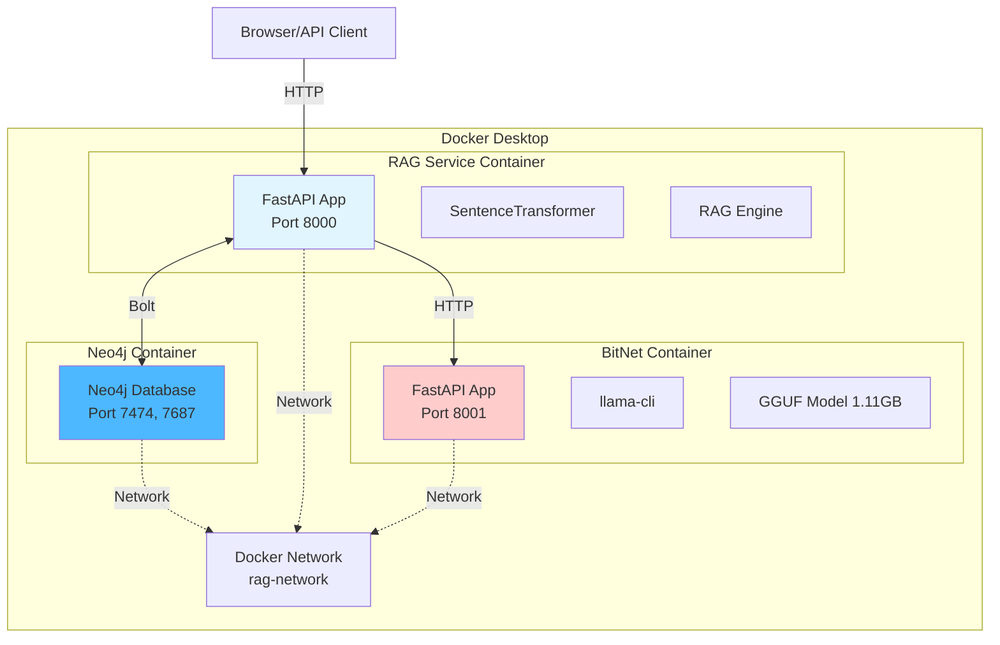
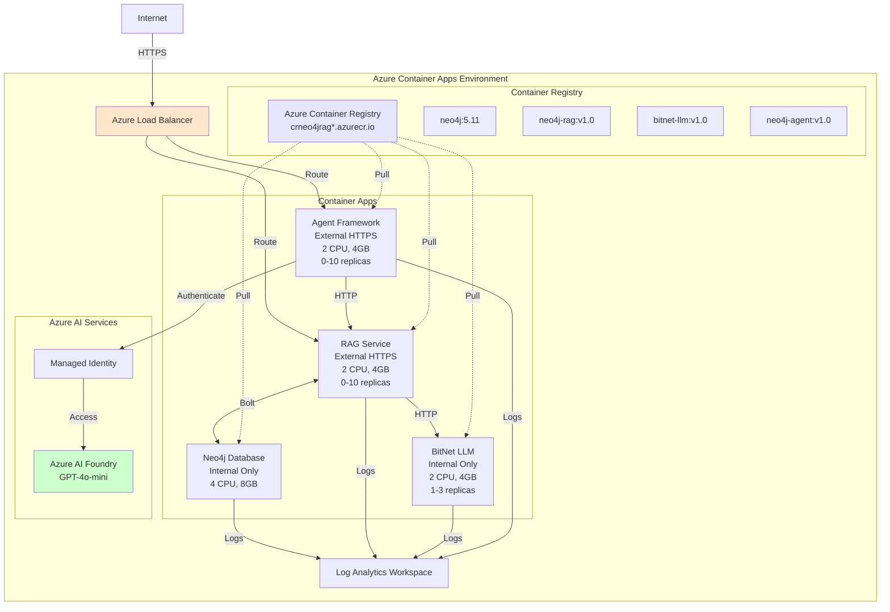
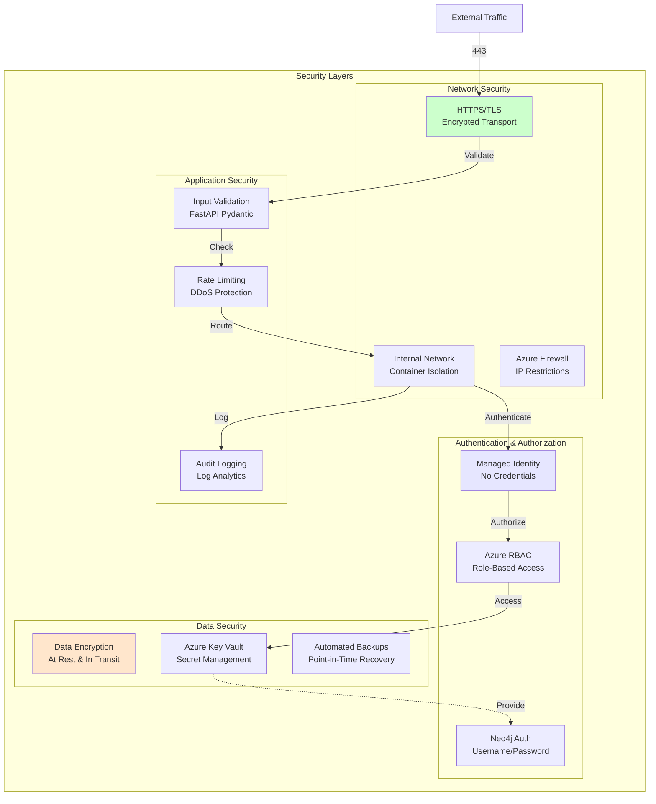
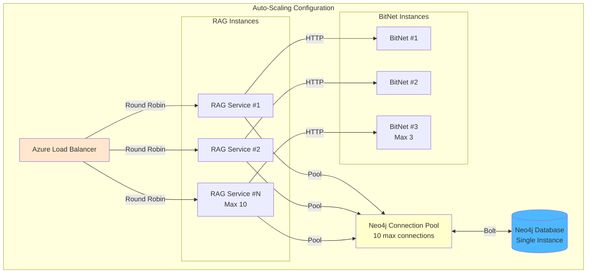
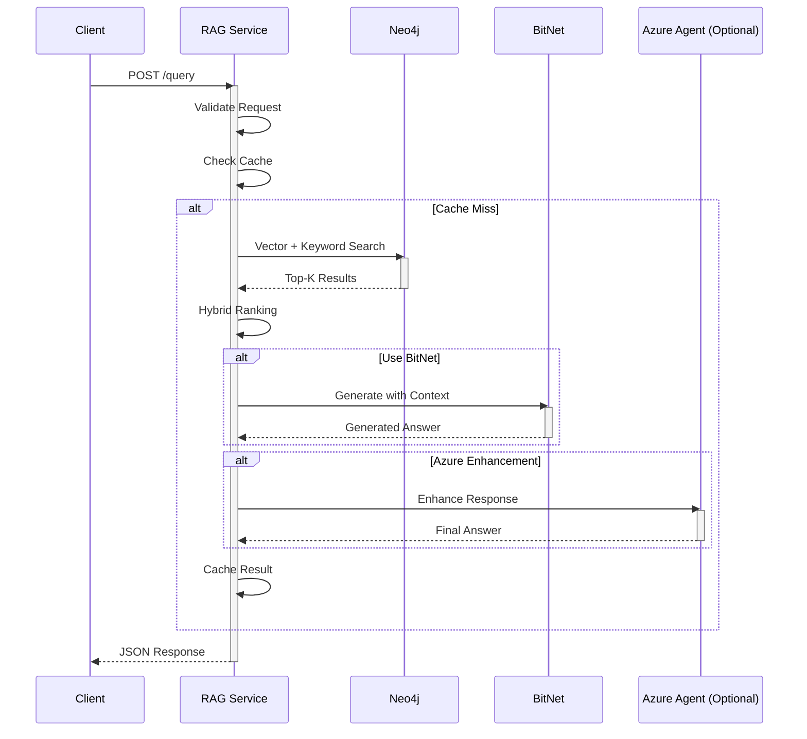

# System Architecture

**Complete technical architecture for Neo4j RAG + BitNet + Azure Agent Framework**

---

## 📐 High-Level Architecture



---

## 🔧 Component Architecture

### 1. Document Processing Pipeline



**Components:**
- **Docling Loader**: Advanced PDF processing with table/image extraction
- **Document Parser**: Extracts structure, metadata, and content
- **Text Chunker**: RecursiveCharacterTextSplitter (300 chars, 50 overlap)
- **Embedding Generator**: SentenceTransformer (all-MiniLM-L6-v2)

### 2. Query Processing Pipeline



**Components:**
- **Query Cache**: FIFO cache with 100 entries (thread-safe)
- **Vector Search**: Cosine similarity on 384-dim embeddings
- **Keyword Search**: Full-text index matching
- **Hybrid Search**: Weighted combination (alpha=0.5)
- **Connection Pool**: 10 max connections to Neo4j

### 3. BitNet Inference Architecture



**Components:**
- **FastAPI Server**: REST API for LLM inference
- **llama-cli Binary**: Compiled with clang-18, ARM optimizations
- **TL1 Kernels**: Generated by `codegen_tl1.py`
- **GGUF Model**: 1.58-bit ternary quantization (-1, 0, +1)

---

## 🏗️ Deployment Architecture

### Local Deployment



**Resources:**
- **Neo4j**: 4GB heap, 2GB pagecache
- **RAG Service**: 2GB RAM, 1 CPU
- **BitNet**: 2GB RAM, 1 CPU
- **Total**: ~6GB RAM, 3 CPUs

### Azure Production Deployment



**Azure Resources:**
- **Resource Group**: rg-neo4j-rag-bitnet
- **Container Registry**: Basic SKU
- **Container Apps Environment**: With Log Analytics
- **Managed Identity**: For secure authentication
- **Auto-scaling**: HTTP-based scaling (0-10 instances)

---

## 📊 Data Flow Architecture

### End-to-End Data Flow

```mermaid
flowchart LR
    subgraph Input
        PDF[PDF Document<br/>50 pages]
    end

    subgraph Processing
        Docling[Docling<br/>Extract 150 chunks]
        Embed[Embed<br/>150 × 384-dim vectors]
    end

    subgraph Storage
        Neo4j[Neo4j<br/>1 Doc + 150 Chunks<br/>+ Indexes]
    end

    subgraph Query
        Q[User Query<br/>"What is Neo4j?"]
        QEmbed[Query Vector<br/>384-dim]
        Search[Search<br/>Top-5 results]
    end

    subgraph Generation
        Context[5 chunks context<br/>~1500 chars]
        BitNet[BitNet Generate<br/>2-5s inference]
        Answer[Answer<br/>200 tokens]
    end

    PDF -->|50 pages| Docling
    Docling -->|150 chunks| Embed
    Embed -->|Store| Neo4j
    Q -->|Encode| QEmbed
    QEmbed -->|Search| Neo4j
    Neo4j -->|Retrieve| Search
    Search -->|Top-5| Context
    Context -->|Augment| BitNet
    BitNet -->|Generate| Answer

    style Docling fill:#e1f5ff
    style Neo4j fill:#4db8ff
    style BitNet fill:#ffcccc
```

**Performance Metrics:**
- **Upload**: 50-page PDF → 2-3s per page → 100-150s total
- **Storage**: 150 chunks × 384-dim → ~230KB embeddings
- **Query**: Encoding 10ms + Search 20ms + Rerank 10ms = 40ms
- **Generation**: Context 1500 chars → BitNet 2-5s → 200 tokens
- **Total**: ~3-6s end-to-end (query + generation)

---

## 🔒 Security Architecture



---

## 📈 Scaling Architecture

### Horizontal Scaling



**Scaling Triggers:**
- **RAG Service**: HTTP concurrency > 10 requests
- **BitNet Service**: CPU > 70% or Memory > 80%
- **Scale-down**: After 5 minutes of low traffic
- **Cool-down**: 3 minutes between scale events

---

## 🔗 Integration Patterns

### API Integration



---

## 📚 Related Documentation

- [**📖 Documentation Index**](README.md) - Complete documentation map
- [**🏗️ Azure Architecture**](AZURE_ARCHITECTURE.md) - Azure-specific architecture
- [**📊 Performance Analysis**](performance_analysis.md) - Performance benchmarks
- [**🚀 Quick Start Guide**](README-QUICKSTART.md) - Getting started
- [**📖 Main README**](../README.md) - Project overview

---

**Last Updated**: 2025-10-05
**Version**: 1.0
**Status**: Production Ready
