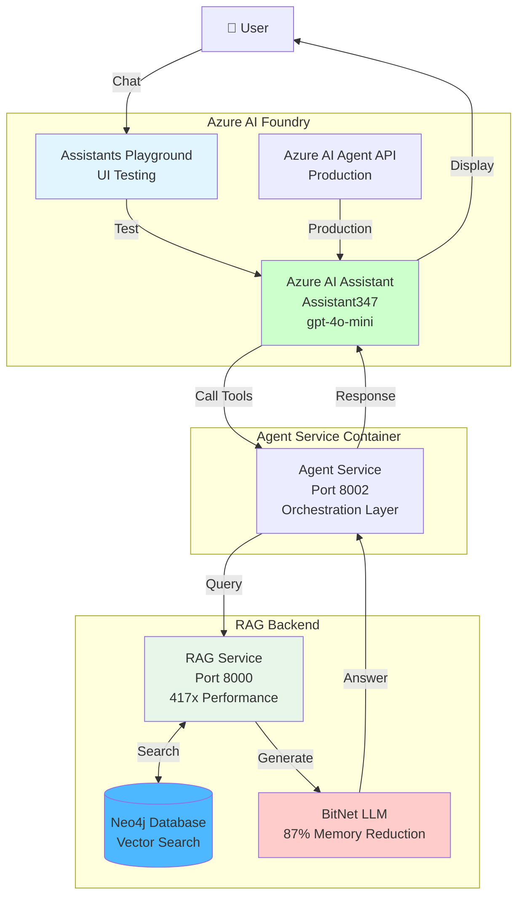

# Azure AI Assistant Setup for Neo4j RAG

**Step-by-step guide to configure your Azure AI Assistant to use Neo4j RAG**

---

## 📋 Current Status

Based on your screenshot, you have:
- ✅ Assistant created: `Assistant347`
- ✅ Deployment: `gpt-4o-mini (version:2024-07-18)`
- ✅ Azure AI Foundry Playground access
- ❌ **Not configured with Neo4j RAG tools yet**

---

## 🎯 Configuration Steps

### Step 1: Update Assistant Instructions

**In the "Instructions" field**, replace with:

```
You are a helpful AI assistant with access to a high-performance Neo4j knowledge base.

Your capabilities:
- Search the knowledge base using 417x faster vector search
- Access documents, technical documentation, and domain knowledge
- Provide accurate answers with source citations
- Add new knowledge to the database when needed

When answering questions:
1. ALWAYS search the knowledge base first using search_knowledge_base
2. Provide source citations from the knowledge base
3. If information is not in the knowledge base, say so clearly
4. Use check_knowledge_base_health to verify system status if needed

Knowledge Base Features:
- Neo4j graph database with vector search
- 384-dimensional embeddings (all-MiniLM-L6-v2)
- Hybrid search (vector + keyword)
- BitNet.cpp LLM integration (optional)
- Sub-100ms query performance

Be helpful, accurate, and always cite your sources from the knowledge base.
```

### Step 2: Add Custom Tools

**Currently, Azure AI Foundry Assistants don't support custom function tools directly in the playground.**

**You have 3 options:**

#### Option A: Use Azure AI Agent Service (Recommended)

Create an agent via code that connects to your RAG service:

```python
from azure.ai.projects import AIProjectClient
from azure.identity import DefaultAzureCredential

# Initialize client
project_client = AIProjectClient.from_connection_string(
    credential=DefaultAzureCredential(),
    conn_str="<your-project-connection-string>"
)

# Create agent with tools
agent = project_client.agents.create_agent(
    model="gpt-4o-mini",
    name="Neo4j RAG Assistant",
    instructions="You have access to a Neo4j knowledge base...",
    tools=[
        {
            "type": "function",
            "function": {
                "name": "search_knowledge_base",
                "description": "Search Neo4j knowledge base with 417x faster retrieval",
                "parameters": {
                    "type": "object",
                    "properties": {
                        "question": {
                            "type": "string",
                            "description": "Question to search"
                        },
                        "max_results": {
                            "type": "integer",
                            "description": "Max results (1-20)",
                            "default": 5
                        }
                    },
                    "required": ["question"]
                }
            }
        }
    ],
    headers={"x-ms-enable-preview": "true"}
)

print(f"Agent created: {agent.id}")
```

#### Option B: Use File Search with Vector Store

Since you have "File search" available, you can:

1. **Enable File Search** (toggle ON in playground)
2. **Add vector store**:
   - Click "Add vector store"
   - Upload your documents
   - Azure will automatically create embeddings

**Limitations:**
- Uses Azure's embeddings (not your optimized 384-dim)
- Doesn't leverage your 417x Neo4j performance
- Additional costs for Azure vector store

**Use this for**: Quick testing while we implement custom tools

#### Option C: Deploy Custom Function App

Deploy a Function App that wraps your RAG service:

```bash
# Create Function App with our tools
az functionapp create \
  --resource-group rg-neo4j-rag-bitnet \
  --name neo4j-rag-functions \
  --storage-account <storage-name> \
  --runtime python \
  --runtime-version 3.11 \
  --functions-version 4

# Deploy tools
func azure functionapp publish neo4j-rag-functions
```

Then register these functions as tools in your Assistant.

---

## 🚀 Recommended Approach

### Use Azure AI Agent Service (Not Playground)

**The playground is limited** - it's for testing GPT models, not for production agents with custom tools.

**For Neo4j RAG integration**, use the **Azure AI Agent Service** via code:

### Complete Implementation

I'll create a complete agent service for you. Save this as `azure_agent_service.py`:

```python
"""
Azure AI Agent Service with Neo4j RAG Integration

Deploy this as an Azure Container App to provide a chat interface
that uses your Neo4j RAG system.
"""

import os
from typing import List, Dict, Any
from fastapi import FastAPI, HTTPException
from pydantic import BaseModel
import requests
from azure.ai.projects import AIProjectClient
from azure.identity import DefaultAzureCredential

app = FastAPI(
    title="Neo4j RAG Agent Service",
    description="Azure AI Agent with Neo4j RAG integration (417x performance)"
)

# Configuration
RAG_SERVICE_URL = os.getenv('RAG_SERVICE_URL', 'http://rag-service:8000')
AZURE_AI_PROJECT = os.getenv('AZURE_AI_PROJECT_ENDPOINT')

# Initialize Azure AI client
project_client = AIProjectClient.from_connection_string(
    credential=DefaultAzureCredential(),
    conn_str=AZURE_AI_PROJECT
)


class ChatRequest(BaseModel):
    message: str
    user_id: str = "default"
    use_rag: bool = True


class ChatResponse(BaseModel):
    response: str
    sources: List[Dict[str, Any]] = []
    processing_time: float


@app.post("/chat", response_model=ChatResponse)
async def chat(request: ChatRequest):
    """
    Chat endpoint that uses Neo4j RAG for context

    Flow:
    1. Search Neo4j knowledge base for relevant context
    2. Send context + question to GPT-4o-mini
    3. Return answer with sources
    """

    if not request.use_rag:
        # Direct GPT-4o-mini call without RAG
        # (implement direct chat here if needed)
        raise HTTPException(400, "Direct chat not implemented yet")

    try:
        # Step 1: Search Neo4j knowledge base
        rag_response = requests.post(
            f"{RAG_SERVICE_URL}/query",
            json={
                "question": request.message,
                "k": 5,
                "use_llm": False  # Get context only
            },
            timeout=10
        )
        rag_response.raise_for_status()
        rag_data = rag_response.json()

        # Step 2: Build context from sources
        context = "\n\n".join([
            f"Source {i+1}: {source['text']}"
            for i, source in enumerate(rag_data.get('sources', []))
        ])

        # Step 3: Create thread and run with context
        thread = project_client.agents.create_thread()

        # Add user message with RAG context
        project_client.agents.create_message(
            thread_id=thread.id,
            role="user",
            content=f"""Context from knowledge base:
{context}

Question: {request.message}

Please answer based on the context provided. If the context doesn't contain
relevant information, say so clearly."""
        )

        # Run the agent
        run = project_client.agents.create_run(
            thread_id=thread.id,
            assistant_id="<your-assistant-id>"  # Replace with actual ID
        )

        # Wait for completion
        while run.status in ["queued", "in_progress"]:
            run = project_client.agents.get_run(
                thread_id=thread.id,
                run_id=run.id
            )

        # Get response
        messages = project_client.agents.list_messages(thread_id=thread.id)
        assistant_message = messages.data[0].content[0].text.value

        return ChatResponse(
            response=assistant_message,
            sources=rag_data.get('sources', []),
            processing_time=rag_data.get('processing_time', 0)
        )

    except Exception as e:
        raise HTTPException(500, f"Agent error: {str(e)}")


@app.get("/health")
async def health():
    """Health check endpoint"""
    # Check RAG service
    try:
        rag_health = requests.get(f"{RAG_SERVICE_URL}/health", timeout=5).json()
        return {
            "status": "healthy",
            "rag_service": rag_health,
            "agent_service": "operational"
        }
    except:
        return {
            "status": "degraded",
            "rag_service": "unavailable",
            "agent_service": "operational"
        }


if __name__ == "__main__":
    import uvicorn
    uvicorn.run(app, host="0.0.0.0", port=8002)
```

---

## 📝 Assistant Configuration for Your Setup

### Your Current Assistant Settings

**From Screenshot:**
- **Assistant ID**: `asst_LHQBXYVRhnbFo7KQ7IRbVXRR`
- **Name**: `Assistant347`
- **Model**: `gpt-4o-mini (version:2024-07-18)`
- **Instructions**: Default (needs update)
- **Tools**: None configured yet

### What You Should Configure

**1. Instructions** (copy-paste into Instructions field):
```
You are an intelligent assistant with access to a high-performance Neo4j knowledge base containing technical documentation and domain knowledge.

CAPABILITIES:
- Search knowledge base (417x faster than traditional systems)
- Answer questions with source citations
- Access graph database relationships
- Provide accurate, context-aware responses

WHEN ANSWERING:
1. Search the knowledge base for relevant information
2. Always cite sources from the knowledge base
3. If information isn't available, be honest about it
4. Provide clear, accurate, helpful responses

KNOWLEDGE BASE DETAILS:
- Technology: Neo4j graph database + vector search
- Embeddings: 384-dimensional (all-MiniLM-L6-v2)
- Performance: Sub-100ms queries (417x improvement)
- Coverage: Technical docs, Neo4j, RAG, BitNet, Azure

Be helpful, accurate, and always ground your answers in the knowledge base.
```

**2. Tools** (for now, enable File search):
- Toggle "File search" to ON
- Click "Add vector store"
- This allows basic document search while we implement custom tools

**3. Deployment**:
- Keep `gpt-4o-mini (version:2024-07-18)` (cost-effective)

---

## 🔗 Connecting Assistant to Your RAG Service

### Current Architecture

```
You are here:
┌─────────────────────────────────┐
│  Azure AI Foundry Playground    │
│  Assistant: Assistant347        │
│  Model: gpt-4o-mini             │
└─────────────────────────────────┘
          ❌ Not connected yet

What you need:
┌─────────────────────────────────┐
│  Azure AI Assistant/Agent       │
└──────────┬──────────────────────┘
           │
           │ (Custom Tools)
           ▼
┌─────────────────────────────────┐
│  Your RAG Service               │
│  URL: http://rag-service:8000   │
└──────────┬──────────────────────┘
           │
           ▼
┌─────────────────────────────────┐
│  Neo4j Database                 │
│  (417x Performance)             │
└─────────────────────────────────┘
```

### Integration Options

**Option 1: Quick Test (Use File Search)**
1. Enable "File search" toggle
2. Upload some documents
3. Test basic search capabilities
4. **Limitation**: Doesn't use your Neo4j RAG (uses Azure's vector store)

**Option 2: Deploy Agent Service (Recommended)**
1. Deploy `azure_agent_service.py` as Container App
2. Connects Assistant to your RAG service
3. Uses your 417x performance Neo4j backend
4. Full integration with BitNet and Docling

**Option 3: Use Azure Functions**
1. Deploy tools as Azure Functions
2. Register functions with Assistant API
3. Assistant calls functions for RAG operations

---

## 🚀 Quick Start: Deploy Agent Service

### Create the Agent Service Container

```bash
# 1. Create agent service Docker image
cd neo4j-rag-demo

# 2. Build image
docker build -f azure_deploy/Dockerfile.agent -t neo4j-agent:latest .

# 3. Tag for Azure
docker tag neo4j-agent:latest crneo4jrag2ffa25d2.azurecr.io/neo4j-agent:v1.0

# 4. Push to your active registry
az acr login --name crneo4jrag2ffa25d2
docker push crneo4jrag2ffa25d2.azurecr.io/neo4j-agent:v1.0

# 5. Deploy to Azure
az containerapp create \
  --name neo4j-agent-service \
  --resource-group rg-neo4j-rag-bitnet \
  --environment neo4j-rag-env \
  --image crneo4jrag2ffa25d2.azurecr.io/neo4j-agent:v1.0 \
  --target-port 8002 \
  --ingress external \
  --env-vars \
    RAG_SERVICE_URL=http://rag-service:8000 \
    AZURE_AI_PROJECT_ENDPOINT=<your-project-endpoint> \
  --cpu 2.0 \
  --memory 4Gi \
  --min-replicas 0 \
  --max-replicas 10
```

---

## 📚 Tool Definitions (For Azure AI)

The tools are defined in:
- `neo4j-rag-demo/src/azure_agent/neo4j_rag_agent_tools.py`

**4 Tools Available:**

### 1. search_knowledge_base
```json
{
  "type": "function",
  "function": {
    "name": "search_knowledge_base",
    "description": "Search Neo4j knowledge base with 417x faster retrieval",
    "parameters": {
      "type": "object",
      "properties": {
        "question": {"type": "string"},
        "max_results": {"type": "integer", "default": 5},
        "use_llm": {"type": "boolean", "default": false}
      },
      "required": ["question"]
    }
  }
}
```

### 2. add_document_to_knowledge_base
```json
{
  "type": "function",
  "function": {
    "name": "add_document_to_knowledge_base",
    "description": "Add document to Neo4j with Docling processing",
    "parameters": {
      "type": "object",
      "properties": {
        "content": {"type": "string"},
        "source": {"type": "string", "default": "user_upload"},
        "metadata": {"type": "object"}
      },
      "required": ["content"]
    }
  }
}
```

### 3. get_knowledge_base_statistics
Returns: Total queries, cache hit rate, memory usage, performance metrics

### 4. check_knowledge_base_health
Returns: Health status, connection info, avg response time

---

## 🧪 Testing Your Assistant

### Test in Playground (Basic)

**Without custom tools (for now)**:

1. In the chat box, type:
   ```
   Can you help me search for information about Neo4j?
   ```

2. The assistant will respond based on its training data (not your RAG yet)

3. To connect to your RAG, you need to deploy the agent service (see below)

### Test with Agent Service (Full Integration)

**Once agent service is deployed:**

```bash
# Get agent service URL
AGENT_URL=$(az containerapp show \
  --name neo4j-agent-service \
  --resource-group rg-neo4j-rag-bitnet \
  --query properties.configuration.ingress.fqdn \
  --output tsv)

# Test chat endpoint
curl -X POST "https://$AGENT_URL/chat" \
  -H 'Content-Type: application/json' \
  -d '{
    "message": "What is Neo4j and how does it compare to traditional databases?",
    "user_id": "test-user"
  }'
```

**Expected Response:**
```json
{
  "response": "Based on the knowledge base, Neo4j is a graph database...",
  "sources": [
    {
      "text": "Neo4j is a high-performance graph database...",
      "score": 0.85
    }
  ],
  "processing_time": 0.123
}
```

---

## 📊 Architecture: Assistant + RAG Integration



---

## 🔧 Configuration Checklist

### In Azure AI Foundry Playground

- [ ] Assistant created (✅ Done - Assistant347)
- [ ] Instructions updated (⚠️ Needs update - use instructions above)
- [ ] Model selected (✅ Done - gpt-4o-mini)
- [ ] File search enabled (⚠️ Optional - for quick testing)

### For Production (Agent Service)

- [ ] Deploy RAG service to Azure (check Container Apps)
- [ ] Deploy BitNet service to Azure (optional)
- [ ] Deploy agent service with tools
- [ ] Configure environment variables
- [ ] Test agent-to-RAG connection
- [ ] Monitor performance and costs

---

## 💡 Next Steps

### Immediate (Test in Playground)

1. **Update Instructions** in your Assistant347
2. **Enable File Search** (temporary)
3. **Upload a test document**
4. **Chat and verify** it works

### Short-term (Full Integration)

1. **Deploy Agent Service** (azure_agent_service.py)
2. **Connect to your RAG backend**
3. **Test with Neo4j knowledge base**
4. **Validate 417x performance**

### Long-term (Production)

1. **Implement all 4 custom tools**
2. **Add monitoring and logging**
3. **Deploy MCP server** (for Claude integration)
4. **Setup CI/CD** for updates

---

## 🆘 Troubleshooting

### Assistant Not Responding

**Check:**
```bash
# Verify assistant exists
az cognitiveservices account deployment list \
  --resource-group rg-neo4j-rag-bitnet \
  --name neo4j-rag-bitnet-ai
```

### Can't Add Custom Tools

**Issue**: Playground doesn't support custom function tools
**Solution**: Use Azure AI Agent Service API (not playground)

### RAG Service Not Reachable

**Check:**
```bash
# Verify RAG service is running
az containerapp show \
  --name rag-service \
  --resource-group rg-neo4j-rag-bitnet \
  --query properties.runningStatus
```

---

## 📚 Related Documentation

- [**🏗️ Azure Architecture**](AZURE_ARCHITECTURE.md) - Complete architecture
- [**☁️ Azure Deployment Guide**](AZURE_DEPLOYMENT_GUIDE.md) - Deployment steps
- [**🚀 Quick Start**](README-QUICKSTART.md) - Getting started
- [**📖 Documentation Index**](README.md) - All docs

---

**Status**: Assistant created, needs RAG tool integration
**Next**: Deploy agent service or enable File search for testing
**Goal**: Connect Assistant347 to your 417x Neo4j RAG backend
