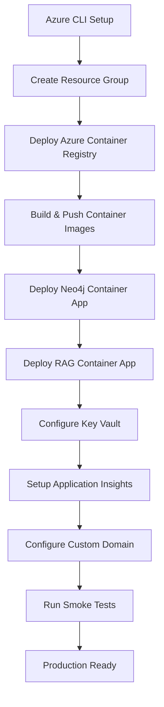

# Azure Cloud Architecture - Enterprise Deployment

**Architecture**: Hybrid Cloud - Neo4j DB + RAG Service in Azure, Local Testing

## Architecture Overview

```
┌─────────────────────────────────────────────────────────────────────┐
│                        Azure Cloud (Knowledge Base)                  │
│                                                                       │
│  ┌──────────────────────────────────────────────────────────────┐  │
│  │                    Resource Group: rg-neo4j-rag                │  │
│  │                                                                  │  │
│  │  ┌─────────────────────┐      ┌──────────────────────────┐   │  │
│  │  │   Neo4j Database    │      │   RAG Service            │   │  │
│  │  │   (Container App)   │◄─────┤   (Container App)        │   │  │
│  │  │                     │      │                          │   │  │
│  │  │   Port: 7687        │      │   Port: 8000             │   │  │
│  │  │   Public Endpoint   │      │   Public HTTPS Endpoint  │   │  │
│  │  │   Authentication    │      │   Managed Identity       │   │  │
│  │  └─────────────────────┘      └──────────────────────────┘   │  │
│  │           │                              │                     │  │
│  │           │                              │                     │  │
│  │           └──────────┬───────────────────┘                     │  │
│  │                      │                                          │  │
│  │           ┌──────────▼──────────┐                              │  │
│  │           │  Azure Key Vault    │                              │  │
│  │           │  - DB Credentials   │                              │  │
│  │           │  - API Keys         │                              │  │
│  │           └─────────────────────┘                              │  │
│  │                                                                  │  │
│  │  ┌─────────────────────────────────────────────────────────┐  │  │
│  │  │              Azure Monitor & Application Insights        │  │  │
│  │  │  - Logs, Metrics, Alerts                                │  │  │
│  │  └─────────────────────────────────────────────────────────┘  │  │
│  └──────────────────────────────────────────────────────────────┘  │
└───────────────────────────────────┬───────────────────────────────┘
                                    │
                                    │ HTTPS/Bolt (TLS)
                                    │
┌───────────────────────────────────▼───────────────────────────────┐
│                      Local Development/Testing                      │
│                                                                      │
│  ┌────────────────────────────────────────────────────────────┐   │
│  │               Playwright Test Suite                         │   │
│  │                                                              │   │
│  │  ┌──────────────┐  ┌──────────────┐  ┌──────────────┐     │   │
│  │  │ Chat Tests   │  │ Upload Tests │  │ Monitor Tests│     │   │
│  │  │ (TC-7.*)     │  │ (TC-8.*)     │  │ (TC-9.*)     │     │   │
│  │  └──────────────┘  └──────────────┘  └──────────────┘     │   │
│  │                                                              │   │
│  │  Test Target: https://rag-service.azurecontainerapps.io    │   │
│  │  Database: neo4j+s://neo4j.azurecontainerapps.io:7687      │   │
│  └────────────────────────────────────────────────────────────┘   │
│                                                                      │
│  Optional: Local Streamlit UI (Development Only)                    │
│  └─► Connects to Cloud RAG Service                                  │
└──────────────────────────────────────────────────────────────────┘
```

## Component Architecture

### Azure Cloud Components

#### 1. Neo4j Database (Azure Container Apps)
- **Service**: Azure Container Apps
- **Image**: `neo4j:5.11` (or custom with optimizations)
- **Configuration**:
  - CPU: 2 cores, Memory: 8GB (min for production)
  - Persistent Storage: Azure Files (100GB+)
  - Network: VNET integration for security
  - Authentication: Username/password in Key Vault
  - Backup: Daily snapshots to Azure Blob Storage

**Endpoints**:
- Bolt Protocol: `neo4j+s://neo4j-rag.azurecontainerapps.io:7687`
- HTTP API: `https://neo4j-rag.azurecontainerapps.io:7474`
- Browser: `https://neo4j-rag.azurecontainerapps.io:7473`

**Environment Variables**:
```bash
NEO4J_AUTH=neo4j/${KEY_VAULT_SECRET}
NEO4J_dbms_memory_heap_max__size=4G
NEO4J_dbms_memory_pagecache_size=2G
NEO4J_ACCEPT_LICENSE_AGREEMENT=yes
NEO4J_PLUGINS=["apoc", "graph-data-science"]
```

#### 2. RAG Service (Azure Container Apps)
- **Service**: Azure Container Apps
- **Image**: Custom RAG container (from `scripts/Dockerfile.rag`)
- **Configuration**:
  - CPU: 4 cores, Memory: 8GB
  - Scaling: 1-10 instances (auto-scale based on CPU >70%)
  - Managed Identity: For Key Vault access
  - Health Probes: `/health` endpoint

**Endpoints**:
- API: `https://rag-service.azurecontainerapps.io`
- Health: `https://rag-service.azurecontainerapps.io/health`
- Stats: `https://rag-service.azurecontainerapps.io/stats`

**Environment Variables**:
```bash
NEO4J_URI=neo4j+s://neo4j-rag.azurecontainerapps.io:7687
NEO4J_USER=neo4j
NEO4J_PASSWORD=${KEY_VAULT_SECRET}
BITNET_LLM_URL=https://bitnet-llm.azurecontainerapps.io:8001
AZURE_KEY_VAULT_NAME=kv-neo4j-rag
```

#### 3. BitNet LLM (Optional Cloud Deployment)
- **Service**: Azure Container Apps (CPU-optimized)
- **Image**: Custom BitNet container
- **Configuration**:
  - CPU: 8 cores (ARM or x64)
  - Memory: 16GB
  - Scaling: 1-3 instances (expensive, consider on-demand)

**Endpoint**:
- API: `https://bitnet-llm.azurecontainerapps.io:8001`

**Alternative**: Keep BitNet local for cost savings, only deploy RAG + Neo4j to cloud

#### 4. Azure Key Vault
- **Purpose**: Secure credential storage
- **Secrets**:
  - `neo4j-password`
  - `rag-api-key` (if implementing auth)
  - `azure-openai-key` (alternative to BitNet)

#### 5. Azure Monitor & Application Insights
- **Metrics**:
  - Container CPU/Memory usage
  - Request rates and response times
  - Error rates and exceptions
  - Custom metrics (query performance, cache hit rate)

- **Alerts**:
  - High error rate (>5%)
  - Slow response time (>5s)
  - Service unavailable
  - Database connection failures

#### 6. Azure Blob Storage
- **Purpose**:
  - Document storage (uploaded files)
  - Database backups
  - Application logs archival

#### 7. Azure Virtual Network (Optional)
- **Configuration**:
  - Private endpoints for Neo4j
  - Service endpoints for Container Apps
  - Network Security Groups for traffic control
  - VPN Gateway for secure local access

### Local Testing Components

#### 1. Playwright Test Suite
- **Location**: Local machine
- **Configuration**: Point to cloud endpoints
- **Environment Variables**:
```bash
export STREAMLIT_URL=http://localhost:8501  # Local UI (optional)
export RAG_API_URL=https://rag-service.azurecontainerapps.io
export NEO4J_URI=neo4j+s://neo4j-rag.azurecontainerapps.io:7687
export BITNET_URL=https://bitnet-llm.azurecontainerapps.io:8001
```

#### 2. Local Streamlit UI (Optional)
- **Purpose**: Development and manual testing
- **Configuration**: Connects to cloud RAG service
- **Deployment**: Not deployed to cloud (use locally only)

## Deployment Architecture Decisions

### Option A: Full Cloud Deployment (Recommended for Production)
```
Cloud Components:
✅ Neo4j Database (Azure Container Apps)
✅ RAG Service (Azure Container Apps)
✅ BitNet LLM (Azure Container Apps) OR Azure OpenAI
✅ Streamlit UI (Azure Static Web Apps or Container Apps)

Local Components:
✅ Playwright Test Suite (connects to cloud)
✅ Development tools
```

**Pros**:
- Production-ready
- Auto-scaling
- High availability
- Centralized monitoring

**Cons**:
- Higher cost (~$300-500/month)
- More complex setup

### Option B: Hybrid Deployment (Cost-Optimized)
```
Cloud Components:
✅ Neo4j Database (Azure Container Apps) - Knowledge base
✅ RAG Service (Azure Container Apps) - API layer

Local Components:
✅ BitNet LLM (local Docker) - Save ~$100/month
✅ Streamlit UI (local development only)
✅ Playwright Test Suite
```

**Pros**:
- Cost-effective (~$150-200/month)
- Fast LLM inference (local hardware)
- Cloud knowledge base persistence

**Cons**:
- BitNet not scalable
- Local dependency for LLM

### Option C: Knowledge Base Only (Minimum Cloud)
```
Cloud Components:
✅ Neo4j Database (Azure Container Apps) - Persistent storage

Local Components:
✅ RAG Service (local Docker)
✅ BitNet LLM (local Docker)
✅ Streamlit UI (local)
✅ Playwright Test Suite
```

**Pros**:
- Lowest cost (~$50-100/month)
- Most control over services
- Shared knowledge base

**Cons**:
- Not production-ready
- Manual scaling
- Local infrastructure required

## Cost Estimation (Monthly)

### Option A: Full Cloud Deployment
| Component | SKU | Cost |
|-----------|-----|------|
| Neo4j Container App | 2 CPU, 8GB | $150 |
| RAG Service (1-10 instances) | 4 CPU, 8GB | $200 |
| BitNet LLM (1-3 instances) | 8 CPU, 16GB | $300 |
| Azure Blob Storage (100GB) | Standard | $5 |
| Key Vault | Standard | $1 |
| Application Insights | Basic | $10 |
| Data Transfer | Outbound | $20 |
| **Total** | | **~$686/month** |

### Option B: Hybrid Deployment (Recommended)
| Component | SKU | Cost |
|-----------|-----|------|
| Neo4j Container App | 2 CPU, 8GB | $150 |
| RAG Service (1-5 instances) | 4 CPU, 8GB | $150 |
| Azure Blob Storage (100GB) | Standard | $5 |
| Key Vault | Standard | $1 |
| Application Insights | Basic | $10 |
| Data Transfer | Outbound | $10 |
| **Total** | | **~$326/month** |

### Option C: Knowledge Base Only
| Component | SKU | Cost |
|-----------|-----|------|
| Neo4j Container App | 2 CPU, 8GB | $150 |
| Azure Blob Storage (50GB) | Standard | $3 |
| Key Vault | Standard | $1 |
| Application Insights | Basic | $5 |
| **Total** | | **~$159/month** |

## Security Architecture

### Authentication & Authorization
1. **Neo4j Authentication**:
   - Username/password stored in Key Vault
   - TLS/SSL encryption (neo4j+s://)
   - IP allowlist (optional)

2. **RAG Service Authentication**:
   - Azure Managed Identity
   - API key authentication (optional)
   - Azure AD integration (enterprise)

3. **Network Security**:
   - HTTPS only (TLS 1.2+)
   - VNET integration
   - Private endpoints (production)
   - DDoS protection (Azure Front Door)

### Data Protection
1. **Encryption at Rest**:
   - Azure Storage encryption (AES-256)
   - Neo4j data encryption

2. **Encryption in Transit**:
   - TLS 1.2+ for all connections
   - Certificate-based authentication

3. **Backup Strategy**:
   - Daily Neo4j snapshots
   - 30-day retention
   - Geo-redundant storage

## Monitoring & Observability

### Key Metrics to Monitor

#### Neo4j Database
- Query response time (target: <100ms)
- Memory usage (heap + page cache)
- Transaction rate
- Connection pool utilization
- Disk I/O

#### RAG Service
- API response time (target: <500ms)
- Request rate (queries/minute)
- Error rate (target: <1%)
- Cache hit rate (target: >40%)
- Memory usage

#### Application Insights Queries
```kusto
// Average response time by endpoint
requests
| where timestamp > ago(1h)
| summarize avg(duration) by name
| order by avg_duration desc

// Error rate
requests
| where timestamp > ago(1h)
| summarize ErrorRate = 100.0 * countif(success == false) / count()

// Top slowest queries
dependencies
| where type == "SQL" or type == "Neo4j"
| where timestamp > ago(1h)
| top 10 by duration desc
```

### Alerts Configuration
```yaml
alerts:
  - name: High Error Rate
    condition: error_rate > 5%
    window: 5 minutes
    action: Email + Teams notification

  - name: Slow Response Time
    condition: avg_response_time > 5000ms
    window: 10 minutes
    action: Email

  - name: Neo4j Connection Failure
    condition: connection_errors > 0
    window: 1 minute
    action: Email + SMS

  - name: High Memory Usage
    condition: memory_usage > 85%
    window: 15 minutes
    action: Email
```

## Scalability & Performance

### Auto-Scaling Configuration

#### RAG Service
```yaml
scaling:
  min_replicas: 1
  max_replicas: 10
  rules:
    - type: cpu
      metadata:
        type: Utilization
        value: "70"
    - type: http
      metadata:
        concurrentRequests: "100"
```

#### Performance Targets
- **Query Response Time**: <500ms (p95)
- **Vector Search**: <100ms (maintained from local)
- **Document Upload**: <30s per 5MB file
- **Concurrent Users**: 50+ simultaneous
- **Availability**: 99.9% uptime

### Caching Strategy
1. **Application-Level Cache**:
   - Query result cache (FIFO, 100 entries)
   - Embedding cache (Redis optional)

2. **CDN Caching** (if serving static content):
   - Azure CDN
   - 24-hour TTL for documents

## Disaster Recovery

### Backup Strategy
```bash
# Daily automated backup
0 2 * * * /scripts/backup-neo4j.sh

# Backup script
#!/bin/bash
DATE=$(date +%Y%m%d)
az containerapp exec \
  --name neo4j-rag \
  --resource-group rg-neo4j-rag \
  --command "neo4j-admin backup --to=/backup/neo4j-$DATE"

az storage blob upload \
  --container-name backups \
  --file /backup/neo4j-$DATE \
  --name neo4j-$DATE.tar.gz
```

### Recovery Procedures
1. **Database Restoration**:
   ```bash
   # Download backup
   az storage blob download --name neo4j-YYYYMMDD.tar.gz

   # Restore to new instance
   neo4j-admin restore --from=neo4j-YYYYMMDD
   ```

2. **Service Recovery**:
   - Automatic container restart (health probe failure)
   - Manual redeployment from Azure Container Registry
   - Rollback to previous revision

### RTO/RPO Targets
- **Recovery Time Objective (RTO)**: 30 minutes
- **Recovery Point Objective (RPO)**: 24 hours (daily backup)

## Testing Strategy

### Local Testing Against Cloud
```bash
# Configure cloud endpoints
export RAG_API_URL=https://rag-service.azurecontainerapps.io
export NEO4J_URI=neo4j+s://neo4j-rag.azurecontainerapps.io:7687

# Run Playwright tests
cd neo4j-rag-demo/tests/playwright
pytest -v --cloud

# Expected: All tests pass against cloud infrastructure
```

### Test Environments

#### 1. Development (Local)
- Local Docker Compose
- Local testing only

#### 2. Staging (Cloud)
- Reduced-scale cloud deployment
- Pre-production testing
- Subset of production data

#### 3. Production (Cloud)
- Full-scale deployment
- Production data
- Monitored 24/7

## Deployment Workflow

### Initial Deployment


### CI/CD Pipeline
```yaml
# Azure Pipelines / GitHub Actions
stages:
  - build:
      - Build Docker images
      - Run unit tests
      - Push to ACR

  - deploy_staging:
      - Deploy to staging environment
      - Run integration tests
      - Run Playwright smoke tests

  - deploy_production:
      - Require manual approval
      - Deploy to production
      - Run health checks
      - Monitor for 30 minutes
```

## Next Steps

See the following implementation guides:
1. `AZURE_DEPLOYMENT_GUIDE.md` - Step-by-step deployment
2. `CLOUD_TESTING_GUIDE.md` - Running tests against cloud
3. `scripts/azure-deploy-enterprise.sh` - Automated deployment script
4. `tests/playwright/conftest-cloud.py` - Cloud test configuration

---

**Architecture Type**: Hybrid Cloud (Option B Recommended)
**Estimated Monthly Cost**: $326 (Neo4j + RAG in cloud, BitNet local)
**Deployment Time**: 2-3 hours (automated)
**Maintenance**: Low (managed services)
