# Gamma.app Template - NODES 2025 Presentation

**Import this document into Gamma.app via URL or paste content**

**GitHub Raw URL**: https://raw.githubusercontent.com/ma3u/neo4j-agentframework/main/docs/GAMMA_APP_TEMPLATE.md

**Screenshots Available**:
- https://raw.githubusercontent.com/ma3u/neo4j-agentframework/main/docs/images/neo4j-rag-streamlit-ui-mockup.png
- https://raw.githubusercontent.com/ma3u/neo4j-agentframework/main/docs/images/neo4j-graph-database-browser.png
- https://raw.githubusercontent.com/ma3u/neo4j-agentframework/main/docs/images/neo4j-rag-docker-desktop-containers.jpg
- https://raw.githubusercontent.com/ma3u/neo4j-agentframework/main/docs/images/azure-ai-foundry-assistant-configuration.png

---

Create a 12-slide presentation for a technical conference talk with the following content:

## Presentation Title
Sovereign Neo4j RAG: Achieving Cloud-Grade Performance Using BitNet LLM

## Speaker Info
- Speaker: Matthias Buchhorn-Roth
- Title: AI & Cloud Engineer for Sovereignty
- Location: Berlin, Germany
- Event: NODES 2025 Conference, November 6, 2025, 3:30 PM
- Track: Knowledge Graphs
- Session Link: https://neo4j.com/nodes-2025/agenda/sovereign-neo4j-rag-achieving-cloud-grade-performance-using-bitnet-llm/

## Visual Theme
- Modern, technical style
- Color scheme: Neo4j blue (#008CC1), Azure blue (#0078D4), Green accents
- Use code blocks, diagrams, and data visualizations
- Professional but approachable

---

## Slide 1: Title + Hook

Title: Sovereign Neo4j RAG: Achieving Cloud-Grade Performance Using BitNet LLM

Subtitle: Built with Neo4j • Azure CLI • Claude Code

Speaker: Matthias Buchhorn-Roth | Berlin
NODES 2025 | Knowledge Graphs Track | November 6, 2025

Key Numbers (large text):
- 417x FASTER search
- 87% LESS memory
- Runs on LAPTOP
- Built in HALF THE TIME

Include small text: "Production system running NOW with 30,000 chunks"

---

## Slide 2: The Enterprise RAG Dilemma

Title: The Painful Choice

Create a 2-column comparison table:

Column 1 - Cloud RAG:
✅ Great performance
✅ Latest models (GPT-4, Claude)
❌ $500+/month costs
❌ Data leaves premises
❌ Privacy concerns
❌ Vendor lock-in

Column 2 - Local RAG:
✅ Data sovereignty
✅ No monthly bills
❌ 8-16GB RAM needed
❌ Expensive GPUs required
❌ Slow performance
❌ Complex maintenance

Big question at bottom: "Can we get cloud-grade performance with on-premises sovereignty?"

---

## Slide 3: The Solution - Hybrid Architecture

Title: Hybrid Architecture: Best of Both Worlds

**Include these mermaid diagrams from repository:**

Left Side - Local Development (100% Sovereign):

```mermaid
graph LR
    USER[👤 User<br/>Web Browser]

    subgraph Docker["🐳 Docker Containers"]
        UI[🧠 Streamlit UI<br/>Document Upload<br/>Q&A Interface]
        RAG[⚡ RAG Service<br/>FastAPI + Docling<br/>SentenceTransformers]
        DB[(🗄️ Neo4j Database<br/>Vector + Keyword Search<br/>417x Faster)]
        BitNet[🤖 BitNet.cpp<br/>1.58-bit LLM<br/>87% Memory Reduction]
    end

    USER -->|Interact| UI
    UI -->|Query| RAG
    RAG -->|Search| DB
    DB -->|Context| RAG
    RAG -->|Generate| BitNet
    BitNet -->|Answer| UI
    UI -->|Display| USER
```


Labels: "$0 cost | 100% sovereign | Laptop-ready"

Right Side - Azure Production (Enterprise Scale):

```mermaid
graph LR
    subgraph Internet["🌐 Internet"]
        USER[👤 End Users<br/>API Clients]
    end

    subgraph Azure["☁️ Azure Cloud"]
        subgraph AIFoundry["🤖 Azure AI Foundry"]
            ASSISTANT["Azure AI Assistant<br/>Model: gpt-4o-mini<br/>Functions:<br/>• search_knowledge_base<br/>• add_document<br/>• get_statistics"]
        end

        subgraph CAE["Container Apps"]
            RAG["⚡ RAG Service<br/>CPU: 2, RAM: 4GB<br/>Replicas: 0-10"]
        end

        subgraph Data["🗄️ Data Layer"]
            AURA[(Neo4j Aura<br/>Managed Database<br/>30,006 Chunks)]
        end
    end

    USER -->|HTTPS API| ASSISTANT
    ASSISTANT -->|Function Calls| RAG
    RAG <-->|Bolt 7687| AURA
```


Labels: "~$200/month | Auto-scale 0-10 | 100+ users"

Bottom text (large): "Same Python code. Different environment variables. That's it."

---

## Slide 4: BitNet Compilation Hell → Heaven

Title: The BitNet Journey (From Pain to Production)

Week 1 - Compilation Hell:
❌ Day 1: "just build" → 47 dependency errors
❌ Day 2: Compiler conflicts (Clang/GCC)
❌ Day 3: ARM kernel failures
❌ Day 5: 30-minute builds

Week 2 - The Breakthrough:
✅ Multi-stage Docker builds
✅ Pre-compiled binaries
✅ External model storage (334MB base)
✅ GitHub Container Registry

Result:
Before: 30 minutes of compilation pain
After: 30 seconds `docker pull`

Bottom: "We solved BitNet so you don't have to"

---

## Slide 5: Production Metrics (Real Numbers)

Title: Demonstrated Performance

Performance table (make numbers LARGE and bold):
| Metric | Traditional | Our System | Improvement |
| Vector Search | 46 seconds | 110ms | **417x FASTER ⚡** |
| LLM Memory | 8-16 GB | 1.5 GB | **87% REDUCTION 💾** |
| Embedding Cost | $50/month | $0 local | **100% SAVINGS 💰** |
| Deployment | Cloud-only | Hybrid | **Complete Flexibility 🔄** |

**Screenshot**: Include Azure AI Foundry


Current Production State (highlighted box):
✅ Neo4j Aura Instance: 6b870b04 (westeurope)
✅ Knowledge Base: 12 books, 30,006 chunks
✅ Embeddings: 100% coverage
✅ Azure AI Foundry: Assistant configured
✅ Status: LIVE in production NOW

---

## Slide 6: Why Neo4j for RAG?

Title: The 3-in-1 Database Advantage

Traditional RAG needs 2-3 databases:
- Pinecone/Weaviate (vector only)
- Elasticsearch (keyword only)
- Maybe Neo4j (relationships only)
= Complex synchronization

Neo4j provides ALL THREE:
1. Vector Search (semantic, 384-dim, ~110ms)
2. Keyword Search (full-text Lucene, ~50ms)
3. Graph Relationships (context, citations, multi-hop)

Show sample Cypher query:
```
MATCH (d:Document)-[:HAS_CHUNK]->(c:Chunk)
WHERE vector.similarity(c.embedding, $query) > 0.8
  AND c.text CONTAINS $keyword
RETURN d.source, c.text
```

Bottom: "One database. Three search types. 417x faster."

---

## Slide 7: Local vs Aura - When to Use What

Title: Decision Matrix

Comparison table (11 features):
| Feature | Neo4j Local | Neo4j Aura | Winner |
| Setup | 5 min | 2 min | Tie |
| Cost | $0 | $65-200/mo | Local |
| Sovereignty | 100% | Azure cloud | Local |
| Scalability | 1-5 users | 100+ users | Aura |
| Maintenance | You manage | Fully managed | Aura |
| Performance | Fast (local) | Fast (optimized) | Tie |
| Backups | Manual | Automatic | Aura |

Our Approach (highlighted box):
"Use BOTH: Develop locally → Deploy to Aura"

---

## Slide 8: Neo4j Browser - Live Knowledge Base

Title: 30,000 Chunks in Production

**Screenshot**: Use this image


Overlay text boxes on screenshot:
- "12 Technical Books"
- "O'Reilly, Neo4j Official, Academic Papers"
- "Query time: ~100ms on 30K chunks"

Sample query (show in code block):
```cypher
MATCH (c:Chunk)
WHERE toLower(c.text) CONTAINS 'vector search'
RETURN count(c) as matches;
```

Bottom: "Live system. Real data. Query it yourself: console.neo4j.io"

---

## Slide 9: What You Build ON TOP of Neo4j

Title: Neo4j Provides vs You Build

Two boxes side-by-side:

Left Box - Neo4j Gives You (40%):
✅ Vector index & search
✅ Full-text keyword index
✅ Graph relationships
✅ Cypher query language
✅ ACID transactions
✅ Horizontal scaling

Right Box - You Still Build (60%):
1. Document processing (PDF → chunks)
2. Embedding generation (SentenceTransformers)
3. Search orchestration (hybrid algorithm)
4. API layer (FastAPI)
5. Caching (performance)
6. LLM integration (BitNet/Azure)

Bottom: "Neo4j handles the foundation. You add the RAG intelligence."

---

## Slide 10: My Neo4j RAG Wishlist

Title: What I Wish Neo4j Would Add

Feature requests with impact:
1. 🔥🔥🔥 Native RAG Endpoints - Built-in /query API
2. 🔥🔥🔥 Auto-Chunking - `LOAD PDF 'file.pdf' CHUNK 300`
3. 🔥🔥 Managed Embeddings - Auto-generate on insert
4. 🔥🔥 Smart Query Cache - Built-in result caching
5. 🔥 RAG Metrics Dashboard - Query latency in Browser
6. 🔥 LLM Connectors - `CALL llm.generate()`

Example of what I wish worked:
```cypher
LOAD PDF 'book.pdf'
  CHUNK SIZE 300
  AUTO_EMBED true
  AS (d:Document)-[:HAS_CHUNK]->(c:Chunk);
```

Bottom: "Neo4j is 80% there. These additions would make RAG built-in."

---

## Slide 11: Claude Code = 50% Faster

Title: How AI Helped Build AI

Time comparison table:
| Task | Normal | With Claude | Saved |
| 45 Cypher Queries | 1 week | 1 day | 85% |
| Azure Automation | 4 days | 8 hours | 75% |
| Documentation | 1 week | 6 hours | 90% |
| Total Project | 6-8 weeks | 3-4 weeks | 50% |

5 Best Practices:
1. 📝 CLAUDE.md - Project context file
2. 🗺️ Plan Mode - Complex task planning
3. 🔖 Git Tags - `v1.5-working-bitnet` saved us
4. ✅ Small Commits - 87 commits, each working
5. 💡 Explain + Generate - Full documentation

Tools Stack:
Neo4j + Azure CLI + Claude Code = Production in weeks

Message: "Use AI to build AI. It works."

---

## Slide 12: Takeaways & Try It

Title: 6 Key Takeaways

Numbered list (large text):
1. ✅ Hybrid > All-or-Nothing
2. ✅ Neo4j = 3-in-1 RAG Accelerator (417x)
3. ✅ BitNet Enables Sovereignty (87% less RAM)
4. ✅ Graph Relationships Matter
5. ✅ Claude Code Accelerates Development (50% faster)
6. ✅ Production-Ready Today (30K chunks live)

Roadmap box:
Q4 2025: Scale to 100K chunks, multi-language
2026: GraphRAG patterns, fine-tuned BitNet

Try It Yourself (large code block):
```bash
git clone https://github.com/ma3u/neo4j-agentframework
docker-compose -f scripts/docker-compose.ghcr.yml up -d
# Running in 5 minutes!
```

Bottom:
GitHub: @ma3u/neo4j-agentframework
QR code to repository

"Thank You! Questions?"

---

## Design Notes for Gamma

- Use professional technical theme
- Code blocks with syntax highlighting
- Tables with clear headers
- Large, readable numbers (417x, 87%, 30K)
- Screenshot placeholders for slides 8, 10
- Mermaid diagram support for Slide 3 if possible
- QR code on final slide
- Consistent color scheme throughout (Neo4j blue primary)
- Icons for tools: 🔵 Neo4j, ☁️ Azure, 🤖 Claude Code

---

## Additional Instructions

- Make slide transitions smooth
- Emphasize key numbers (417x, 87%, 50%)
- Use bold for important terms
- Keep text concise and scannable
- Add visual interest with icons and colors
- Ensure code is readable (larger font)
- Use speaker notes feature for detailed explanations
