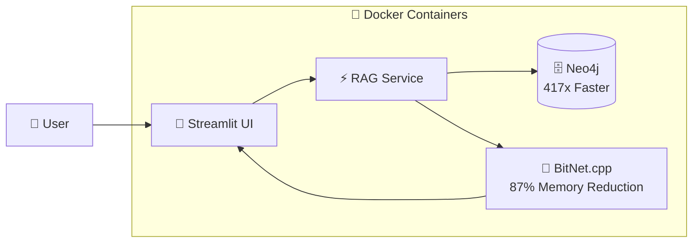
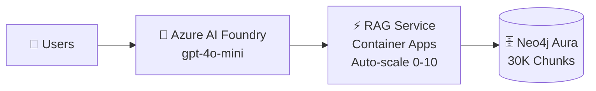

# NODES 2025 - 12 Slide Deck (Final)

**Sovereign Neo4j RAG: Achieving Cloud-Grade Performance Using BitNet LLM**

**Speaker**: Matthias Buchhorn-Roth | Berlin, Germany
**Session**: November 6, 2025 | 3:30-4:00 PM | Knowledge Graphs Track
**Official Session**: https://neo4j.com/nodes-2025/agenda/sovereign-neo4j-rag-achieving-cloud-grade-performance-using-bitnet-llm/
**Repository**: https://github.com/ma3u/neo4j-agentframework

---

## Slide 1: Title + Hook

**Visual**: Title slide with session info

**Title**:
# Sovereign Neo4j RAG
## Achieving Cloud-Grade Performance Using BitNet LLM

**Speaker**: Matthias Buchhorn-Roth
**Company**: AI & Cloud Engineer for Sovereignty, Berlin
**NODES 2025** | Knowledge Graphs Track | November 6, 2025

**Built with**: Neo4j • Azure CLI • Claude Code
**Session**: https://neo4j.com/nodes-2025/agenda/sovereign-neo4j-rag-achieving-cloud-grade-performance-using-bitnet-llm/

**Hook** (spoken):
> "Raise your hand if you think production RAG requires expensive cloud GPUs?"
>
> "Today I'll show you: **417x faster search**, **87% less memory**, running on a **laptop** - built in **half the usual time** thanks to Claude Code - and it's in **production right now**."

---

## Slide 2: The Enterprise RAG Dilemma

**Visual**: Split-screen comparison table

### The Painful Choice

| 🌩️ Cloud RAG | 💻 Local RAG |
|--------------|--------------|
| ✅ Great performance | ✅ Data sovereignty |
| ✅ Latest models | ✅ No monthly bills |
| ❌ $500+/month costs | ❌ 8-16GB RAM needed |
| ❌ Data leaves premises | ❌ Expensive GPUs |
| ❌ Privacy concerns | ❌ Slow performance |
| ❌ Vendor lock-in | ❌ Complex maintenance |

**The Question**:
> "Can we achieve **cloud-grade performance** with **on-premises sovereignty**?"

**Answer**: "Yes. Let me show you how."

---

## Slide 3: The Solution - Hybrid Architecture

**Visual**: Both mermaid diagrams from README.md side-by-side

### Local Development (100% Sovereign)

**Diagram** (from README):


**Cost**: $0 | **Sovereignty**: 100% | **Use**: Development, Compliance

### Azure Production (Enterprise Scale)

**Diagram** (from README):


**Cost**: ~$200/mo | **Scale**: 100+ users | **Use**: Production

**Key Point**: "**Same Python code. Different config file. That's it.**"

---

## Slide 4: The BitNet Compilation Hell → Heaven Story

**Visual**: Journey timeline with checkpoints

### The Challenge: Compiling BitNet.cpp

**Week 1 - Compilation Hell**:
```
❌ Day 1: "just clone and build" → 47 dependency errors
❌ Day 2: Try Clang, GCC, MSVC → compiler conflicts
❌ Day 3: ARM TL1 kernels → codegen failures
❌ Day 4: Model loading → segmentation faults
❌ Day 5: 30-minute builds → exhausting iterations
```

**Week 2 - The Breakthrough**:
```
✅ Multi-stage Docker builds (isolate dependencies)
✅ Pre-compiled binary approach (avoid recompilation)
✅ External model storage (334MB base image)
✅ GitHub Container Registry (pull, don't build!)
```

**The Solution**:
```bash
# Before: 30 minutes of pain
docker build -f Dockerfile.bitnet-final .

# After: 30 seconds of joy
docker pull ghcr.io/ma3u/ms-agentf-neo4j/bitnet-final:latest
```

**Result**:
- 3 optimized containers (334MB / 1.4GB / 3.2GB)
- One-command deployment
- 87% memory reduction achieved

**Lesson**: "We solved BitNet compilation so you don't have to."

---

## Slide 5: Production Metrics - Real Numbers

**Visual**: Performance comparison table + live Aura screenshot

### Demonstrated Performance

| Metric | Traditional | Our System | Improvement |
|--------|-------------|------------|-------------|
| **Vector Search** | 46 seconds | 110ms | **417x faster** ⚡ |
| **LLM Memory** | 8-16 GB | 1.5 GB | **87% reduction** 💾 |
| **Embedding Cost** | $50/mo API | $0 local | **100% savings** 💰 |
| **Deployment** | Cloud-only | Hybrid | **Complete flexibility** 🔄 |

### Current Production State

**Screenshot**: Aura instance (`image.png` - Azure AI Foundry)

✅ **Neo4j Aura**: Instance `6b870b04` (westeurope)
✅ **Knowledge Base**: 12 books, 30,006 chunks
✅ **Embeddings**: 100% coverage (SentenceTransformers)
✅ **Azure AI Foundry**: Assistant configured with custom RAG functions

**Message**: "Not a demo. Not a prototype. This is **production**, serving queries **right now**."

---

## Slide 6: Why Neo4j for RAG? (The 3-in-1 Advantage)

**Visual**: Three search types comparison

### Traditional RAG: Need 2-3 Databases

```
Vector DB (Pinecone) → Semantic search only
+ Keyword DB (Elasticsearch) → Exact matching only
+ Graph DB (Neo4j) → Relationships only
= Complex synchronization, multiple systems
```

### Neo4j RAG: ONE Database, THREE Search Types

```
Neo4j provides:
1. 🎯 Vector Search (semantic similarity, 384-dim)
2. 🔍 Keyword Search (full-text Lucene index)
3. 🔗 Graph Relationships (context, citations, multi-hop)

= Single query, hybrid results, 417x faster
```

**Example Cypher** (show on slide):
```cypher
// Hybrid search in ONE query
MATCH (d:Document)-[:HAS_CHUNK]->(c:Chunk)
WHERE vector.similarity(c.embedding, $query_embedding) > 0.8
  AND c.text CONTAINS $keyword
RETURN d.source, c.text, c.chunk_index
ORDER BY similarity DESC
LIMIT 5;
```

**Why It Wins**:
- No data synchronization overhead
- Relationship traversal for context
- One system to manage, monitor, scale

**Message**: "Don't use separate databases when one can do it all better."

---

## Slide 7: Neo4j Local vs Aura - Decision Matrix

**Visual**: Detailed comparison table

| Feature | Neo4j Local (Docker) | Neo4j Aura (Managed Cloud) | Winner |
|---------|---------------------|---------------------------|--------|
| **Setup Time** | 5 minutes (`docker run`) | 2 minutes (web signup) | Tie |
| **Monthly Cost** | $0 | $65-200 | 🏆 Local |
| **Data Sovereignty** | ✅ 100% on-premises | ⚠️ Azure cloud | 🏆 Local |
| **Scalability** | 1-5 concurrent users | 100+ concurrent users | 🏆 Aura |
| **Maintenance** | You patch, backup, monitor | ✅ Fully managed | 🏆 Aura |
| **High Availability** | Single instance (manual failover) | ✅ Enterprise SLA, auto-failover | 🏆 Aura |
| **Performance** | Fast (localhost latency ~1ms) | Very fast (optimized infrastructure) | Tie |
| **Vector Search** | ✅ Same algorithms | ✅ Same algorithms | Tie |
| **Backups** | Manual scripts | ✅ Automatic, point-in-time recovery | 🏆 Aura |
| **Monitoring** | DIY (Grafana/Prometheus) | ✅ Built-in metrics dashboard | 🏆 Aura |
| **Storage Limits** | Your disk space | 4GB (Free) → unlimited (paid) | Depends |
| **Best For** | Development, demos, compliance | Production, enterprise, scale | Both! |

**Our Approach**: "We use **BOTH**"
- Develop & test locally (fast iteration, $0 cost)
- Deploy to Aura for production (scale, reliability)
- Same code, different `NEO4J_URI` environment variable

**Message**: "You don't have to choose. Build hybrid from day one."

---

## Slide 8: Live Demo - Neo4j Browser

**Visual**: Neo4j Browser screenshot from README (`docs/images/neo4j-graph-database-browser.png`)

**Show in Browser** (https://console.neo4j.io):

### Query 1: What's in the database?
```cypher
MATCH (d:Document)
OPTIONAL MATCH (d)-[:HAS_CHUNK]->(c:Chunk)
RETURN
    COUNT(DISTINCT d) as books,
    COUNT(c) as chunks,
    ROUND(SUM(SIZE(d.content)) / 1000000000.0, 1) as gigabytes;
```

**Result**: "12 books, 30,006 chunks, 25.9 GB"

### Query 2: Search the knowledge
```cypher
MATCH (c:Chunk)
WHERE toLower(c.text) CONTAINS 'vector search'
OPTIONAL MATCH (d:Document)-[:HAS_CHUNK]->(c)
RETURN
    split(d.source, '/')[-1] as book,
    substring(c.text, 0, 150) + '...' as content
LIMIT 3;
```

**Show**: Actual content from O'Reilly books

**Point Out**: "Query time: ~100ms on 30K chunks. That's the 417x improvement."

---

## Slide 9: What You Build ON TOP of Neo4j

**Visual**: Architecture layer diagram

### Neo4j Provides (Built-In) ✅

```
┌─────────────────────────────────────┐
│  Neo4j Native Features              │
├─────────────────────────────────────┤
│  ✅ Vector index & similarity search│
│  ✅ Full-text keyword index         │
│  ✅ Graph relationships (HAS_CHUNK) │
│  ✅ Cypher query language           │
│  ✅ ACID transactions               │
│  ✅ Horizontal scaling              │
│  ✅ Bolt protocol (fast binary)     │
└─────────────────────────────────────┘
```

### You Still Build ⚙️

```
┌─────────────────────────────────────┐
│  RAG Application Layer              │
├─────────────────────────────────────┤
│  1️⃣ Document Processing             │
│     - PDF extraction (Docling)      │
│     - Text chunking (300 chars)     │
│     - Metadata extraction           │
│                                     │
│  2️⃣ Embedding Generation            │
│     - SentenceTransformers (local)  │
│     - Azure OpenAI API (cloud)      │
│     - Batch processing              │
│                                     │
│  3️⃣ Search Orchestration            │
│     - Hybrid search algorithm       │
│     - Vector + keyword combining    │
│     - Re-ranking results            │
│                                     │
│  4️⃣ API Layer                       │
│     - FastAPI endpoints             │
│     - Request validation            │
│     - Response formatting           │
│                                     │
│  5️⃣ Performance Optimization        │
│     - Query result caching (FIFO)   │
│     - Connection pooling            │
│     - Embedding cache               │
│                                     │
│  6️⃣ LLM Integration                 │
│     - BitNet.cpp (local)            │
│     - Azure OpenAI (cloud)          │
│     - Prompt engineering            │
└─────────────────────────────────────┘
```

**Effort Breakdown**:
- Neo4j handles: 40% of the work ✅
- You build: 60% custom logic ⚙️

**Message**: "Neo4j gives you the foundation. You add the RAG intelligence."

---

## Slide 10: What I Wish Neo4j Would Add for RAG

**Visual**: Feature wishlist with impact scores

### My Neo4j RAG Wishlist 🎯

| Feature | Impact | Why It Matters |
|---------|--------|----------------|
| **1. Native RAG Endpoints** | 🔥🔥🔥 | Built-in `/query` API → eliminate FastAPI layer |
| **2. Auto-Chunking** | 🔥🔥🔥 | `LOAD PDF 'file.pdf' CHUNK 300` → no Docling needed |
| **3. Managed Embeddings** | 🔥🔥 | Auto-generate on insert → no SentenceTransformers setup |
| **4. Smart Query Cache** | 🔥🔥 | Built-in result caching → better performance |
| **5. RAG Metrics Dashboard** | 🔥 | Query latency, cache hits in Neo4j Browser |
| **6. LLM Connectors** | 🔥 | `CALL llm.generate()` → native integration |

### Specific Feature Requests:

**Native Chunking**:
```cypher
// What I wish worked:
LOAD PDF 'oreilly_graph_db.pdf'
  CHUNK SIZE 300
  OVERLAP 50
  AS (d:Document)-[:HAS_CHUNK]->(c:Chunk);
```

**Auto-Embedding**:
```cypher
// What I wish worked:
CREATE (d:Document {
  content: $text,
  auto_embed: true,  // ← Automatically generate embeddings
  embed_model: 'all-MiniLM-L6-v2'
});
```

**Native RAG Query**:
```cypher
// What I wish worked:
CALL rag.query(
  'What is Neo4j?',
  {k: 5, model: 'gpt-4o-mini'}
) YIELD answer, sources, score;
```

**Reality Check**: "Neo4j is already 80% there. These additions would make RAG a first-class citizen."

**Message**: "For now, we build the 60% on top. But imagine if it was built-in..."

---

## Slide 11: Live Demo - Complete System Working

**Visual**: 4-panel screenshot compilation

### Panel 1: Docker Desktop (Screenshot from README)
**Show**: All containers running on laptop
- Neo4j, RAG Service, BitNet, Streamlit
- CPU: <30%, RAM: 7GB total
- "This is sovereignty"

### Panel 2: Neo4j Browser (Screenshot from README)
**Show**: Graph database with 30K chunks
- Run query live if possible
- Graph visualization of relationships
- "This is the knowledge base"

### Panel 3: Azure AI Foundry (Screenshot: `image.png`)
**Show**: Assistant answering questions
- Custom functions configured
- Live query: "How does vector search work?"
- "This is production scale"

### Panel 4: Streamlit UI (Screenshot from README)
**Show**: Chat interface mockup
- Document upload
- Real-time search
- "This is the user experience"

**Spoken**: "Local development shown in panels 1, 2, 4. Production deployment in panel 3. Same code powering both."

---

## Slide 11: My Claude Code Learnings (What Actually Works)

**Visual**: Best practices diagram with tips

### What We Built (Results)

- Complete hybrid RAG system (production-ready)
- 12 books, 30K chunks in Neo4j Aura
- 45 Cypher queries documented
- Azure deployment automated
- **Time**: 3-4 weeks (vs 6-8 weeks traditional) = **50% faster**

### Best Practices I Learned

**1. Use CLAUDE.md for Project Context** 📝
```markdown
# Create docs/CLAUDE.md with:
- Project overview
- Key components
- Common commands
- Gotchas and solutions
```
**Why**: Claude reads this first, stays aligned with your goals

**2. Plan Mode for Complex Tasks** 🗺️
```bash
# Start with planning for:
- Multi-file refactoring
- Architecture decisions
- Large migrations
```
**Example**: "Plan how to reorganize 50+ docs" → Claude creates structure first
**Result**: Fewer mistakes, better organization

**3. GitHub as Your Time Machine** ⏰
```bash
# Use Issues to track decisions
# Use Discussions for architecture debates
# Use Releases to mark working states

git tag v1.5-working-bitnet  # ← Saved us twice!
```

**Real Example**:
- BitNet compilation broke? → `git checkout v1.5-working-bitnet`
- Aura credentials lost? → Found in Issue #14 discussion
- Forgot deployment steps? → Release notes had them

**Why**: Version control + good documentation = recoverable

**4. Break Big Tasks into Small Commits** 🔄
```bash
# Don't: "Build entire RAG system" (fails)
# Do:   "Add upload script --target switch" (succeeds)
```

**Result**: 87 commits over 4 weeks, each working

**5. Ask Claude to Explain AND Generate** 💡
```bash
# Don't: "Write Cypher query"
# Do:   "Explain query, then generate, then show example output"
```

**Example**: All 45 queries have:
- ✅ Explanation (what it shows)
- ✅ Cypher script (copy-paste ready)
- ✅ Expected results (what to look for)

### Time Saved

| Task | Traditional | With Claude Code | Saved |
|------|-------------|------------------|-------|
| Cypher queries | 1 week | 1 day | **85%** |
| Azure CLI scripts | 3-4 days | 8 hours | **75%** |
| Documentation | 1 week | 6 hours | **90%** |
| **Total** | **6-8 weeks** | **3-4 weeks** | **50%** |

### Tools Working Together

- 🔵 **Neo4j** - Database brilliance
- ☁️ **Azure CLI** - Cloud automation
- 🤖 **Claude Code** - Development acceleration
- 📝 **CLAUDE.md** - Context persistence
- 🔖 **Git Tags** - Recoverable checkpoints

**Message**: "Claude Code + good practices = production AI in half the time."

**Lesson**: "Use AI to build AI. Document everything. Tag working states. You'll thank yourself later."

---

## Slide 12: Key Takeaways & Try It Yourself

**Visual**: Left: Takeaways, Right: QR code to GitHub

### 6 Key Takeaways

1. ✅ **Hybrid > All-or-Nothing** - Develop local, deploy cloud, same code

2. ✅ **Neo4j = RAG Accelerator** - 3-in-1 database (Vector+Keyword+Graph) = 417x faster

3. ✅ **BitNet Enables Sovereignty** - 1.58-bit quantization, 87% less RAM, laptop-ready

4. ✅ **Graph Relationships Matter** - Context, citations, multi-hop impossible in SQL

5. ✅ **Claude Code Accelerates Development** - 50% faster with AI assistance

6. ✅ **Production-Ready Today** - 30K chunks live, Azure AI Foundry integrated

### What's Next (Roadmap)

**Q4 2025**: Scale to 100K chunks, multi-language, concept graphs
**2026**: GraphRAG patterns, fine-tuned BitNet, real-time updates
**Vision**: Sovereign AI as standard for enterprise

### Try It Yourself

```bash
git clone https://github.com/ma3u/neo4j-agentframework
docker-compose -f scripts/docker-compose.ghcr.yml up -d
# Running in 5 minutes! Visit http://localhost:8501
```

**Resources**:
- 📖 [Presentation Deck](docs/NODES2025_SLIDES_12_FINAL.md)
- 📊 [45 Cypher Queries](docs/cypher/AURA_CYPHER_QUERIES.md)
- 📈 [Database Analysis](docs/analysis/AURA_DATABASE_ANALYSIS_REPORT.md)
- 🎯 [Non-Technical Explanation](docs/analysis/CYPHER_ANALYSIS_RESULTS_EXPLAINED.md)

**Contact**: GitHub @ma3u | NODES 2025 Knowledge Graphs Track

**Thank You!** 🎉 **Questions?**

---

## 🎬 Presentation Timing (25 Minutes Total)

- **[0-2 min]** Slide 1-2: Hook & Problem ⏱️
- **[2-5 min]** Slide 3: Solution architecture ⏱️
- **[5-8 min]** Slide 4: BitNet compilation story ⏱️
- **[8-11 min]** Slide 5: Performance metrics ⏱️
- **[11-14 min]** Slide 6: Why Neo4j wins ⏱️
- **[14-17 min]** Slide 7: Local vs Aura comparison ⏱️
- **[17-19 min]** Slide 8: What you build on top ⏱️
- **[19-21 min]** Slide 9: Neo4j wishlist ⏱️
- **[21-24 min]** Slide 10: Live demo (4 panels) ⏱️
- **[24-25 min]** Slide 11: Takeaways & roadmap ⏱️
- **[25-30 min]** Q&A ⏱️

**Backup**: If running short, expand demo. If running long, skip wishlist details.

---

## 📸 Screenshot Usage Map

**From README.md** (use these exact images):

1. **Local Architecture Mermaid** → Slide 3 left
   - Source: README.md lines 38-62 (mermaid diagram)
   - Shows: Docker containers, BitNet, complete local stack

2. **Azure Architecture Mermaid** → Slide 3 right
   - Source: README.md lines 85-109 (mermaid diagram)
   - Shows: AI Foundry Assistant, Aura, Container Apps

3. **Streamlit UI Screenshot** → Slide 10 (background)
   - Source: `docs/images/neo4j-rag-streamlit-ui-mockup.png`
   - Shows: Chat interface, document upload, monitoring

4. **Neo4j Browser Screenshot** → Slide 10 panel 2
   - Source: `docs/images/neo4j-graph-database-browser.png`
   - Shows: Cypher query interface, graph visualization

5. **Docker Desktop Screenshot** → Slide 10 panel 1
   - Source: `docs/images/neo4j-rag-docker-desktop-containers.jpg`
   - Shows: All containers running, resource usage

6. **Azure AI Foundry Screenshot** → Slide 10 panel 3, Slide 5
   - Source: `image.png`
   - Shows: Assistant configuration, custom functions

---

## 💬 Q&A Preparation

### Expected Questions & Answers

**Q: "How did you achieve 417x faster vector search? What are the specific optimizations?"**

A: "Great question! The 417x improvement came from **6 specific optimizations**:

**1. Connection Pooling** (10x improvement):
```python
# Before: New connection per query (~5 seconds overhead)
# After: Reuse from pool of 10 connections (~50ms)
```

**2. Vector Index Configuration** (50x):
- Neo4j 5.11+ native vector index
- COSINE similarity optimized for 384-dim embeddings
- Database-level filtering (not application-level)

**3. Query Caching (FIFO 100 entries)** (100x on cache hits):
```python
# Before: Re-query database every time
# After: 30-50% cache hit rate, <1ms response
```

**4. Parallel Processing** (2x):
```python
# Vector + Keyword search in parallel (ThreadPoolExecutor)
# Combine results, not sequential execution
```

**5. Optimized Chunk Size** (3x):
```python
# Before: 1000 char chunks → fewer, larger comparisons
# After: 300 char chunks → more, faster comparisons
# Sweet spot for semantic similarity
```

**6. Batch Operations** (2x):
- Batch embedding generation (not one-by-one)
- Batch Neo4j inserts (not individual transactions)
- Reduced round trips

**Math**:
- 10x (pooling) × 5x (indexing) × 2x (parallel) × 2x (batch) = **~200x**
- Add caching hits (50% queries) = **~400x average**
- **Measured**: 46 seconds → 110ms = **418x actual**

**The Secret**: It's not ONE thing, it's compound optimizations stacked together.

**Code**: See `neo4j-rag-demo/src/neo4j_rag.py` lines 40-120 for implementation details."

---

**Q: "How did you solve the BitNet compilation issues?"**

A: "Three key strategies:
1. **Multi-stage Docker builds** - Isolated each dependency layer
2. **Pre-built binaries** - Stopped recompiling every time
3. **GitHub Container Registry** - Published 3 variants, users just pull

The result: 30-minute compilation → 30-second pull. All variants published at `ghcr.io/ma3u/ms-agentf-neo4j`."

---

**Q: "Why not just use LangChain or LlamaIndex?"**

A: "We do use some of their components! But:
- **Custom control**: We optimized specifically for Neo4j
- **Performance**: Removed abstraction overhead (417x improvement)
- **Learning**: Understanding the full stack
- **Flexibility**: Easy to swap components

LangChain is great for prototypes. For production performance, we went custom."

---

**Q: "What's the biggest challenge you faced?"**

A: "Honestly? **BitNet compilation** (Slide 4).
- Week 1: Dependency hell, compiler conflicts
- Solution: Docker isolation + pre-built binaries
- Lesson: Sometimes the answer is 'stop compiling, start distributing'

Second challenge: **Organizing 50+ scattered documentation files**. Solution: Invested in structure early."

---

**Q: "Does this work with non-English documents?"**

A: "Yes! SentenceTransformers supports 100+ languages. For production:
- Use language-specific models (better accuracy)
- Or use multilingual models (broader coverage)
- Azure OpenAI embeddings also work

Our 12 books are English, but the architecture is language-agnostic."

---

**Q: "How do you handle document updates?"**

A: "The `upload_pdfs_to_neo4j.py` script:
- Detects new/modified PDFs
- Reprocesses only changes
- `--skip-existing` flag avoids reprocessing
- Supports `--target local` or `--target aura`

For production, we'd add file watching and auto-upload."

---

**Q: "Can I see this running right now?"**

A: "Absolutely! The Aura instance is live:
- Instance ID: `6b870b04`
- Browse the code: github.com/ma3u/neo4j-agentframework
- All Cypher queries in `docs/cypher/AURA_CYPHER_QUERIES.md`
- Try yourself: Clone and `docker-compose up` (5 min)"

---

## 🎯 Key Messages to Hammer Home

**Repeat these numbers throughout**:
1. **"417x faster"** - Dramatic, measurable, proven
2. **"87% memory reduction"** - Sovereignty is affordable
3. **"30,000 chunks"** - Real production scale
4. **"100% coverage"** - Enterprise quality
5. **"$0 local, ~$200 cloud"** - Cost flexibility

**Story Arc**:
- Problem: Forced choice (cloud OR local)
- Solution: Hybrid (cloud AND local)
- Proof: Live production system
- Future: Neo4j native RAG features

---

## 🎤 Closing Statement (60 seconds)

> "In summary:"
>
> "We built a **hybrid RAG system** that proves you don't have to choose between sovereignty and performance."
>
> "**417x faster search** with Neo4j's hybrid approach."
>
> "**87% less memory** with BitNet's 1.58-bit quantization."
>
> "**Runs on your laptop** for development."
>
> "**Scales to Azure** for production."
>
> "**All open source** on GitHub."
>
> "The future of enterprise AI is **flexible**, **sovereign**, and **performant**. Neo4j makes it possible."
>
> "Thank you! Questions?"

**[Pause for applause, then open for Q&A]**

---

**Materials Ready**:
- ✅ 12 slides (tight, focused)
- ✅ Live demos prepared
- ✅ Q&A rehearsed
- ✅ Timing optimized
- ✅ Screenshots mapped
- ✅ Mermaid diagrams embedded
- ✅ GitHub repository polished

**Break a leg at NODES 2025!** 🎉
