# Streamlit Chat UI Concept for Neo4j RAG + BitNet LLM

## Overview

A simple, interactive Streamlit-based chat interface for local testing and development of the Neo4j RAG + BitNet system. This concept focuses on user experience and system architecture rather than implementation details.

## Core Vision

**Local-First Development Interface**: Enable developers to easily test, iterate, and demonstrate the Neo4j RAG + BitNet pipeline through an intuitive chat interface that requires zero cloud dependencies.

## Key Features

### 1. Interactive Chat Interface
- **Conversational Flow**: Natural back-and-forth conversation with the AI system
- **Message History**: Persistent conversation context within sessions
- **Streaming Responses**: Real-time response generation with typewriter effect
- **Source Attribution**: Clear display of which documents influenced each response

### 2. Document Management
- **Simple Upload**: Drag-and-drop interface for adding documents to the knowledge base
- **Multiple Formats**: Support for PDF, TXT, MD, and DOCX files
- **Upload Feedback**: Visual confirmation and processing status
- **Batch Operations**: Handle multiple files simultaneously

### 3. System Monitoring
- **Health Indicators**: Visual status of Neo4j, RAG service, and BitNet LLM
- **Performance Metrics**: Response times, document counts, and system statistics
- **Real-time Updates**: Live dashboard that refreshes automatically
- **Query Analytics**: Recent performance and usage patterns

### 4. Configuration Options
- **Search Parameters**: Adjustable number of results (k-value)
- **Model Settings**: Temperature and response length controls
- **Advanced Options**: Similarity thresholds and filtering options

## User Experience Flow

### Chat Interaction
```
User enters question → System searches knowledge base → 
BitNet generates response → User sees answer with sources → 
Conversation continues naturally
```

### Document Upload
```
User selects files → System validates formats → 
Processing begins → Progress shown → 
Success confirmation → Knowledge base updated
```

### System Monitoring
```
Dashboard loads → Shows current status → 
Displays key metrics → Updates in real-time → 
Alerts on any issues
```

## Architecture Concept

```mermaid
graph TB
    subgraph "User Interface"
        A[👤 User] --> B[💬 Chat Interface]
        A --> C[📤 Document Upload]
        A --> D[📊 System Monitor]
    end
    
    subgraph "API Layer"
        B --> E[RAG Service API]
        C --> E
        D --> E
    end
    
    subgraph "Data & AI"
        E --> F[Neo4j Database]
        E --> G[BitNet LLM]
    end
    
    style A fill:#e3f2fd
    style B fill:#f3e5f5
    style C fill:#f3e5f5
    style D fill:#f3e5f5
    style E fill:#fff3e0
    style F fill:#e8f5e8
    style G fill:#e8f5e8
```



### Three-Layer Design
1. **User Interface Layer**: Streamlit components for interaction
2. **Service Layer**: API calls to existing RAG and BitNet services
3. **Data Layer**: Neo4j database and BitNet model

## Design Principles

### Simplicity First
- Minimal learning curve for new users
- Clean, uncluttered interface
- Focus on essential features only

### Local Development Focus
- No external dependencies
- Fast iteration and testing
- Complete offline capability

### Performance Transparency
- Show response times clearly
- Display system resource usage
- Make bottlenecks visible

### Error Resilience
- Graceful handling of service failures
- Clear error messages for users
- Automatic retry where appropriate

## User Interface Mockups

### Main Chat Interface
```
┌─────────────────────────────────────────────────────────┐
│ 🤖 Neo4j RAG + BitNet Chat Assistant                   │
├─────────────────────────────────────────────────────────┤
│                                                         │
│ 🧑 User: What is Neo4j used for?                       │
│                                                         │
│ 🤖 Assistant: Neo4j is a high-performance graph        │
│    database management system designed for handling     │
│    connected data and relationships...                  │
│    📚 Sources: [neo4j-intro.pdf (0.89), graph-db.md]   │
│                                                         │
│ 🧑 User: How does it compare to SQL databases?         │
│                                                         │
│ 🤖 Assistant: [Streaming response with typewriter...]   │
│                                                         │
├─────────────────────────────────────────────────────────┤
│ 💬 Type your message here...                    [Send] │
└─────────────────────────────────────────────────────────┘
```

### Sidebar Dashboard
```
┌─────────────────────────┐
│ 📤 Document Upload      │
├─────────────────────────┤
│ [Choose Files...]       │
│ ✅ doc1.pdf (uploaded)  │
│ ⏳ doc2.txt (processing)│
│ [Upload to Knowledge]   │
├─────────────────────────┤
│ 📊 System Stats         │
├─────────────────────────┤
│ 📈 Documents: 15        │
│ 📄 Chunks: 247          │
│ ⚡ Avg Query: 45ms      │
│ 🎯 Cache Hit: 67%       │
│ 🟢 Neo4j: Healthy      │
│ 🟢 BitNet: Ready        │
├─────────────────────────┤
│ ⚙️ Configuration        │
├─────────────────────────┤
│ 🔧 Model: BitNet        │
│ 📊 Results (k): 3       │
│ 🎚️ Similarity: 0.7      │
│ 🌡️ Temperature: 0.7     │
└─────────────────────────┘
```

## Success Metrics

### Usability
- New users can start chatting within 30 seconds
- Document upload completes without confusion
- System status is immediately clear

### Performance
- Chat responses appear within 5 seconds
- File uploads process without timeout
- Interface remains responsive during operations

### Reliability
- Works consistently across different document types
- Handles service restarts gracefully
- Maintains conversation context properly

## Implementation Approach

### Development Strategy
- Start with minimal viable interface
- Add features incrementally based on user feedback
- Prioritize stability over feature completeness

### Technical Philosophy
- Leverage existing APIs rather than rebuilding functionality
- Focus on UI/UX excellence over complex backend logic
- Maintain separation between interface and core services

## Future Enhancements

### Advanced Chat Features
- Conversation export/import
- Multi-turn conversation branching
- Voice input/output capabilities

### Enhanced Monitoring
- Detailed performance analytics
- Query pattern analysis
- Resource usage optimization

### Collaboration Features
- Multi-user session support
- Shared knowledge bases
- Team workspace capabilities

## Conclusion

This Streamlit Chat UI concept provides a foundation for building an intuitive, local-first interface for the Neo4j RAG + BitNet system. By focusing on user experience and leveraging existing backend services, we can create a powerful development tool that enhances productivity while maintaining complete data sovereignty.

The concept emphasizes simplicity, performance transparency, and local development workflows - making it easier for developers to build, test, and demonstrate AI applications without cloud dependencies.

---

**Status**: 📝 Concept Complete - Ready for Implementation Planning  
**Next Step**: Create detailed implementation plan with technical specifications