# Streamlit + LangChain Local Implementation Analysis

## 📖 DataCamp Tutorial Approach

Based on the [DataCamp tutorial](https://www.datacamp.com/tutorial/how-to-build-user-interfaces-for-ai-applications-using-streamlit-and-langchain), they use:

### Current Stack (Cloud-Dependent)
```python
# DataCamp Tutorial Dependencies
from langchain.chains import GraphCypherQAChain
from langchain_community.graphs import Neo4jGraph  
from langchain_openai import ChatOpenAI  # ← Cloud dependency!

# Authentication for OpenAI API
openai_api_key = st.text_input("Enter your OpenAI API Key", type="password")
```

### Architecture Flow
1. **User Input** → Streamlit chat interface
2. **LangChain Processing** → GraphCypherQAChain orchestration
3. **Neo4j Query** → Graph database retrieval via Cypher
4. **OpenAI API** → GPT model for natural language generation
5. **Response** → Back to Streamlit UI

## 🏠 Our Local-Only Alternative

### Why Not Just Use Their Approach?

**Cloud Dependencies**: 
- Requires OpenAI API key and internet connection
- Data sent to external servers
- Ongoing API costs
- Rate limits and potential outages

**Our Advantages**:
- Complete data sovereignty 
- Zero ongoing costs
- Works offline
- No rate limits

### 🔄 Local Adaptation Strategy

We can use the same Streamlit + LangChain pattern but swap out the cloud components:

#### Components Comparison

| Component | DataCamp (Cloud) | Our Local Alternative |
|-----------|------------------|----------------------|
| **UI Framework** | ✅ Streamlit | ✅ Streamlit (same) |
| **Orchestration** | ✅ LangChain | ✅ LangChain (same) |
| **Graph DB** | ✅ Neo4j | ✅ Neo4j (same) |
| **LLM** | ❌ OpenAI API | ✅ Local BitNet |
| **Authentication** | ❌ API Key Input | ✅ None needed |

#### Local Implementation
```python
# Our Local-Only Version
from langchain.chains import GraphCypherQAChain
from langchain_community.graphs import Neo4jGraph
from langchain_community.llms import BitNetLLM  # Custom local wrapper

# No API key needed!
graph = Neo4jGraph(
    url="bolt://localhost:7687",
    username="neo4j", 
    password="password"
)

# Local BitNet instead of OpenAI
local_llm = BitNetLLM(
    model_path="./models/bitnet-model",
    temperature=0.7
)

# Same chain pattern
chain = GraphCypherQAChain.from_llm(
    llm=local_llm,
    graph=graph
)
```

## 🏗️ Simplified Local Architecture

```mermaid
graph TB
    subgraph "Local Environment (Docker)"
        A[👤 User] --> B[💬 Streamlit Chat UI]
        B --> C[🔗 LangChain Orchestration]
        
        C --> D[🔍 GraphCypherQAChain]
        D --> E[🗃️ Neo4j Graph DB]
        D --> F[🧠 BitNet Local LLM]
        
        E --> G[📊 Cypher Query Results]
        F --> H[📝 Natural Language Generation]
        
        G --> I[🤖 Response Assembly]
        H --> I
        I --> C
        C --> B
        B --> A
    end
    
    subgraph "External (Not Used)"
        J[☁️ OpenAI API]
        K[💳 API Costs]
        style J fill:#ffebee,stroke:#f44336
        style K fill:#ffebee,stroke:#f44336
    end
    
    style A fill:#e3f2fd
    style B fill:#f3e5f5  
    style C fill:#fff3e0
    style D fill:#e8f5e8
    style E fill:#e8f5e8
    style F fill:#e8f5e8
    style I fill:#fff3e0
```



## 🛠️ Implementation Plan

### What We Need to Build

1. **BitNet LangChain Wrapper**
   ```python
   class BitNetLLM(BaseLLM):
       """Custom LangChain wrapper for local BitNet model"""
       def _call(self, prompt: str) -> str:
           # Call our local BitNet API
           response = requests.post("http://localhost:8001/generate", 
                                  json={"prompt": prompt})
           return response.json()["text"]
   ```

2. **Streamlit App Structure**
   ```python
   # streamlit_local_agent.py
   import streamlit as st
   from langchain.chains import GraphCypherQAChain
   from local_bitnet_llm import BitNetLLM  # Our custom wrapper
   
   def main():
       st.title("🏠 Local Neo4j RAG Agent")
       
       # Initialize components
       graph = Neo4jGraph(url="bolt://localhost:7687")
       llm = BitNetLLM(endpoint="http://localhost:8001")
       chain = GraphCypherQAChain.from_llm(llm=llm, graph=graph)
       
       # Chat interface
       if prompt := st.chat_input("Ask about your knowledge base"):
           with st.chat_message("user"):
               st.write(prompt)
           
           with st.chat_message("assistant"):
               response = chain.run(prompt)
               st.write(response)
   ```

### What We Can Reuse from DataCamp

✅ **Keep These**:
- Streamlit chat interface patterns
- LangChain GraphCypherQAChain orchestration
- Neo4j graph database integration
- Session state management
- Error handling patterns

❌ **Replace These**:
- OpenAI API calls → Local BitNet
- API key authentication → None needed
- Cloud deployment → Local Docker

## 🎯 Key Advantages of Our Approach

### vs DataCamp Tutorial
| Aspect | DataCamp | Our Local Version |
|--------|----------|-------------------|
| **Cost** | $0.002 per 1K tokens | $0 after setup |
| **Privacy** | Data sent to OpenAI | 100% local |
| **Latency** | 200-1000ms + network | 2-5s local |
| **Offline** | Requires internet | ✅ Fully offline |
| **Customization** | Limited to API | Full model control |

### Development Benefits
- **Faster iteration**: No API rate limits
- **Cost-free experimentation**: Test unlimited queries
- **Data privacy**: Sensitive data never leaves your machine
- **Reliability**: No external dependencies or outages

## 🚀 Quick Start Implementation

### 1. Docker Stack
```yaml
# docker-compose-local-langchain.yml
services:
  neo4j:
    image: neo4j:5.15-community
    ports: ["7474:7474", "7687:7687"]
    
  bitnet-llm:
    image: bitnet-local:latest
    ports: ["8001:8001"]
    
  streamlit-app:
    build: ./streamlit-langchain
    ports: ["8501:8501"]
    depends_on: [neo4j, bitnet-llm]
```

### 2. Streamlit App
```bash
# Start the stack
docker-compose -f docker-compose-local-langchain.yml up -d

# Access the app
open http://localhost:8501
```

### 3. Simple Usage
```python
# No API keys needed!
st.title("Local AI Agent")

# Direct local processing
if user_input:
    response = local_chain.run(user_input)  # All local!
    st.write(response)
```

## 💡 Conclusion

The DataCamp tutorial provides an excellent foundation, but we can make it **completely sovereign** by:

1. **Keeping the good parts**: Streamlit UI, LangChain orchestration, Neo4j graph
2. **Replacing cloud deps**: BitNet instead of OpenAI, local processing only
3. **Adding sovereignty**: No external APIs, no data leakage, no costs

This gives us the best of both worlds:
- **Professional UI/UX** from the proven DataCamp approach
- **Complete sovereignty** through local-only processing
- **Zero ongoing costs** with one-time setup

The architecture is simple, proven, and fully local - exactly what we need for a sovereign AI agent.

---

**Next Steps**: 
1. Build the BitNet LangChain wrapper
2. Adapt the Streamlit interface 
3. Test with our existing Neo4j + BitNet stack