# ADR-001: Azure AI Foundry Agent Framework Integration with Neo4j RAG

**Date**: 2025-10-05
**Status**: Proposed
**Decision Makers**: Architecture Team
**Stakeholders**: ML Engineers, DevOps, Product Team

---

## 📑 Table of Contents

- [Context](#context)
- [Decision](#decision)
- [Integration Architecture Analysis](#integration-architecture-analysis)
- [Integration Patterns Comparison](#integration-patterns-comparison)
- [Recommendation](#recommendation)
- [Implementation Considerations](#implementation-considerations)
- [Consequences](#consequences)
- [References](#references)

---

## Context

### Current System Architecture

We have successfully deployed a high-performance RAG system with:
- **Neo4j Database**: 417x faster retrieval with vector + full-text indexes
- **BitNet.cpp**: 1.58-bit quantized LLM (87% memory reduction)
- **Docling**: Advanced PDF processing with table/image extraction
- **Local Operation**: 100% local deployment capability
- **Azure Deployment**: Optional cloud deployment with auto-scaling

### Business Requirements

1. **Enterprise Integration**: Connect to Microsoft's enterprise AI ecosystem
2. **Advanced Orchestration**: Support multi-agent workflows and complex reasoning
3. **Flexibility**: Maintain ability to integrate with multiple AI platforms
4. **Performance**: Preserve 417x retrieval performance improvement
5. **Cost Efficiency**: Maintain 87% memory reduction and cost savings
6. **Future-Proofing**: Enable future integration with emerging AI standards

### Technical Challenge

**How should we integrate Azure AI Foundry Agent Framework with our Neo4j RAG system?**

We need to decide between three integration approaches:
1. Azure AI Foundry Agent Framework Direct Integration
2. Model Context Protocol (MCP) Server Integration
3. HTTP Query API in Aura

---

## Decision

**We propose a **Hybrid Approach** combining:**
1. **Primary**: Model Context Protocol (MCP) Server for standardized integration
2. **Secondary**: Azure AI Foundry Agent Framework for enterprise features
3. **Fallback**: HTTP Query API for performance-critical operations

This provides maximum flexibility while preserving performance and enabling enterprise features.

---

## Integration Architecture Analysis

### Azure AI Foundry Agent Framework to Neo4j RAG Connection

The Azure AI Foundry Agent Framework connects to Neo4j RAG through a multi-layered integration architecture leveraging Microsoft's unified agent development platform.

#### Microsoft Agent Framework Foundation

**Framework Convergence**: Azure AI Foundry Agent Framework is built on the convergence of:
- **Semantic Kernel**: Enterprise-ready foundations for agent development
- **AutoGen (AG2)**: Multi-agent orchestration and collaboration patterns
- **Unified Platform**: Commercial-grade framework for building production AI agents

**Key Capabilities**:
- Native Azure integration (AI Foundry, Monitor, Microsoft Graph)
- Enterprise-ready observability (OpenTelemetry)
- Built-in authentication (Entra ID)
- CI/CD compatibility
- Multi-agent orchestration (group chat, debate, reflection)

#### Neo4j Integration Layers

The connection operates through multiple integration patterns:

**1. Direct Database Connectivity**
- Neo4j Python drivers embedded in agent workflows
- Cypher query engines for graph operations
- Direct Bolt protocol connection

**2. LlamaIndex GraphRAG Integration**
- Through AG2 (AutoGen) framework's built-in GraphRAG capabilities
- Neo4j property graph database integration
- Auto-generated graph schemas from unstructured data

**3. Semantic Kernel Graph Connectors**
- Microsoft's semantic kernel graph database connectors
- Neo4j-specific connection adapters
- Standardized graph operations

#### Agent Framework GraphRAG Implementation

**Architecture Pattern**:


**Components**:
- **Graph Schema Generation**: Auto-generates schemas from unstructured data
- **Embedding Integration**: Azure OpenAI embeddings for nodes and relationships
- **Query Engine**: `Neo4jGraphQueryEngine` translates NL to Cypher
- **Agent Capabilities**: `Neo4jGraphCapability` class for conversational access

---

## Integration Patterns Comparison

### Pattern 1: Azure AI Foundry Agent Framework Direct Integration


#### Advantages ✅

**Enterprise-Ready Features**:
- ✅ Native Azure Integration (AI Foundry, Monitor, Graph)
- ✅ Built-in observability (OpenTelemetry)
- ✅ Entra ID authentication
- ✅ CI/CD compatibility
- ✅ Multi-agent orchestration (group chat, debate, reflection)
- ✅ Unified development experience

**Production Capabilities**:
- ✅ Enterprise governance and compliance
- ✅ Advanced monitoring and debugging
- ✅ Proven Microsoft support and updates
- ✅ Integrated security model

**GraphRAG Support**:
- ✅ Built-in AG2 GraphRAG capabilities
- ✅ Semantic Kernel graph connectors
- ✅ Auto-schema generation

#### Disadvantages ❌

**Platform Constraints**:
- ❌ **Platform Lock-in**: Tightly coupled to Microsoft ecosystem
- ❌ **Limited Flexibility**: Constrained by framework implementations
- ❌ **Performance Overhead**: Additional abstraction layers (10-20ms)
- ❌ **Vendor Dependency**: Reliant on Microsoft's roadmap
- ❌ **Migration Complexity**: Difficult to switch to alternative platforms

**Development Constraints**:
- ❌ Learning curve for Semantic Kernel + AutoGen
- ❌ Limited community beyond Microsoft ecosystem
- ❌ Custom integrations require framework-specific code

#### Best For

- Organizations with existing Microsoft investments
- Enterprise deployments requiring governance
- Complex multi-agent workflows
- Teams familiar with .NET/C# ecosystem

---

### Pattern 2: Model Context Protocol (MCP) Server Integration


#### Advantages ✅

**Standardization & Interoperability**:
- ✅ **Universal Protocol**: Works across Claude, VS Code, Cursor, and custom agents
- ✅ **Dynamic Discovery**: Agents discover tools at runtime without redeployment
- ✅ **Platform Agnostic**: Not locked to any specific AI provider
- ✅ **Modular Architecture**: Each MCP server focuses on specific functionality
- ✅ **Growing Ecosystem**: Community-driven with pre-built connectors

**Neo4j MCP Capabilities**:
- ✅ **Cypher Query Server**: Natural language → Cypher translation
- ✅ **Knowledge Graph Memory**: Persistent memory across sessions
- ✅ **Aura Management**: Direct instance management from AI assistants
- ✅ **Data Modeling**: Interactive graph modeling and visualization

**Developer Experience**:
- ✅ Rapid prototyping and iteration
- ✅ Multi-platform support from single implementation
- ✅ Open-source community contributions
- ✅ Easy testing and debugging

#### Disadvantages ❌

**Maturity & Enterprise Readiness**:
- ❌ **Early Stage Protocol**: Still evolving, breaking changes possible
- ❌ **Security Challenges**: Less mature security model
- ❌ **Limited Governance**: Fewer enterprise governance features
- ❌ **Observability Gaps**: Less comprehensive monitoring vs Agent Framework
- ❌ **Additional Infrastructure**: Requires MCP server deployment

**Production Considerations**:
- ❌ Performance overhead from protocol translation
- ❌ Less proven at enterprise scale
- ❌ Limited commercial support options
- ❌ Coordination complexity with multiple MCP servers

#### Best For

- Developers wanting platform flexibility
- Rapid prototyping and experimentation
- Multi-platform integration requirements
- Open-source and community-driven projects
- Scenarios requiring integration with Claude, VS Code, etc.

---

### Pattern 3: HTTP Query API in Aura


#### Advantages ✅

**Performance & Control**:
- ✅ **Direct Performance**: No intermediate protocol layers
- ✅ **Optimal Latency**: Minimal overhead for performance-critical ops
- ✅ **Fine-grained Control**: Precise security, caching, error handling
- ✅ **Universal Compatibility**: Any HTTP-capable client

**Reliability**:
- ✅ **Proven Reliability**: Well-established patterns
- ✅ **Extensive Tooling**: Rich debugging and monitoring ecosystem
- ✅ **Production-Tested**: Decades of real-world usage
- ✅ **Clear Security Model**: Standard HTTP security practices

#### Disadvantages ❌

**Development & Maintenance**:
- ❌ **Custom Integration Required**: Each AI platform needs separate code
- ❌ **Static Endpoints**: No dynamic capability discovery
- ❌ **Development Overhead**: Significant time for each integration
- ❌ **No Standardization**: Different APIs for different platforms
- ❌ **Maintenance Burden**: Multiple integration codebases to maintain

**Limited AI-Native Features**:
- ❌ No built-in tool discovery
- ❌ Manual schema documentation required
- ❌ No automatic conversation context management
- ❌ Each feature requires explicit API development

#### Best For

- High-performance, mission-critical applications
- Specific security or compliance requirements
- Complete control over integration layer
- Scenarios where performance is paramount
- Existing HTTP API infrastructure

---

## Integration Patterns Comparison Matrix

| Criteria | Agent Framework | MCP Server | HTTP API |
|----------|----------------|------------|----------|
| **Platform Lock-in** | ❌ High (Microsoft) | ✅ None | ✅ None |
| **Enterprise Features** | ✅ Excellent | ⚠️ Limited | ⚠️ Manual |
| **Multi-Platform Support** | ❌ Microsoft only | ✅ Universal | ✅ Universal |
| **Dynamic Discovery** | ⚠️ Limited | ✅ Native | ❌ None |
| **Performance** | ⚠️ 10-20ms overhead | ⚠️ 5-10ms overhead | ✅ Optimal |
| **Development Speed** | ⚠️ Moderate | ✅ Fast | ❌ Slow |
| **Security Maturity** | ✅ Enterprise-grade | ⚠️ Evolving | ✅ Proven |
| **Observability** | ✅ Built-in | ⚠️ Limited | ⚠️ Manual |
| **Community Support** | ⚠️ Microsoft-focused | ✅ Growing | ✅ Extensive |
| **Flexibility** | ❌ Framework-bound | ✅ Highly flexible | ✅ Maximum control |
| **Maintenance** | ⚠️ Framework updates | ⚠️ Protocol changes | ✅ Stable |
| **Cost** | ⚠️ Azure costs | ✅ Low | ✅ Low |

**Legend**: ✅ Strong Advantage | ⚠️ Moderate/Depends | ❌ Disadvantage

---

## Recommendation

### Proposed Hybrid Architecture

**Primary Integration**: **Model Context Protocol (MCP) Server**
**Secondary Integration**: **Azure AI Foundry Agent Framework**
**Fallback**: **HTTP Query API**

```mermaid
graph TB
    subgraph "Client Layer"
        Claude[Claude Desktop<br/>MCP Client]
        AgentFramework[Azure Agent Framework<br/>Enterprise Client]
        Custom[Custom Applications<br/>HTTP Client]
    end

    subgraph "Integration Layer"
        MCP[MCP Server<br/>Primary Integration<br/>━━━━━━━━━━━━━━<br/>Dynamic Discovery<br/>Universal Protocol<br/>Platform Agnostic]
        AgentTools[Agent Framework Tools<br/>Secondary Integration<br/>━━━━━━━━━━━━━━<br/>Enterprise Features<br/>Advanced Orchestration]
        HTTPAPI[HTTP REST API<br/>Fallback<br/>━━━━━━━━━━━━━━<br/>Performance Critical<br/>Direct Access]
    end

    subgraph "RAG Service Layer"
        RAGEngine[Neo4j RAG Engine<br/>━━━━━━━━━━━━━━<br/>417x Performance<br/>Connection Pool<br/>Query Cache]
    end

    subgraph "Database Layer"
        Neo4j[(Neo4j Database<br/>━━━━━━━━━━━━━━<br/>Vector Search<br/>Graph Relationships<br/>Full-text Index)]
    end

    Claude -->|MCP Protocol| MCP
    AgentFramework -->|Agent Tools| AgentTools
    Custom -->|HTTP/REST| HTTPAPI

    MCP -->|Translate| RAGEngine
    AgentTools -->|Execute| RAGEngine
    HTTPAPI -->|Direct| RAGEngine

    RAGEngine <-->|Bolt| Neo4j

    style MCP fill:#e1f5ff,stroke:#0066cc,stroke-width:3px
    style AgentTools fill:#ccffcc,stroke:#00cc00,stroke-width:2px
    style HTTPAPI fill:#ffe6cc,stroke:#ff9900,stroke-width:1px
    style Neo4j fill:#4db8ff
```



### Rationale for Hybrid Approach

**1. MCP as Primary (70% of use cases)**
- Enables Claude Desktop, VS Code, Cursor integration
- Provides dynamic tool discovery
- Platform-agnostic for future flexibility
- Rapid development and iteration
- Community-driven ecosystem

**2. Agent Framework as Secondary (20% of use cases)**
- Enterprise deployments requiring governance
- Complex multi-agent orchestration
- Microsoft ecosystem integration
- Advanced security requirements
- Existing Azure AI Foundry investments

**3. HTTP API as Fallback (10% of use cases)**
- Performance-critical operations
- Bulk data operations
- Monitoring and health checks
- Emergency fallback mechanism
- Custom integrations not supported by MCP/Agent Framework

### Implementation Strategy

**Phase 1: MCP Server Development** (2-3 weeks)
```
Week 1: Core MCP Server
- Implement Cypher query MCP server
- Add knowledge graph memory MCP server
- Basic tool discovery and schema

Week 2: Advanced Features
- Hybrid search MCP tools
- Document upload MCP tools
- Performance monitoring

Week 3: Testing & Documentation
- Integration testing with Claude
- Documentation and examples
- Performance benchmarking
```

**Phase 2: Agent Framework Integration** (2 weeks)
```
Week 4-5: Agent Framework Tools
- Implement @tool decorators for RAG operations
- Azure AI Foundry connection
- Multi-agent workflow examples
- Enterprise security integration
```

**Phase 3: HTTP API Enhancement** (1 week)
```
Week 6: API Optimization
- Performance-critical endpoints
- Bulk operation APIs
- Monitoring endpoints
- Documentation
```

---

## Implementation Considerations

### MCP Server Implementation

**Required MCP Servers**:

1. **Cypher Query MCP** (`mcp-neo4j-cypher`)
   - Natural language → Cypher translation
   - Safe query execution with validation
   - Result formatting and visualization
   - Error handling and recovery

2. **Knowledge Graph Memory MCP** (`mcp-neo4j-memory`)
   - Persistent memory across sessions
   - Entity and relationship tracking
   - Conversation context storage
   - Memory retrieval and summarization

3. **RAG Operations MCP** (`mcp-neo4j-rag`)
   - Document upload and processing
   - Vector search operations
   - Hybrid search capabilities
   - Performance statistics

4. **Aura Management MCP** (`mcp-neo4j-aura`)
   - Instance management
   - Backup and restore
   - Configuration management
   - Monitoring and alerts

**Technology Stack**:
```python
# MCP Server Implementation
from mcp import Server, Tool
from neo4j import GraphDatabase
from sentence_transformers import SentenceTransformer

class Neo4jRAGMCPServer:
    def __init__(self):
        self.rag_engine = Neo4jRAG()
        self.embedder = SentenceTransformer('all-MiniLM-L6-v2')

    @Tool(name="vector_search")
    async def vector_search(self, query: str, k: int = 5):
        """Search Neo4j knowledge base using vector similarity"""
        return await self.rag_engine.vector_search(query, k)

    @Tool(name="add_document")
    async def add_document(self, content: str, metadata: dict):
        """Add document to knowledge base with Docling processing"""
        return await self.rag_engine.add_document(content, metadata)
```

### Agent Framework Implementation

**Required Components**:

1. **Neo4j RAG Tools** (`neo4j_rag_tools.py`)
   ```python
   from azure.ai.agent import tool
   from src.neo4j_rag import Neo4jRAG

   @tool(name="search_knowledge_base")
   async def search_knowledge_base(query: str, max_results: int = 5):
       """Search Neo4j knowledge base using hybrid search"""
       rag = Neo4jRAG()
       results = rag.hybrid_search(query, k=max_results)
       rag.close()
       return results

   @tool(name="add_knowledge")
   async def add_knowledge(content: str, source: str, metadata: dict):
       """Add new knowledge to Neo4j graph database"""
       rag = Neo4jRAG()
       doc_id = rag.add_document(content, metadata)
       rag.close()
       return {"document_id": doc_id, "status": "success"}
   ```

2. **Agent Service** (`agent_service.py`)
   - Agent orchestration logic
   - Conversation state management
   - Tool execution and coordination
   - Azure AI Foundry connection

### HTTP API Enhancement

**Performance-Critical Endpoints**:
```python
# Bulk operations (not suitable for MCP/Agent Framework)
@app.post("/bulk-query")
async def bulk_query(queries: List[str]):
    """Process multiple queries in parallel"""
    return await process_bulk_queries(queries)

# Health checks (direct, no abstraction)
@app.get("/health/detailed")
async def detailed_health():
    """Detailed health metrics for monitoring"""
    return {
        "neo4j": check_neo4j_health(),
        "cache": get_cache_stats(),
        "performance": get_performance_metrics()
    }
```

---

## Consequences

### Positive Consequences ✅

**Flexibility & Future-Proofing**:
- ✅ Support multiple AI platforms (Claude, Azure, custom)
- ✅ Not locked into single vendor
- ✅ Easy to add new platforms via MCP
- ✅ Can leverage emerging AI standards

**Performance Preservation**:
- ✅ Maintains 417x retrieval performance
- ✅ Direct Bolt connection for critical operations
- ✅ Cache and connection pool optimizations preserved
- ✅ Minimal overhead from protocol layers

**Cost Efficiency**:
- ✅ MCP server has minimal infrastructure cost
- ✅ Can use local AI models (Claude, etc.) instead of Azure API costs
- ✅ Maintains BitNet 87% memory reduction
- ✅ Scale-to-zero capabilities preserved

**Developer Experience**:
- ✅ Multiple integration options for different use cases
- ✅ Rapid prototyping with MCP
- ✅ Enterprise deployment with Agent Framework
- ✅ Direct API access when needed

### Negative Consequences ❌

**Complexity**:
- ❌ Three integration paths to maintain
- ❌ More complex testing requirements
- ❌ Additional infrastructure (MCP servers)
- ❌ Need to coordinate updates across patterns

**Development Overhead**:
- ❌ Initial development time for all three patterns
- ❌ Documentation for multiple integration methods
- ❌ Training team on different approaches
- ❌ Potential code duplication

**Operational Complexity**:
- ❌ More components to monitor and maintain
- ❌ Different error handling patterns
- ❌ Multiple security models to manage
- ❌ Coordination across integration layers

### Mitigation Strategies

**Complexity Management**:
1. **Shared Core**: Common RAG engine used by all integration patterns
2. **Clear Separation**: Each pattern in separate modules
3. **Comprehensive Testing**: Integration tests for all patterns
4. **Documentation**: Clear guidance on when to use each pattern

**Development Efficiency**:
1. **Prioritize MCP**: Focus 70% effort on MCP as primary integration
2. **Agent Framework Templates**: Reusable templates for common patterns
3. **API Automation**: Code generation for API endpoints
4. **Shared Utilities**: Common validation, auth, error handling

**Operational Excellence**:
1. **Unified Monitoring**: Single dashboard for all integration patterns
2. **Standardized Logging**: Common log format across all patterns
3. **Automated Testing**: CI/CD pipeline tests all integration methods
4. **Runbook Documentation**: Clear operational procedures

---

## Implementation Roadmap

### Phase 1: MCP Server Foundation (Priority 1)

**Timeline**: 3 weeks
**Effort**: High

**Deliverables**:
- [ ] Core MCP server implementation
- [ ] Cypher query MCP tool
- [ ] Knowledge graph memory MCP tool
- [ ] RAG operations MCP tool
- [ ] Integration with Claude Desktop
- [ ] Testing suite for MCP servers
- [ ] Documentation and examples

**Success Criteria**:
- MCP server responds to Claude Desktop requests
- Query performance maintains <200ms for cached queries
- Tool discovery works dynamically
- Error handling is robust

### Phase 2: Agent Framework Integration (Priority 2)

**Timeline**: 2 weeks
**Effort**: Medium

**Deliverables**:
- [ ] Neo4j RAG tools with @tool decorators
- [ ] Agent service with orchestration logic
- [ ] Azure AI Foundry connection
- [ ] Multi-agent workflow examples
- [ ] Enterprise security integration
- [ ] OpenTelemetry instrumentation

**Success Criteria**:
- Agent Framework successfully calls RAG tools
- Multi-agent orchestration functional
- Azure AI Foundry integration working
- Monitoring dashboard shows metrics

### Phase 3: HTTP API Enhancement (Priority 3)

**Timeline**: 1 week
**Effort**: Low

**Deliverables**:
- [ ] Bulk operation endpoints
- [ ] Performance-critical direct APIs
- [ ] Enhanced monitoring endpoints
- [ ] API documentation (OpenAPI)
- [ ] Rate limiting and security

**Success Criteria**:
- Bulk operations 50% faster than individual calls
- Health endpoints respond <5ms
- API documentation complete
- Security testing passed

---

## Technical Architecture Decision

### Decision: Hybrid Integration with MCP Primary

**We will implement a hybrid integration architecture with:**

1. **MCP Server as Primary Integration** (70% use cases)
   - Target: Claude Desktop, VS Code, Cursor, and future MCP clients
   - Benefits: Platform flexibility, dynamic discovery, community ecosystem
   - Trade-off: Slightly higher overhead vs direct HTTP

2. **Agent Framework as Secondary Integration** (20% use cases)
   - Target: Azure AI Foundry, enterprise deployments
   - Benefits: Enterprise governance, advanced orchestration
   - Trade-off: Microsoft lock-in

3. **HTTP API as Fallback** (10% use cases)
   - Target: Performance-critical operations, monitoring, bulk operations
   - Benefits: Maximum performance, universal compatibility
   - Trade-off: Manual integration required

### Architectural Principles

**Preserve Core Performance**:
- All integration patterns use the same optimized RAG engine
- Connection pooling and caching remain centralized
- 417x performance improvement maintained across all patterns

**Minimize Coupling**:
- Integration layers are abstracted from core RAG logic
- Each pattern can evolve independently
- Shared utilities prevent code duplication

**Enable Flexibility**:
- Support multiple AI platforms simultaneously
- Easy to add new integration patterns
- No vendor lock-in at the core RAG level

---

## Implementation Issues

### Critical Implementation Challenges

**1. MCP Server Deployment** (Priority: HIGH)
- Need to containerize MCP servers for Azure deployment
- Service discovery mechanism for dynamic MCP server registration
- Load balancing across multiple MCP server instances
- Security model for MCP server authentication

**2. Agent Framework Tool Registration** (Priority: HIGH)
- Automatic tool registration with Azure AI Foundry
- Tool schema generation from Python decorators
- Context management across multi-agent conversations
- Error propagation from RAG to Agent Framework

**3. Performance Optimization** (Priority: MEDIUM)
- Minimize protocol overhead in MCP layer
- Connection pooling across integration patterns
- Shared query cache between MCP and Agent Framework
- Benchmark performance across all three patterns

**4. Security & Authentication** (Priority: HIGH)
- MCP server authentication mechanism
- API key management for HTTP APIs
- Managed Identity integration for Agent Framework
- Unified audit logging across all patterns

**5. Monitoring & Observability** (Priority: MEDIUM)
- Unified metrics across MCP, Agent Framework, HTTP
- Distributed tracing with OpenTelemetry
- Performance tracking (417x validation)
- Error tracking and alerting

**6. Documentation & Developer Experience** (Priority: MEDIUM)
- Clear guidance on when to use each pattern
- Code examples for all three integrations
- Migration guides between patterns
- Troubleshooting documentation

---

## References

### Azure AI Foundry Agent Framework
1. [Microsoft Announces Open-Source Agent Framework](https://www.infoq.com/news/2025/10/microsoft-agent-framework/)
2. [Introducing Microsoft Agent Framework](https://azure.microsoft.com/en-us/blog/introducing-microsoft-agent-framework/)
3. [Making AI Agents Simple for Every Developer](https://devblogs.microsoft.com/dotnet/introducing-microsoft-agent-framework-preview/)
4. [Semantic Kernel Agent Architecture](https://learn.microsoft.com/en-us/semantic-kernel/frameworks/agent/agent-architecture)

### Neo4j GraphRAG Integration
5. [Using Neo4j with AG2 agents for GraphRAG](https://docs.ag2.ai/0.8.7/docs/use-cases/notebooks/notebooks/agentchat_graph_rag_neo4j/)
6. [Building GraphRAG with Neo4j and Semantic Kernel](https://www.linkedin.com/pulse/building-graph-rag-neo4j-semantic-kernel-azure-ai-services-patni-sk1sc)
7. [Integrating Microsoft GraphRAG Into Neo4j](https://neo4j.com/blog/developer/microsoft-graphrag-neo4j/)
8. [Neo4j, Microsoft add graph features to Azure AI](https://neo4j.com/news/neo4j-microsoft-add-graph-features-to-azure-ai-services/)

### Model Context Protocol (MCP)
9. [What Is the Model Context Protocol (MCP)](https://www.descope.com/learn/post/mcp)
10. [Neo4j MCP server for AI agents](https://playbooks.com/mcp/neo4j-contrib-mcp-neo4j)
11. [neo4j-contrib/mcp-neo4j GitHub](https://github.com/neo4j-contrib/mcp-neo4j)
12. [Model Context Protocol (MCP) Explained](https://www.moveworks.com/us/en/resources/blog/model-context-protocol-mcp-explained)
13. [Everything a Developer Needs to Know About MCP](https://neo4j.com/blog/developer/model-context-protocol/)
14. [Neo4j Live: MCP for LLM Agents](https://neo4j.com/videos/neo4j-live-mcp-for-llm-agents-apis-graphs/)

### Integration Patterns
15. [API vs MCP: How MCP differs for AI agents](https://www.linkedin.com/posts/andreatrocino_api-vs-mcp-whats-the-difference-for-ai-activity-7376905284121935872-CBmz)
16. [MCP vs APIs: When to Use Which](https://www.tinybird.co/blog-posts/mcp-vs-apis-when-to-use-which-for-ai-agent-development)
17. [What is MCP and AI agents? REST APIs comparison](https://tallyfy.com/mcp-agents-rest-apis/)

### GraphRAG & Knowledge Graphs
18. [Create Your Own GraphRAG Agent in Minutes](https://neo4j.com/blog/genai/build-context-aware-graphrag-agent/)
19. [GraphRAG with Qdrant and Neo4j](https://qdrant.tech/documentation/examples/graphrag-qdrant-neo4j/)
20. [Graphiti: Knowledge Graph Memory](https://neo4j.com/blog/developer/graphiti-knowledge-graph-memory/)

---

## Related Documentation

- [**🏗️ System Architecture**](../ARCHITECTURE.md) - Complete system architecture
- [**☁️ Azure Architecture**](../AZURE_ARCHITECTURE.md) - Azure deployment architecture
- [**📖 Documentation Index**](../README.md) - All documentation

---

**ADR Status**: Proposed
**Next Steps**: Team review and approval
**Implementation**: Pending decision approval
**Last Updated**: 2025-10-05

---

## 🆕 Update: Neo4j Official MCP Servers Discovery

**Date**: 2025-10-05
**Status**: Recommended approach updated

### Critical Discovery

**Neo4j provides production-ready MCP servers**: [neo4j-contrib/mcp-neo4j](https://github.com/neo4j-contrib/mcp-neo4j)

**Available for Immediate Reuse:**
1. ✅ `mcp-neo4j-cypher` - Natural language to Cypher
2. ✅ `mcp-neo4j-memory` - Knowledge graph memory
3. ✅ `mcp-neo4j-cloud-aura-api` - Aura management
4. ✅ `mcp-neo4j-data-modeling` - Data modeling

**Deployment Capabilities:**
- Containerized with Docker support
- Azure Container Apps ready
- Auto-scaling and load balancing
- HTTP/SSE/STDIO transports

### Microsoft Agent Framework MCP Support Confirmed

**Can Microsoft Agent Framework Create MCP Servers?** ✅ **YES!**

**Official Support (2025)**:
- C# MCP SDK for building servers and clients
- Agent Framework can expose agents as MCP tools
- Integration with Azure AI Foundry, GitHub, Copilot Studio
- Microsoft working with MCP Steering Committee on security

**Implementation Example**:
```csharp
// Expose AIAgent as MCP tool
var mcpTool = new McpServerTool(myAgent);
mcpServer.RegisterTool(mcpTool);
```

### Revised Recommendation

**Hybrid Approach with Neo4j MCP Reuse:**

```
MCP Server Container Architecture:
┌─────────────────────────────────────────┐
│  Neo4j Official MCP Servers (REUSE):    │
│  ✅ mcp-neo4j-cypher         (Week 0)   │
│  ✅ mcp-neo4j-memory         (Week 0)   │
│  ✅ mcp-neo4j-aura-api       (Week 0)   │
│  ✅ mcp-neo4j-data-modeling  (Week 0)   │
├─────────────────────────────────────────┤
│  Custom MCP Tool (BUILD):               │
│  🔨 mcp-neo4j-rag            (Week 1)   │
│     Built with MS Agent Framework       │
│     - Vector search operations          │
│     - Document upload (Docling)         │
│     - Hybrid search                     │
│     - Performance statistics            │
│     - BitNet LLM integration            │
└─────────────────────────────────────────┘
```

**Key Benefits:**
- ✅ **80% less development** - Reuse 4 production-ready servers
- ✅ **Week 1 instead of Week 3** - Immediate deployment
- ✅ **Production-ready** - Neo4j battle-tested servers
- ✅ **Best of both** - Neo4j expertise + MS Agent Framework
- ✅ **Reduced risk** - Only custom code is RAG-specific

**MCP Server Deployment:**
- **Container**: Separate optional Azure Container App
- **Resources**: 1 CPU, 1GB RAM
- **Scaling**: 0-3 replicas (scale-to-zero enabled)
- **Cost**: $25-75/month (only when active)
- **Ports**: 3000 (HTTP/SSE)
- **Image Size**: ~200MB (minimal)
- **Deployment**: Local Docker AND Azure Container Apps

### Updated Implementation Timeline

**Phase 1: MCP Server** (1 week - REDUCED from 3 weeks!)

**Days 1-2**: Deploy Neo4j Official MCP Servers
- [ ] Pull neo4j-contrib/mcp-neo4j Docker images
- [ ] Configure for Azure Container Apps
- [ ] Test Cypher, Memory, Aura, Modeling tools
- [ ] Verify Claude Desktop integration

**Days 3-5**: Build Custom RAG MCP Tool with MS Agent Framework
- [ ] Scaffold MCP tool using MS Agent Framework SDK
- [ ] Implement vector search MCP method
- [ ] Implement document upload MCP method  
- [ ] Implement hybrid search MCP method
- [ ] Implement stats/performance MCP method
- [ ] Add BitNet LLM integration

**Days 6-7**: Integration & Deployment
- [ ] Combine Neo4j MCP + custom RAG MCP in one container
- [ ] Azure Container Apps deployment
- [ ] Load testing and performance validation
- [ ] Documentation and examples

**Phase 2 & 3**: Unchanged (Agent Framework + HTTP API)

### Impact on Decision

**Original Recommendation**: Build all MCP tools from scratch
**Updated Recommendation**: Reuse Neo4j MCP + build 1 custom tool

**Time Savings**: 2 weeks (67% reduction in Phase 1)
**Code Reduction**: 80% less custom MCP code
**Risk Reduction**: Leverage Neo4j's production-tested servers
**Maintenance**: Only maintain RAG-specific MCP tool

### Architecture Updates

See updated diagrams with MCP Server container in:
- `docs/AZURE_ARCHITECTURE.md` - Azure deployment with MCP container
- `docs/ARCHITECTURE.md` - System architecture with MCP layer

**Discussion**: https://github.com/ma3u/neo4j-agentframework/discussions/5
**Issue**: https://github.com/ma3u/neo4j-agentframework/issues/4

