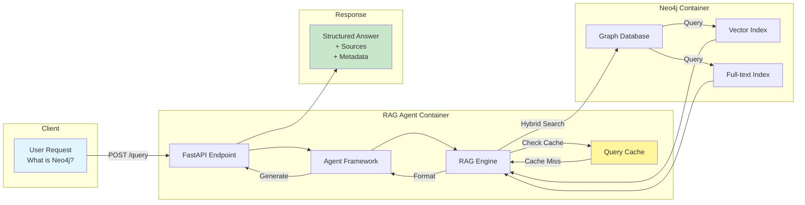

# Azure Integration Architecture

## Overview
Integration architecture for deploying the high-performance Neo4j RAG system with Microsoft Agent Framework on Azure.

## Detailed Architecture Diagram

```mermaid
graph TB
    subgraph Internet["🌐 Internet"]
        USER[👤 End Users]
        COPILOT[🤖 Microsoft Copilot Studio]
        DEVS[👨‍💻 Developers/CI-CD]
    end

    subgraph Azure["☁️ Azure Cloud - Sweden Central"]
        subgraph RG["Resource Group: rg-neo4j-rag-bitnet"]

            subgraph ACR_SG["📦 Container Registry"]
                ACR[Azure Container Registry<br/>crneo4jragec81d81b.azurecr.io<br/>━━━━━━━━━━━━━━<br/>🐳 neo4j-rag-agent:v1.0<br/>📊 Basic SKU]
            end

            subgraph CAE["Container Apps Environment: neo4j-rag-env"]
                DOMAIN[🌍 Domain<br/>yellowtree-8fdce811.swedencentral<br/>.azurecontainerapps.io<br/>━━━━━━━━━━━━━━<br/>IP: 20.240.85.35]

                subgraph AGENT["Neo4j RAG Agent Container"]
                    AGENT_APP["🚀 FastAPI Application<br/>━━━━━━━━━━━━━━<br/>Port: 8000<br/>CPU: 2 cores<br/>Memory: 4GB<br/>Replicas: 0-10<br/>━━━━━━━━━━━━━━<br/>📍 /health<br/>📍 /query<br/>📍 /stats"]
                    AGENT_FW["🧠 MS Agent Framework<br/>━━━━━━━━━━━━━━<br/>Context7 Integration<br/>Tool Orchestration<br/>State Management"]
                    RAG_ENGINE["⚡ Neo4j RAG Engine<br/>━━━━━━━━━━━━━━<br/>Connection Pool (10)<br/>Query Cache (FIFO)<br/>Vector Search<br/>Hybrid Search<br/>━━━━━━━━━━━━━━<br/>417x Performance"]
                end

                subgraph NEO4J["Neo4j Database Container"]
                    NEO4J_DB["🗄️ Neo4j 5.11<br/>━━━━━━━━━━━━━━<br/>Port: 7687 (internal)<br/>CPU: 4 cores<br/>Memory: 8GB<br/>Replicas: 1<br/>━━━━━━━━━━━━━━<br/>Heap: 4GB<br/>PageCache: 2GB"]
                    NEO4J_DATA["📊 Graph Data<br/>━━━━━━━━━━━━━━<br/>Documents<br/>Chunks<br/>Embeddings (384-dim)<br/>Full-text Indexes"]
                end
            end

            subgraph MONITOR_SG["📈 Monitoring & Logging"]
                LOG_ANALYTICS["📋 Log Analytics<br/>workspace-rgneo4jragbitnetf4Qh<br/>━━━━━━━━━━━━━━<br/>Container Logs<br/>Performance Metrics<br/>Custom Events"]
                APP_INSIGHTS["📊 Application Insights<br/>━━━━━━━━━━━━━━<br/>Request Tracing<br/>Dependency Tracking<br/>Performance Counters<br/>Custom Metrics"]
            end

            subgraph SECURITY["🔐 Security & Secrets"]
                KEYVAULT["🔑 Azure Key Vault<br/>━━━━━━━━━━━━━━<br/>NEO4J_PASSWORD<br/>API_KEYS<br/>Certificates"]
                MANAGED_ID["🆔 Managed Identity<br/>━━━━━━━━━━━━━━<br/>Service Authentication<br/>RBAC Assignments"]
            end

            subgraph STORAGE_SG["💾 Storage"]
                BLOB_STORAGE["📦 Azure Blob Storage<br/>━━━━━━━━━━━━━━<br/>Neo4j Backups<br/>PDF Documents<br/>Export Data"]
            end
        end

        subgraph AI_SG["🤖 Azure AI Foundry (Optional)"]
            AI_PROJECT["Azure AI Project<br/>━━━━━━━━━━━━━━<br/>Model: GPT-4o-mini<br/>Deployment: 10 TPM<br/>Endpoint: HTTPS"]
        end
    end

    %% User Interactions
    USER -->|HTTPS| DOMAIN
    COPILOT -->|HTTPS| DOMAIN
    DOMAIN -->|Route| AGENT_APP

    %% Developer Interactions
    DEVS -->|Push Images| ACR
    DEVS -->|Deploy| CAE

    %% Internal Flow
    AGENT_APP -->|Uses| AGENT_FW
    AGENT_FW -->|Executes| RAG_ENGINE
    RAG_ENGINE -->|bolt://neo4j-database:7687| NEO4J_DB
    NEO4J_DB -->|Stores| NEO4J_DATA

    %% Security & Secrets
    AGENT_APP -.->|Retrieve Secrets| KEYVAULT
    AGENT_APP -.->|Authenticate| MANAGED_ID

    %% Monitoring
    AGENT_APP -->|Logs| LOG_ANALYTICS
    AGENT_APP -->|Telemetry| APP_INSIGHTS
    NEO4J_DB -->|Logs| LOG_ANALYTICS

    %% Storage
    NEO4J_DB -.->|Backups| BLOB_STORAGE

    %% Registry
    CAE -.->|Pull Images| ACR

    %% AI Integration (Optional)
    AGENT_FW -.->|LLM Calls| AI_PROJECT

    %% Styling
    classDef userClass fill:#e1f5ff,stroke:#01579b,stroke-width:2px
    classDef azureClass fill:#fff4e1,stroke:#e65100,stroke-width:2px
    classDef containerClass fill:#e8f5e9,stroke:#2e7d32,stroke-width:2px
    classDef dbClass fill:#fce4ec,stroke:#c2185b,stroke-width:2px
    classDef monitorClass fill:#f3e5f5,stroke:#7b1fa2,stroke-width:2px
    classDef securityClass fill:#fff9c4,stroke:#f57f17,stroke-width:2px

    class USER,COPILOT,DEVS userClass
    class ACR,DOMAIN azureClass
    class AGENT_APP,AGENT_FW,RAG_ENGINE containerClass
    class NEO4J_DB,NEO4J_DATA dbClass
    class LOG_ANALYTICS,APP_INSIGHTS monitorClass
    class KEYVAULT,MANAGED_ID securityClass
```

## Component Relationships

### Data Flow Architecture

### Network Architecture

```mermaid
graph TB
    subgraph Public["🌐 Public Internet"]
        USERS[Users/Clients]
    end

    subgraph LB["Load Balancer / Ingress"]
        HTTPS[HTTPS Endpoint<br/>yellowtree-8fdce811.swedencentral<br/>.azurecontainerapps.io]
    end

    subgraph Internal["Internal Network"]
        AGENT[Agent Container<br/>External Ingress<br/>Port 8000]
        NEO4J[Neo4j Container<br/>Internal Ingress<br/>Port 7687]
    end

    subgraph Services["Azure Services"]
        ACR_NET[Container Registry]
        KV[Key Vault]
        MON[Monitoring]
    end

    USERS -->|443/HTTPS| HTTPS
    HTTPS -->|Route| AGENT
    AGENT -->|bolt://neo4j-database:7687| NEO4J
    AGENT -.->|Pull Secrets| KV
    AGENT -.->|Send Telemetry| MON
    AGENT -.->|Pull Image| ACR_NET

    style USERS fill:#e1f5ff
    style HTTPS fill:#fff59d
    style AGENT fill:#c8e6c9
    style NEO4J fill:#ffccbc
```

## Component Details

### 1. Azure AI Foundry Project
**Purpose**: Central hub for AI model management and agent orchestration
**Configuration**:
- Model deployment: GPT-4o-mini (or GPT-4o for production)
- Agent service enabled
- Monitoring and logging configured
- Role-based access control (RBAC)

### 2. Neo4j RAG Agent (Container Apps)
**Purpose**: Containerized application hosting the optimized Neo4j RAG system
**Key Features**:
- Microsoft Agent Framework integration
- 417x performance optimizations preserved
- Auto-scaling based on demand
- Health checks and monitoring

### 3. Neo4j Database (Container Apps)
**Purpose**: High-performance graph database with vector search capabilities
**Configuration**:
- Production memory settings (4GB heap, 2GB page cache)
- Persistent storage with backup to Azure Storage
- Full-text indexes and vector indexes
- Connection pooling optimized

### 4. Authentication & Security
**Method**: Azure CLI Credential / Managed Identity
**Components**:
- Azure Key Vault for secrets management
- Azure RBAC for service-to-service authentication
- Environment-based configuration

## Deployment Strategy

### Phase 1: Foundation Setup
1. Create Azure AI Foundry project
2. Deploy AI models (GPT-4o-mini)
3. Set up Container Apps environment
4. Configure networking and security

### Phase 2: Core Services
1. Deploy Neo4j container with production configuration
2. Deploy Neo4j RAG Agent with Agent Framework integration
3. Configure service discovery and communication
4. Set up monitoring and logging

### Phase 3: Integration & Testing
1. Connect to Azure AI services
2. Implement health checks and monitoring
3. Performance testing and optimization
4. Security validation

### Phase 4: Production Readiness
1. Set up CI/CD pipelines
2. Configure auto-scaling
3. Implement backup and disaster recovery
4. Documentation and training

## Performance Considerations

### Preserving 417x Performance Gains
- **Connection Pooling**: Maintain optimized Neo4j connection pool
- **Query Caching**: Preserve intelligent caching system
- **Parallel Processing**: Keep vector + keyword search parallelization
- **Container Resources**: Allocate sufficient CPU/memory for performance

### Azure-Specific Optimizations
- **Container Apps**: Use consumption-based scaling for cost optimization
- **Regional Deployment**: Deploy in same region as AI models for low latency
- **Network Optimization**: Use private networking for database connections

## Cost Optimization

### Resource Sizing
- **Agent Container**: 2 CPU, 4GB RAM (scales 0-10 instances)
- **Neo4j Container**: 4 CPU, 8GB RAM (persistent, always-on)
- **AI Model**: GPT-4o-mini for cost-effective performance

### Scaling Strategy
- **Agent App**: Auto-scale based on HTTP requests
- **Database**: Fixed size with connection pooling
- **Storage**: Premium SSD for Neo4j data, Standard for backups

## Security Architecture

### Identity & Access
- **Managed Identity**: For Azure service authentication
- **RBAC**: Least privilege access model
- **Network Security**: Private endpoints and VNets

### Data Protection
- **Encryption**: At rest and in transit
- **Key Management**: Azure Key Vault integration
- **Audit Logging**: Comprehensive activity monitoring

## Monitoring & Observability

### Application Insights Integration
- **Agent Framework Telemetry**: Built-in OpenTelemetry support
- **Custom Metrics**: Neo4j performance metrics
- **Query Analytics**: RAG query performance and accuracy
- **Health Monitoring**: Service availability and dependencies

### Alerting Strategy
- **Performance Degradation**: Response time > 1 second
- **Error Rates**: > 5% error rate
- **Resource Utilization**: > 80% CPU/Memory
- **Database Connectivity**: Connection failures

## Disaster Recovery

### Backup Strategy
- **Neo4j Data**: Daily backups to Azure Storage
- **Configuration**: Infrastructure as Code (Bicep/ARM)
- **Application Code**: Git-based versioning

### Recovery Procedures
- **RTO**: < 1 hour for service restoration
- **RPO**: < 24 hours for data loss
- **Automated Recovery**: Container Apps auto-restart
- **Manual Procedures**: Database restore from backup

This architecture ensures that your high-performance Neo4j RAG system is preserved while gaining the benefits of Azure's enterprise-grade infrastructure and Microsoft Agent Framework integration.